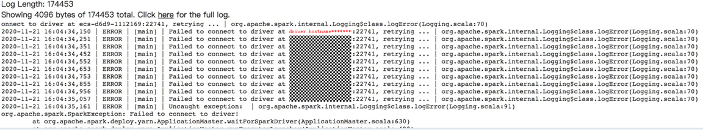

# 集群外节点提交Spark作业到Yarn报错连不上Driver

## 用户问题

在集群外节点使用client模式提交Spark任务到Yarn上，任务失败，报错为连不上Driver。

## 问题现象

集群外节点和集群各个节点网络已经互通，在集群外节点使用client模式提交Spark任务到Yarn上，任务失败，报错为连不上Driver。

## 原因分析

使用client模式提交Spark任务的时候，Spark的driver进程是在客户端这边，而后面的executor都需要和Driver进行交互来运行作业。

如果NodeManager连不上客户端所在的节点，就会报错：

## 处理步骤

在客户端的Spark配置中指定Driver的IP地址：

“<客户端安装位置\>/Spark/spark/conf/spark-defaults.conf“中添加参数“spark.driver.host=driverIP“，重新运行Spark任务即可。

## 建议与总结

建议客户通过cluster模式提交作业。

