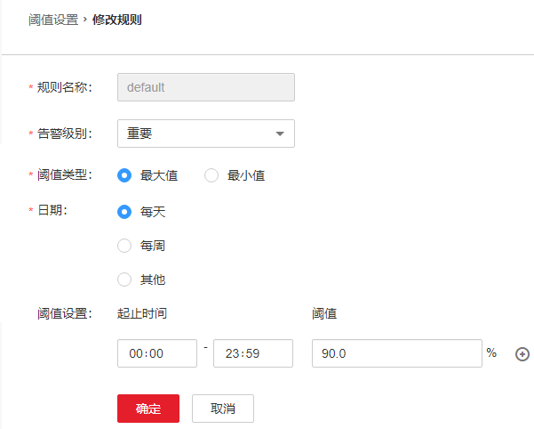

# ALM-12016 CPU使用率超过阈值

## 告警解释

系统每30秒周期性检测CPU使用率，并把实际CPU使用率和阈值相比较。CPU使用率默认提供一个阈值范围。当检测到CPU使用率连续多次（可配置，默认值为10）超出阈值范围时产生该告警。

平滑次数为1，CPU使用率小于或等于阈值时，告警恢复；平滑次数大于1，CPU使用率小于或等于阈值的90%时，告警恢复。

## 告警属性

<table><thead align="left"><tr id="row49989141"><th class="cellrowborder" valign="top" width="33.33333333333333%" id="mcps1.1.4.1.1">
告警ID

</th>
<th class="cellrowborder" valign="top" width="33.33333333333333%" id="mcps1.1.4.1.2">
告警级别

</th>
<th class="cellrowborder" valign="top" width="33.33333333333333%" id="mcps1.1.4.1.3">
是否自动清除

</th>
</tr>
</thead>
<tbody><tr id="row30415758"><td class="cellrowborder" valign="top" width="33.33333333333333%" headers="mcps1.1.4.1.1 ">
12016

</td>
<td class="cellrowborder" valign="top" width="33.33333333333333%" headers="mcps1.1.4.1.2 ">
重要

</td>
<td class="cellrowborder" valign="top" width="33.33333333333333%" headers="mcps1.1.4.1.3 ">
是

</td>
</tr>
</tbody>
</table>

## 告警参数

<table><thead align="left"><tr id="row59179380"><th class="cellrowborder" valign="top" width="50%" id="mcps1.1.3.1.1">
参数名称

</th>
<th class="cellrowborder" valign="top" width="50%" id="mcps1.1.3.1.2">
参数含义

</th>
</tr>
</thead>
<tbody><tr id="row12465939134110"><td class="cellrowborder" valign="top" width="50%" headers="mcps1.1.3.1.1 ">
来源

</td>
<td class="cellrowborder" valign="top" width="50%" headers="mcps1.1.3.1.2 ">
产生告警的集群或系统名称。

</td>
</tr>
<tr id="row48724307"><td class="cellrowborder" valign="top" width="50%" headers="mcps1.1.3.1.1 ">
服务名

</td>
<td class="cellrowborder" valign="top" width="50%" headers="mcps1.1.3.1.2 ">
产生告警的服务名称。

</td>
</tr>
<tr id="row30412584"><td class="cellrowborder" valign="top" width="50%" headers="mcps1.1.3.1.1 ">
角色名

</td>
<td class="cellrowborder" valign="top" width="50%" headers="mcps1.1.3.1.2 ">
产生告警的角色名称。

</td>
</tr>
<tr id="row66596640"><td class="cellrowborder" valign="top" width="50%" headers="mcps1.1.3.1.1 ">
主机名

</td>
<td class="cellrowborder" valign="top" width="50%" headers="mcps1.1.3.1.2 ">
产生告警的主机名。

</td>
</tr>
<tr id="row19795720"><td class="cellrowborder" valign="top" width="50%" headers="mcps1.1.3.1.1 ">
Trigger Condition

</td>
<td class="cellrowborder" valign="top" width="50%" headers="mcps1.1.3.1.2 ">
系统当前指标取值满足自定义的告警设置条件。

</td>
</tr>
</tbody>
</table>

## 对系统的影响

业务进程响应缓慢或不可用。

## 可能原因

-   告警阈值配置或者平滑次数配置不合理。
-   CPU配置无法满足业务需求，CPU使用率达到上限。

## 处理步骤

**检查告警阈值配置或者平滑次数配置是否合理。**

1.  基于实际CPU使用情况，修改告警阈值和平滑次数配置项。

    登录FusionInsight Manager，根据实际服务的使用情况在“运维 \> 告警 \> 阈值设置 \>  _待操作集群的名称_  \> 主机 \> CPU \> 主机CPU使用率”中更改告警的平滑次数，如[图1](#fig49427405173731)所示。

    > **说明：** 
    >该选项的含义为告警检查阶段，“平滑次数”为连续检查多少次超过阈值，则发送告警。

    **图 1**  设置告警平滑次数  
    

    在“主机CPU使用率”界面单击“操作”列的“修改”，更改告警阈值，如[图2](#fig7271564173731)所示。

    **图 2**  设置告警阈值  
    

2.  等待2分钟，查看告警是否自动恢复。
    -   是，处理完毕。
    -   否，执行[3](#li64287686173731)。

**检查CPU使用率是否达到上限。**

1.  打开FusionInsight Manager页面，在告警列表中，单击此告警所在行的，查看该告警的节点地址。
2.  进入“主机”界面，单击告警的所在节点。
3.  在界面观察“主机CPU使用率”实时数据5分钟左右，若CPU使用率多次超过设置的阈值，请联系系统管理员提升CPU。
4.  检查该告警是否恢复。
    -   是，处理完毕。
    -   否，执行[7](#li39839699173731)。

**收集故障信息。**

1.  在FusionInsight Manager界面，选择“运维 \> 日志 \> 下载”。
2.  在“服务”中勾选“OmmServer”，单击“确定”。
3.  单击右上角的设置日志收集的“开始时间”和“结束时间”分别为告警产生时间的前后10分钟，单击“下载”。
4.  请联系运维人员，并发送已收集的故障日志信息。

## 告警清除

此告警修复后，系统会自动清除此告警，无需手工清除。

## 参考信息

无。

