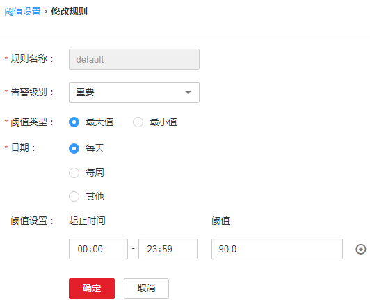

# ALM-12017 磁盘容量不足

## 告警解释

系统每30秒周期性检测磁盘使用率，并把磁盘使用率和阈值相比较。磁盘使用率有一个默认阈值，当检测到磁盘使用率超过阈值时产生该告警。

平滑次数为1，主机磁盘某一分区使用率小于或等于阈值时，告警恢复；平滑次数大于1，主机磁盘某一分区使用率小于或等于阈值的90%时，告警恢复。

## 告警属性

<table><thead align="left"><tr id="row12934337"><th class="cellrowborder" valign="top" width="33.33333333333333%" id="mcps1.1.4.1.1">
告警ID

</th>
<th class="cellrowborder" valign="top" width="33.33333333333333%" id="mcps1.1.4.1.2">
告警级别

</th>
<th class="cellrowborder" valign="top" width="33.33333333333333%" id="mcps1.1.4.1.3">
是否自动清除

</th>
</tr>
</thead>
<tbody><tr id="row66155228"><td class="cellrowborder" valign="top" width="33.33333333333333%" headers="mcps1.1.4.1.1 ">
12017

</td>
<td class="cellrowborder" valign="top" width="33.33333333333333%" headers="mcps1.1.4.1.2 ">
重要

</td>
<td class="cellrowborder" valign="top" width="33.33333333333333%" headers="mcps1.1.4.1.3 ">
是

</td>
</tr>
</tbody>
</table>

## 告警参数

<table><thead align="left"><tr id="row63147375"><th class="cellrowborder" valign="top" width="50%" id="mcps1.1.3.1.1">
参数名称

</th>
<th class="cellrowborder" valign="top" width="50%" id="mcps1.1.3.1.2">
参数含义

</th>
</tr>
</thead>
<tbody><tr id="row97131233154114"><td class="cellrowborder" valign="top" width="50%" headers="mcps1.1.3.1.1 ">
来源

</td>
<td class="cellrowborder" valign="top" width="50%" headers="mcps1.1.3.1.2 ">
产生告警的集群或系统名称。

</td>
</tr>
<tr id="row41806087"><td class="cellrowborder" valign="top" width="50%" headers="mcps1.1.3.1.1 ">
服务名

</td>
<td class="cellrowborder" valign="top" width="50%" headers="mcps1.1.3.1.2 ">
产生告警的服务名称。

</td>
</tr>
<tr id="row8089436"><td class="cellrowborder" valign="top" width="50%" headers="mcps1.1.3.1.1 ">
角色名

</td>
<td class="cellrowborder" valign="top" width="50%" headers="mcps1.1.3.1.2 ">
产生告警的角色名称。

</td>
</tr>
<tr id="row59346302"><td class="cellrowborder" valign="top" width="50%" headers="mcps1.1.3.1.1 ">
主机名

</td>
<td class="cellrowborder" valign="top" width="50%" headers="mcps1.1.3.1.2 ">
产生告警的主机名。

</td>
</tr>
<tr id="row49163466"><td class="cellrowborder" valign="top" width="50%" headers="mcps1.1.3.1.1 ">
设备分区名

</td>
<td class="cellrowborder" valign="top" width="50%" headers="mcps1.1.3.1.2 ">
产生告警的磁盘分区。

</td>
</tr>
<tr id="row58321318"><td class="cellrowborder" valign="top" width="50%" headers="mcps1.1.3.1.1 ">
Trigger Condition

</td>
<td class="cellrowborder" valign="top" width="50%" headers="mcps1.1.3.1.2 ">
系统当前指标取值满足自定义的告警设置条件。

</td>
</tr>
</tbody>
</table>

## 对系统的影响

业务进程不可用。

## 可能原因

-   告警阈值配置不合理。
-   磁盘配置无法满足业务需求，磁盘使用率达到上限。

## 处理步骤

**检查阈值设置是否合理。**

1.  在FusionInsight Manager选择“运维 \> 告警 \> 阈值设置 \>  _待操作集群的名称_  \> 主机 \> 磁盘 \> 磁盘使用率”中查看该告警阈值是否不合理（默认90%为合理值，用户可以根据自己的实际需求调节）。
    -   是，执行[2](#li45018069174323)。
    -   否，执行[4](#li30671586174323)。

2.  根据实际服务的使用情况在“运维 \> 告警 \> 阈值设置 \>  _待操作集群的名称_  \> 主机 \> 磁盘 \> 磁盘使用率”中单击“操作”列的“修改”更改告警阈值。如[图1](#fig30381940174323)所示

    **图 1**  设置告警阈值  
    

3.  等待2分钟，查看告警是否消失。
    -   是，处理完毕。
    -   否，执行[4](#li30671586174323)。

**检查磁盘使用率是否达到上限**

1.  打开FusionInsight Manager页面，在告警列表中，单击此告警所在行的，查看该告警的主机名称和磁盘分区信息。
2.  以**root**用户登录告警所在节点，用户密码为安装前用户自定义，请咨询系统管理员。
3.  执行**df -lmPT |  awk '$2 != "iso9660"' | grep '^/dev/' | awk '\{"readlink -m "$1 | getline real \}\{$1=real; print $0\}' | sort -u -k 1,1**命令，查看系统磁盘分区的使用信息。并通过[4](#li30671586174323)中获取到的磁盘分区名称，查看该磁盘是否挂载在如下几个目录下：“/”、“/opt”、“/tmp”、“/var”、“/var/log”、“/srv/BigData”（可自定义）。
    -   是，说明该磁盘为系统盘，执行[10](#li13975448174323)。
    -   否，说明该磁盘为非系统盘，执行[7](#li28769515174323)。

4.  执行**df -lmPT |  awk '$2 != "iso9660"' | grep '^/dev/' | awk '\{"readlink -m "$1 | getline real \}\{$1=real; print $0\}' | sort -u -k 1,1**命令，查看系统磁盘分区的使用信息。并通过[4](#li30671586174323)中获取到的磁盘分区名称，判断该磁盘属于哪一个角色。
5.  查看磁盘所属服务。

    MRS，是否为HDFS、Yarn、Solr、Kafka、Supervisor或者Redis其中之一。

    -   是，进行容量调整。执行[9](#li30684274174323)。
    -   否，执行[12](#li54147326174323)。

6.  等待2分钟，查看告警是否消失。
    -   是，处理完毕。
    -   否，执行[12](#li54147326174323)。

7.  执行命令**find / -xdev -size +500M -exec ls -l \{\} \\;**，查看该节点上超过500MB的文件，查看该磁盘中，是否有误写入的大文件存在。
    -   是，执行[11](#li65668693174323)。
    -   否，执行[12](#li54147326174323)。

8.  处理该误写入的文件，并等待2分钟，查看告警是否清除。
    -   是，执行完毕。
    -   否，执行[12](#li54147326174323)。

9.  联系系统管理员，对磁盘进行扩容。
10. 等待2分钟，查看告警是否消失。
    -   是，处理完毕。
    -   否，执行[14](#li64364171174323)。

**收集故障信息。**

1.  在FusionInsight Manager界面，选择“运维 \> 日志 \> 下载”。
2.  在“服务”中勾选“OMS”，单击“确定”。
3.  单击右上角的设置日志收集的“开始时间”和“结束时间”分别为告警产生时间的前后10分钟，单击“下载”。
4.  请联系运维人员，并发送已收集的故障日志信息。

## 告警清除

此告警修复后，系统会自动清除此告警，无需手工清除。

## 参考信息

无。

