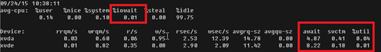
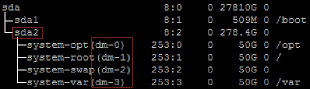

# ALM-12033 慢盘故障

## 告警解释

系统每3秒执行一次**iostat**命令，监控磁盘I/O的系统指标，如果在300s内，svctm大于100ms且大于svctm\_average值的1.5倍，则被认为是一个慢周期。若300s内慢周期的数量大于50%，则认为磁盘有问题，系统上报告警。

> **说明：** 
>svctm\_average的值为当前节点中所有磁盘svctm的均值。

更换磁盘后，告警自动恢复。

当前慢盘故障告警的检查原理为：

在Linux平台上判断IO是否存在问题，输入命令**iostat -x -t 1**，观察下几个值（如图所示红色框中的部分）：

-   %iowait：该值表示CPU等待IO的时间占整个CPU周期的百分比，如果该值超过50%，或者明显大于%system、%user以及%idle，这表示IO可能存在问题。
-   await：该值表示该磁盘IO等待时间+IO服务时间的值，该值一般不超过20，其它DataNode数据盘可以稍高，但是不超过40。
-   svctm：该值表示改磁盘IO服务时间。
-   %util：该值表示磁盘繁忙程度，一般该值超过80%表示该磁盘可能处于繁忙状态。

如果%util大于10，并且svctm大于100，则记录，如果六十次里面有三十次都满足该条件，则发送慢盘故障。

## 告警属性

<table><thead align="left"><tr id="row63241711"><th class="cellrowborder" valign="top" width="33.33333333333333%" id="mcps1.1.4.1.1">
告警ID

</th>
<th class="cellrowborder" valign="top" width="33.33333333333333%" id="mcps1.1.4.1.2">
告警级别

</th>
<th class="cellrowborder" valign="top" width="33.33333333333333%" id="mcps1.1.4.1.3">
是否自动清除

</th>
</tr>
</thead>
<tbody><tr id="row65888257"><td class="cellrowborder" valign="top" width="33.33333333333333%" headers="mcps1.1.4.1.1 ">
12033

</td>
<td class="cellrowborder" valign="top" width="33.33333333333333%" headers="mcps1.1.4.1.2 ">
重要

</td>
<td class="cellrowborder" valign="top" width="33.33333333333333%" headers="mcps1.1.4.1.3 ">
是

</td>
</tr>
</tbody>
</table>

## 告警参数

<table><thead align="left"><tr id="row6331686"><th class="cellrowborder" valign="top" width="49.96%" id="mcps1.1.3.1.1">
参数名称

</th>
<th class="cellrowborder" valign="top" width="50.03999999999999%" id="mcps1.1.3.1.2">
参数含义

</th>
</tr>
</thead>
<tbody><tr id="row56862043194020"><td class="cellrowborder" valign="top" width="49.96%" headers="mcps1.1.3.1.1 ">
来源

</td>
<td class="cellrowborder" valign="top" width="50.03999999999999%" headers="mcps1.1.3.1.2 ">
产生告警的集群或系统名称。

</td>
</tr>
<tr id="row12414232"><td class="cellrowborder" valign="top" width="49.96%" headers="mcps1.1.3.1.1 ">
服务名

</td>
<td class="cellrowborder" valign="top" width="50.03999999999999%" headers="mcps1.1.3.1.2 ">
产生告警的服务名称。

</td>
</tr>
<tr id="row17864933"><td class="cellrowborder" valign="top" width="49.96%" headers="mcps1.1.3.1.1 ">
角色名

</td>
<td class="cellrowborder" valign="top" width="50.03999999999999%" headers="mcps1.1.3.1.2 ">
产生告警的角色名称。

</td>
</tr>
<tr id="row22252820"><td class="cellrowborder" valign="top" width="49.96%" headers="mcps1.1.3.1.1 ">
主机名

</td>
<td class="cellrowborder" valign="top" width="50.03999999999999%" headers="mcps1.1.3.1.2 ">
产生告警的主机名。

</td>
</tr>
<tr id="row15213943"><td class="cellrowborder" valign="top" width="49.96%" headers="mcps1.1.3.1.1 ">
磁盘名

</td>
<td class="cellrowborder" valign="top" width="50.03999999999999%" headers="mcps1.1.3.1.2 ">
产生告警的磁盘名。

</td>
</tr>
</tbody>
</table>

## 对系统的影响

磁盘慢盘故障，导致业务性能下降，阻塞业务的处理能力，严重时可能会导致服务不可用。

## 可能原因

磁盘老化或者磁盘坏道。

## 处理步骤

**检查磁盘状态。**

1.  在FusionInsight Manager界面，选择“运维 \> 告警 \> 告警”。
2.  查看该告警的详细信息，查看定位信息中“主机名”字段和“磁盘名”字段的值，获取该告警产生的故障磁盘信息。
3.  确认上报告警的节点是否为虚拟化环境。
    -   是，执行[4](#li2831628891458)。
    -   否，执行[7](#li2583597491458)。

4.  请检查虚拟化环境提供的存储性能是否满足硬件要求，检查完毕之后执行[5](#li1205527419227)。
5.  以**root**用户登录告警节点，执行**df -h**命令，查看输出内容是否包含“磁盘名”字段的值，用户密码为安装前用户自定义，请咨询系统管理员。
    -   是，执行[7](#li2583597491458)。
    -   否，执行[6](#li2325719119312)。

6.  执行**lsblk**命令，是否可以查到“磁盘名”字段值与磁盘设备的映射关系。

    

    -   是，执行[7](#li2583597491458)。.
    -   否，执行[22](#li4518231891458)。

7.  以**root**用户登录上报告警的节点，执行**lsscsi | grep "/dev/sd\[x\]"**命令查看磁盘的设备信息，判断磁盘是否建立了RAID，用户密码为安装前用户自定义，请咨询系统管理员。

    > **说明：** 
    >其中**/dev/sd\[x\]**为[2](#li3788291791458)中获取到的上报告警的磁盘名称。

    例如执行：

    **lsscsi | grep "/dev/sda"**

    如果命令执行结果第三列显示ATA、SATA或者SAS，说明磁盘没有建立RAID；显示其他信息，则该磁盘可能建立了RAID。

    -   是，执行[12](#li1471607091458)。
    -   否，执行[8](#li523387391458)。

8.  执行**smartctl -i /dev/sd\[x\]**命令检查硬件是否支持smart。

    例如执行：

    **smartctl -i /dev/sda**

    如果命令执行结果中包含“SMART support is: Enabled”，表示磁盘支持smart；执行结果中包含“Device does not support SMART”或者其他，表示磁盘不支持smart。

    -   是，执行[9](#li3483730991458)。
    -   否，执行[17](#li3381567991458)。

9.  执行**smartctl -H --all /dev/sd\[x\]**命令查看smart的基本信息，判断磁盘是否正常。

    例如执行：

    **smartctl -H --all /dev/sda**

    查看命令执行结果的“SMART overall-health self-assessment test result”内容，如果是“FAILED”，表示磁盘故障，需要更换；如果为“PASSED”，需要进一步看“Reallocated\_Sector\_Ct”或者“Elements in grown defect list”项的计数，如果大于100，则认为磁盘故障，需要更换。

    -   是，执行[10](#li1145378391458)。
    -   否，执行[18](#li6235920691458)。

10. 执行**smartctl -l error -H /dev/sd\[x\]**命令查看磁盘的GLIST列表，进一步继续判断磁盘是否正常。

    例如执行：

    **smartctl -l error -H /dev/sda**

    查看命令执行结果的“Command/Featrue\_name”列，如果出现“READ SECTOR\(S\)”或者“WRITE SECTOR\(S\)”表示磁盘有坏道；如果出现其他错误，表示磁盘电路板有问题。这两种错误均表示磁盘不正常，需要更换。

    如果显示“No Errors Logged”，则表示没有错误日志，则可以触发磁盘smart自检。

    -   是，执行[11](#li2167780691458)。
    -   否，执行[18](#li6235920691458)。

11. 执行**smartctl -t long /dev/sd\[x\]**命令触发磁盘smart自检。命令执行后，会提示自检完成的时间，在等待自检完成后，重新执行[9](#li3483730991458)和[10](#li1145378391458)，检查磁盘是否正常。

    例如执行：

    **smartctl -t long /dev/sda**

    -   是，执行[17](#li3381567991458)。
    -   否，执行[18](#li6235920691458)。

12. 执行**smartctl -d \[sat|scsi\]+megaraid,\[DID\] -H --all /dev/sd\[x\]**命令检查硬件是否支持smart。

    > **说明：** 
    >-   \[sat|scsi\]表示磁盘类型，需要尝试以上两种类型。
    >-   \[DID\]表示槽位信息，需要尝试0～15。

    例如依次执行：

    **smartctl -d sat+megaraid,0 -H --all /dev/sda**

    **smartctl -d sat+megaraid,1 -H --all /dev/sda**

    **smartctl -d sat+megaraid,2 -H --all /dev/sda**

    ...

    依次尝试不同磁盘类型和槽位信息的命令组合，如果执行结果中显示“SMART support is: Enabled”，表示磁盘支持smart，记录命令执行成功时磁盘类型和槽位信息组合参数；如果尝试完以上所有的命令组合，执行结果都未显示“SMART support is: Enabled”，表示磁盘不支持smart。

    -   是，执行[13](#li4568369291458)。
    -   否，执行[16](#li1606413991458)。

13. 执行[12](#li1471607091458)中记录的**smartctl -d \[sat|scsi\]+megaraid,\[DID\] -H --all /dev/sd\[x\]**命令查看smart的基本信息，判断磁盘是否正常。

    例如执行：

    **smartctl -d sat+megaraid,2 -H --all /dev/sda**

    查看命令执行结果的“SMART overall-health self-assessment test result”内容，如果是“FAILED”，表示磁盘故障，需要更换；如果为“PASSED”，需要进一步看“Reallocated\_Sector\_Ct”或者“Elements in grown defect list”项的计数，如果大于100，则认为磁盘故障，需要更换。

    -   是，执行[14](#li5027541391458)。
    -   否，执行[18](#li6235920691458)。

14. 执行**smartctl -d \[sat|scsi\]+megaraid,\[DID\] -l error -H /dev/sd\[x\]**命令查看硬盘的GLIST列表，进一步判断硬盘是否正常。

    例如执行：

    **smartctl -d sat+megaraid,2 -l error -H /dev/sda**

    查看命令执行结果的“Command/Featrue\_name”列，如果出现“READ SECTOR\(S\)”或者“WRITE SECTOR\(S\)”表示磁盘有坏道；如果出现其他错误，表示磁盘电路板有问题。这两种错误均表示磁盘不正常，需要更换。

    如果显示“No Errors Logged”，则表示没有错误日志，则可以触发磁盘smart自检。

    -   是，执行[15](#li1119862391458)。
    -   否，执行[18](#li6235920691458)。

15. 执行**smartctl -d \[sat|scsi\]+megaraid,\[DID\] -t long /dev/sd\[x\]**命令触发磁盘smart自检。命令执行后，会提示自检完成的时间，在等待自检完成后，重新执行[13](#li4568369291458)和[14](#li5027541391458)，检查磁盘是否正常。

    例如执行：

    **smartctl -d sat+megaraid,2 -t long /dev/sda**

    -   是，执行[17](#li3381567991458)。
    -   否，执行[18](#li6235920691458)。

16. 磁盘不支持smart，通常是因为配置的RAID卡不支持，此时需要使用对应RAID卡厂商的检查工具进行处理，然后执行[17](#li3381567991458)。

    例如LSI一般是MegaCli工具。

17. 在FusionInsight Manager界面，选择“运维 \> 告警 \> 告警”，单击该告警操作列的“清除”，并继续观察该告警，查看同一块磁盘的告警是否会继续上报。

    如果当前磁盘出现三次以上该告警，建议用户更换磁盘。

    -   是，执行[18](#li6235920691458)。
    -   否，操作结束。

**更换磁盘。**

1.  在FusionInsight Manager界面，选择“运维 \> 告警 \> 告警”。
2.  查看该告警的详细信息，查看定位信息中对应的“主机名”字段和“磁盘名”字段的值，获取该告警上报的故障磁盘信息。
3.  更换硬盘。
4.  检查告警是否清除。
    -   是，操作结束。
    -   否，执行[22](#li4518231891458)。

**收集故障信息。**

1.  在FusionInsight Manager界面，选择“运维 \> 日志 \> 下载”。
2.  在“服务”中勾选“OMS”，单击“确定”。
3.  单击右上角的设置日志收集的“开始时间”和“结束时间”分别为告警产生时间的前后10分钟，单击“下载”。
4.  请联系运维人员，并发送已收集的故障日志信息。

## 告警清除

此告警修复后，系统会自动清除此告警，无需手工清除。

## 参考信息

无。

