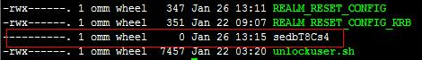

# ALM-12041 关键文件权限异常

## 告警解释

系统每隔5分钟检查一次系统中关键目录或者文件权限、用户、用户组是否正常，如果不正常，则上报故障告警。

当检查到权限等均正常，则告警恢复。

## 告警属性

<table><thead align="left"><tr id="row504499"><th class="cellrowborder" valign="top" width="33.33333333333333%" id="mcps1.1.4.1.1">
告警ID

</th>
<th class="cellrowborder" valign="top" width="33.33333333333333%" id="mcps1.1.4.1.2">
告警级别

</th>
<th class="cellrowborder" valign="top" width="33.33333333333333%" id="mcps1.1.4.1.3">
是否自动清除

</th>
</tr>
</thead>
<tbody><tr id="row2137728"><td class="cellrowborder" valign="top" width="33.33333333333333%" headers="mcps1.1.4.1.1 ">
12041

</td>
<td class="cellrowborder" valign="top" width="33.33333333333333%" headers="mcps1.1.4.1.2 ">
重要

</td>
<td class="cellrowborder" valign="top" width="33.33333333333333%" headers="mcps1.1.4.1.3 ">
是

</td>
</tr>
</tbody>
</table>

## 告警参数

<table><thead align="left"><tr id="row34944941"><th class="cellrowborder" valign="top" width="50%" id="mcps1.1.3.1.1">
参数名称

</th>
<th class="cellrowborder" valign="top" width="50%" id="mcps1.1.3.1.2">
参数含义

</th>
</tr>
</thead>
<tbody><tr id="row17716132313920"><td class="cellrowborder" valign="top" width="50%" headers="mcps1.1.3.1.1 ">
来源

</td>
<td class="cellrowborder" valign="top" width="50%" headers="mcps1.1.3.1.2 ">
产生告警的集群或系统名称。

</td>
</tr>
<tr id="row4761708"><td class="cellrowborder" valign="top" width="50%" headers="mcps1.1.3.1.1 ">
服务名

</td>
<td class="cellrowborder" valign="top" width="50%" headers="mcps1.1.3.1.2 ">
产生告警的服务名称。

</td>
</tr>
<tr id="row55076505"><td class="cellrowborder" valign="top" width="50%" headers="mcps1.1.3.1.1 ">
角色名

</td>
<td class="cellrowborder" valign="top" width="50%" headers="mcps1.1.3.1.2 ">
产生告警的角色名称。

</td>
</tr>
<tr id="row49924307"><td class="cellrowborder" valign="top" width="50%" headers="mcps1.1.3.1.1 ">
主机名

</td>
<td class="cellrowborder" valign="top" width="50%" headers="mcps1.1.3.1.2 ">
产生告警的主机名。

</td>
</tr>
<tr id="row22240205"><td class="cellrowborder" valign="top" width="50%" headers="mcps1.1.3.1.1 ">
路径名

</td>
<td class="cellrowborder" valign="top" width="50%" headers="mcps1.1.3.1.2 ">
异常的文件路径或者名称。

</td>
</tr>
</tbody>
</table>

## 对系统的影响

导致系统功能不可用。

## 可能原因

用户手动修改了文件权限、用户和用户组等信息或者系统异常下电等原因导致文件权限异常或文件丢失。

## 处理步骤

**检查异常文件是否存在及异常文件的权限是否正确。**

1.  在FusionInsight Manager界面，选择“运维 \> 告警 \> 告警”。
2.  查看该告警“定位信息”中对应的“主机名”字段值，获取该告警产生的主机名，查看定位信息中对应的“路径名”字段值，获取异常的文件路径或者名称。
3.  以**root**用户登录告警所在节点，用户密码为安装前用户自定义，请咨询系统管理员。
4.  执行**ll **_路径名_命令，其中_路径名_为[2](#li5151620105859)获取到的异常文件，获取到该文件或者目录在主机上的当前的用户，权限，用户组等信息。
5.  进入“$\{BIGDATA\_HOME\}/om-agent/nodeagent/etc/agent/autocheck”目录，然后执行**vi keyfile**命令，并搜索对应的异常文件名，可以看到该文件的正确权限。

    > **说明：** 
    >除keyfile中所列出的文件和目录外，为保证主备OMS配置同步正常，“$OMS\_RUN\_PATH/workspace/ha/module/hasync/plugin/conf/filesync.xml“中配置的文件、目录以及目录下的文件和子目录也会被监控，其中文件要求omm用户具有可读写权限，目录要求omm用户具有可读和可执行权限。

6.  对比当前主机上该文件的真实权限和[5](#li16569998105859)中获取到的文件应有权限，对该文件进行正确的权限和用户，用户组信息的修改。
7.  等待一个小时，进入下一次检查，查看告警是否恢复。

    -   是，操作结束。
    -   否，执行[8](#li20984928105859)。

    > **说明：** 
    >如果集群安装目录所在磁盘分区已满，部分程序安装目录会由于sed命令执行失败，产生一些临时文件，且没有读写可执行权限。如果这些文件产生在该告警的监控范围内，那么系统会上报该告警，告警原因可以看到是由于产生的临时文件权限异常导致，可以参照上述告警处理流程处理该告警，或者确认权限异常文件为临时文件后，可以直接删除。sed命令产生的临时文件类似于下图。

    

**收集故障信息。**

1.  在FusionInsight Manager界面，选择“运维 \> 日志 \> 下载”。
2.  在“服务”中勾选“NodeAgent”，单击“确定”。
3.  单击右上角的设置日志收集的“开始时间”和“结束时间”分别为告警产生时间的前后10分钟，单击“下载”。
4.  请联系运维人员，并发送已收集的故障日志信息。

## 告警清除

此告警修复后，系统会自动清除此告警，无需手工清除。

## 参考信息

无

