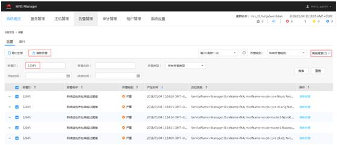

# ALM-12045 网络读包丢包率超过阈值<a name="ZH-CN_TOPIC_0174499395"></a>

## 告警解释<a name="zh-cn_topic_0093195094_zh-cn_topic_0087154373_zh-cn_topic_0087039254_section5890016"></a>

系统每30秒周期性检测网络读包丢包率，并把实际丢包率和阈值（系统默认阈值0.5%）进行比较，当检测到网络读包丢包率连续多次（默认值为5）超过阈值时产生该告警。

用户可通过“系统设置 \> 阈值配置 \> 设备 \> 主机 \> 网络读信息 \> 网络读包率信息 \> 读包丢包率”修改阈值。

平滑次数为1，网络读包丢包率小于或等于阈值时，告警恢复；平滑次数大于1，网络读包丢包率小于或等于阈值的90%时，告警恢复。

该告警检测默认关闭。若需要开启，请根据“检查系统环境”步骤，确认该系统是否可以开启该告警发送。

## 告警属性<a name="zh-cn_topic_0093195094_zh-cn_topic_0087154373_zh-cn_topic_0087039254_section53010144"></a>

<a name="zh-cn_topic_0093195094_zh-cn_topic_0087154373_zh-cn_topic_0087039254_table13729674"></a>
<table><thead align="left"><tr id="zh-cn_topic_0093195094_zh-cn_topic_0087154373_zh-cn_topic_0087039254_row33765803"><th class="cellrowborder" valign="top" width="33.33333333333333%" id="mcps1.1.4.1.1"><p id="zh-cn_topic_0093195094_zh-cn_topic_0087154373_zh-cn_topic_0087039254_p50675546"><a name="zh-cn_topic_0093195094_zh-cn_topic_0087154373_zh-cn_topic_0087039254_p50675546"></a><a name="zh-cn_topic_0093195094_zh-cn_topic_0087154373_zh-cn_topic_0087039254_p50675546"></a>告警ID</p>
</th>
<th class="cellrowborder" valign="top" width="33.33333333333333%" id="mcps1.1.4.1.2"><p id="zh-cn_topic_0093195094_zh-cn_topic_0087154373_zh-cn_topic_0087039254_p11078557"><a name="zh-cn_topic_0093195094_zh-cn_topic_0087154373_zh-cn_topic_0087039254_p11078557"></a><a name="zh-cn_topic_0093195094_zh-cn_topic_0087154373_zh-cn_topic_0087039254_p11078557"></a>告警级别</p>
</th>
<th class="cellrowborder" valign="top" width="33.33333333333333%" id="mcps1.1.4.1.3"><p id="zh-cn_topic_0093195094_zh-cn_topic_0087154373_zh-cn_topic_0087039254_p24947933"><a name="zh-cn_topic_0093195094_zh-cn_topic_0087154373_zh-cn_topic_0087039254_p24947933"></a><a name="zh-cn_topic_0093195094_zh-cn_topic_0087154373_zh-cn_topic_0087039254_p24947933"></a>可自动清除</p>
</th>
</tr>
</thead>
<tbody><tr id="zh-cn_topic_0093195094_zh-cn_topic_0087154373_zh-cn_topic_0087039254_row7516673"><td class="cellrowborder" valign="top" width="33.33333333333333%" headers="mcps1.1.4.1.1 "><p id="zh-cn_topic_0093195094_zh-cn_topic_0087154373_zh-cn_topic_0087039254_p4870770"><a name="zh-cn_topic_0093195094_zh-cn_topic_0087154373_zh-cn_topic_0087039254_p4870770"></a><a name="zh-cn_topic_0093195094_zh-cn_topic_0087154373_zh-cn_topic_0087039254_p4870770"></a>12045</p>
</td>
<td class="cellrowborder" valign="top" width="33.33333333333333%" headers="mcps1.1.4.1.2 "><p id="zh-cn_topic_0093195094_zh-cn_topic_0087154373_zh-cn_topic_0087039254_p58988055"><a name="zh-cn_topic_0093195094_zh-cn_topic_0087154373_zh-cn_topic_0087039254_p58988055"></a><a name="zh-cn_topic_0093195094_zh-cn_topic_0087154373_zh-cn_topic_0087039254_p58988055"></a>严重</p>
</td>
<td class="cellrowborder" valign="top" width="33.33333333333333%" headers="mcps1.1.4.1.3 "><p id="zh-cn_topic_0093195094_zh-cn_topic_0087154373_zh-cn_topic_0087039254_p13303128"><a name="zh-cn_topic_0093195094_zh-cn_topic_0087154373_zh-cn_topic_0087039254_p13303128"></a><a name="zh-cn_topic_0093195094_zh-cn_topic_0087154373_zh-cn_topic_0087039254_p13303128"></a>是</p>
</td>
</tr>
</tbody>
</table>

## 告警参数<a name="zh-cn_topic_0093195094_zh-cn_topic_0087154373_zh-cn_topic_0087039254_section7329254"></a>

<a name="zh-cn_topic_0093195094_zh-cn_topic_0087154373_zh-cn_topic_0087039254_table3811615"></a>
<table><thead align="left"><tr id="zh-cn_topic_0093195094_zh-cn_topic_0087154373_zh-cn_topic_0087039254_row56035103"><th class="cellrowborder" valign="top" width="50%" id="mcps1.1.3.1.1"><p id="zh-cn_topic_0093195094_zh-cn_topic_0087154373_zh-cn_topic_0087039254_p42549504"><a name="zh-cn_topic_0093195094_zh-cn_topic_0087154373_zh-cn_topic_0087039254_p42549504"></a><a name="zh-cn_topic_0093195094_zh-cn_topic_0087154373_zh-cn_topic_0087039254_p42549504"></a>参数名称</p>
</th>
<th class="cellrowborder" valign="top" width="50%" id="mcps1.1.3.1.2"><p id="zh-cn_topic_0093195094_zh-cn_topic_0087154373_zh-cn_topic_0087039254_p23957801"><a name="zh-cn_topic_0093195094_zh-cn_topic_0087154373_zh-cn_topic_0087039254_p23957801"></a><a name="zh-cn_topic_0093195094_zh-cn_topic_0087154373_zh-cn_topic_0087039254_p23957801"></a>参数含义</p>
</th>
</tr>
</thead>
<tbody><tr id="zh-cn_topic_0093195094_zh-cn_topic_0087154373_zh-cn_topic_0087039254_row61533763"><td class="cellrowborder" valign="top" width="50%" headers="mcps1.1.3.1.1 "><p id="zh-cn_topic_0093195094_zh-cn_topic_0087154373_zh-cn_topic_0087039254_p18178934"><a name="zh-cn_topic_0093195094_zh-cn_topic_0087154373_zh-cn_topic_0087039254_p18178934"></a><a name="zh-cn_topic_0093195094_zh-cn_topic_0087154373_zh-cn_topic_0087039254_p18178934"></a>ServiceName</p>
</td>
<td class="cellrowborder" valign="top" width="50%" headers="mcps1.1.3.1.2 "><p id="zh-cn_topic_0093195094_zh-cn_topic_0087154373_zh-cn_topic_0087039254_p63207529"><a name="zh-cn_topic_0093195094_zh-cn_topic_0087154373_zh-cn_topic_0087039254_p63207529"></a><a name="zh-cn_topic_0093195094_zh-cn_topic_0087154373_zh-cn_topic_0087039254_p63207529"></a>产生告警的服务名称。</p>
</td>
</tr>
<tr id="zh-cn_topic_0093195094_zh-cn_topic_0087154373_zh-cn_topic_0087039254_row31996850"><td class="cellrowborder" valign="top" width="50%" headers="mcps1.1.3.1.1 "><p id="zh-cn_topic_0093195094_zh-cn_topic_0087154373_zh-cn_topic_0087039254_p41608040"><a name="zh-cn_topic_0093195094_zh-cn_topic_0087154373_zh-cn_topic_0087039254_p41608040"></a><a name="zh-cn_topic_0093195094_zh-cn_topic_0087154373_zh-cn_topic_0087039254_p41608040"></a>RoleName</p>
</td>
<td class="cellrowborder" valign="top" width="50%" headers="mcps1.1.3.1.2 "><p id="zh-cn_topic_0093195094_zh-cn_topic_0087154373_zh-cn_topic_0087039254_p14808116"><a name="zh-cn_topic_0093195094_zh-cn_topic_0087154373_zh-cn_topic_0087039254_p14808116"></a><a name="zh-cn_topic_0093195094_zh-cn_topic_0087154373_zh-cn_topic_0087039254_p14808116"></a>产生告警的角色名称。</p>
</td>
</tr>
<tr id="zh-cn_topic_0093195094_zh-cn_topic_0087154373_zh-cn_topic_0087039254_row66164180"><td class="cellrowborder" valign="top" width="50%" headers="mcps1.1.3.1.1 "><p id="zh-cn_topic_0093195094_zh-cn_topic_0087154373_zh-cn_topic_0087039254_p57698393"><a name="zh-cn_topic_0093195094_zh-cn_topic_0087154373_zh-cn_topic_0087039254_p57698393"></a><a name="zh-cn_topic_0093195094_zh-cn_topic_0087154373_zh-cn_topic_0087039254_p57698393"></a>HostName</p>
</td>
<td class="cellrowborder" valign="top" width="50%" headers="mcps1.1.3.1.2 "><p id="zh-cn_topic_0093195094_zh-cn_topic_0087154373_zh-cn_topic_0087039254_p43058279"><a name="zh-cn_topic_0093195094_zh-cn_topic_0087154373_zh-cn_topic_0087039254_p43058279"></a><a name="zh-cn_topic_0093195094_zh-cn_topic_0087154373_zh-cn_topic_0087039254_p43058279"></a>产生告警的主机名。</p>
</td>
</tr>
<tr id="zh-cn_topic_0093195094_zh-cn_topic_0087154373_zh-cn_topic_0087039254_row51980192"><td class="cellrowborder" valign="top" width="50%" headers="mcps1.1.3.1.1 "><p id="zh-cn_topic_0093195094_zh-cn_topic_0087154373_zh-cn_topic_0087039254_p49646029"><a name="zh-cn_topic_0093195094_zh-cn_topic_0087154373_zh-cn_topic_0087039254_p49646029"></a><a name="zh-cn_topic_0093195094_zh-cn_topic_0087154373_zh-cn_topic_0087039254_p49646029"></a>NetworkCardName</p>
</td>
<td class="cellrowborder" valign="top" width="50%" headers="mcps1.1.3.1.2 "><p id="zh-cn_topic_0093195094_zh-cn_topic_0087154373_zh-cn_topic_0087039254_p61905431"><a name="zh-cn_topic_0093195094_zh-cn_topic_0087154373_zh-cn_topic_0087039254_p61905431"></a><a name="zh-cn_topic_0093195094_zh-cn_topic_0087154373_zh-cn_topic_0087039254_p61905431"></a>产生告警的网口名。</p>
</td>
</tr>
<tr id="zh-cn_topic_0093195094_zh-cn_topic_0087154373_zh-cn_topic_0087039254_row20277970"><td class="cellrowborder" valign="top" width="50%" headers="mcps1.1.3.1.1 "><p id="zh-cn_topic_0093195094_zh-cn_topic_0087154373_zh-cn_topic_0087039254_p31902865"><a name="zh-cn_topic_0093195094_zh-cn_topic_0087154373_zh-cn_topic_0087039254_p31902865"></a><a name="zh-cn_topic_0093195094_zh-cn_topic_0087154373_zh-cn_topic_0087039254_p31902865"></a>Trigger Condition</p>
</td>
<td class="cellrowborder" valign="top" width="50%" headers="mcps1.1.3.1.2 "><p id="zh-cn_topic_0093195094_zh-cn_topic_0087154373_zh-cn_topic_0087039254_p33995297"><a name="zh-cn_topic_0093195094_zh-cn_topic_0087154373_zh-cn_topic_0087039254_p33995297"></a><a name="zh-cn_topic_0093195094_zh-cn_topic_0087154373_zh-cn_topic_0087039254_p33995297"></a>系统当前指标取值满足自定义的告警设置条件。</p>
</td>
</tr>
</tbody>
</table>

## 对系统的影响<a name="zh-cn_topic_0093195094_zh-cn_topic_0087154373_zh-cn_topic_0087039254_section65963290"></a>

业务性能下降或者个别业务出现超时问题。

风险提示:在SuSE内核版本3.0以上或RedHat 7.2版本，由于系统内核修改了网络读包丢包数的计数机制，在该系统下，即使网络正常运行，也可能会导致该告警出现，对业务无影响，建议优先按照“检查系统环境”进行排查。

## 可能原因<a name="zh-cn_topic_0093195094_zh-cn_topic_0087154373_zh-cn_topic_0087039254_section56798701"></a>

-   操作系统问题。
-   网卡配置了主备bond模式。
-   告警阈值配置不合理。
-   网络环境异常。

## 处理步骤<a name="zh-cn_topic_0093195094_zh-cn_topic_0087154373_zh-cn_topic_0087039254_section41426264"></a>

**查看网络丢包率**

1.  使用PuTTY工具，以**omm**用户登录集群中任意非告警节点，执行**ping** _告警节点IP地址_ **-c 100**命令检查网络中是否存在丢包。

    ```
    # ping 10.10.10.12 -c 5   
    PING 10.10.10.12 (10.10.10.12) 56(84) bytes of data.   
    64 bytes from 10.10.10.11: icmp_seq=1 ttl=64 time=0.033 ms   
    64 bytes from 10.10.10.11: icmp_seq=2 ttl=64 time=0.034 ms   
    64 bytes from 10.10.10.11: icmp_seq=3 ttl=64 time=0.021 ms   
    64 bytes from 10.10.10.11: icmp_seq=4 ttl=64 time=0.033 ms   
    64 bytes from 10.10.10.11: icmp_seq=5 ttl=64 time=0.030 ms     
    --- 10.10.10.12 ping statistics ---   
    5 packets transmitted, 5 received, 0% packet loss, time 4001ms   rtt min/avg/max/mdev = 0.021/0.030/0.034/0.006 ms
    ```

    > **说明：**   
    >-   告警节点IP地址：根据告警定位信息中的HostName字段值，在MRS Manager的“主机管理”界面查询对应的IP地址，管理平面和业务平面IP都需要检查。  
    >-   -c参数：检查次数，默认100次。  

    -   是，执行[10](#zh-cn_topic_0093195094_zh-cn_topic_0087154373_zh-cn_topic_0087039254_li4196511811134)。
    -   否，执行[2](#zh-cn_topic_0093195094_zh-cn_topic_0087154373_zh-cn_topic_0087039254_li6542838717657)。


**检查系统环境**

1.  <a name="zh-cn_topic_0093195094_zh-cn_topic_0087154373_zh-cn_topic_0087039254_li6542838717657"></a>使用PuTTY工具，以**omm**用户登录主OMS节点或者告警所在节点。
2.  执行**cat /etc/\*-release**命令，确认操作系统的类型。
    -   EulerOS，执行[4](#zh-cn_topic_0093195094_zh-cn_topic_0087154373_li55780683112557)。

        ```
        # cat  /etc/*-release                                    EulerOS release 2.0 (SP2)
        EulerOS release 2.0 (SP2)
        ```

    -   SuSE，执行[5](#zh-cn_topic_0093195094_zh-cn_topic_0087154373_zh-cn_topic_0087039254_li42309040172040)。

        ```
        # cat /etc/*-release
        SUSE Linux Enterprise Server 11 (x86_64)
        VERSION = 11
        PATCHLEVEL = 3
        ```

    -   其他，执行[10](#zh-cn_topic_0093195094_zh-cn_topic_0087154373_zh-cn_topic_0087039254_li4196511811134)。

3.  <a name="zh-cn_topic_0093195094_zh-cn_topic_0087154373_li55780683112557"></a>执行**cat /etc/euleros-release**命令，查询操作系统版本是否为EulerOS 2.2。

    ```
    # cat/etc/euleros-release
    EulerOS release 2.0 (SP2)
    ```

    -   是，不能开启告警发送，执行[6](#zh-cn_topic_0093195094_zh-cn_topic_0087154373_zh-cn_topic_0087039254_li43950618195120)。
    -   否，执行[10](#zh-cn_topic_0093195094_zh-cn_topic_0087154373_zh-cn_topic_0087039254_li4196511811134)。

4.  <a name="zh-cn_topic_0093195094_zh-cn_topic_0087154373_zh-cn_topic_0087039254_li42309040172040"></a>执行**cat /proc/version**命令，查询SuSE内核版本是否为3.0及以上。

    ```
    # cat /proc/version
    Linux version 3.0.101-63-default (geeko@buildhost) (gcc version 4.3.4 [gcc-4_3-branch revision 152973] (SUSE Linux) ) #1 SMP Tue Jun 23 16:02:31 UTC 2015 (4b89d0c)
    ```

    -   是，不能开启告警发送，执行[6](#zh-cn_topic_0093195094_zh-cn_topic_0087154373_zh-cn_topic_0087039254_li43950618195120)。
    -   否，执行[10](#zh-cn_topic_0093195094_zh-cn_topic_0087154373_zh-cn_topic_0087039254_li4196511811134)。

5.  <a name="zh-cn_topic_0093195094_zh-cn_topic_0087154373_zh-cn_topic_0087039254_li43950618195120"></a>登录MRS Manager，进入“系统设置 \> 配置 \> 阈值配置”页面。

1.  在“阈值配置”页面左侧树形结构中选择“网络读信息 \> 网络读包率信息 \> 读包丢包率”，在弹出的右侧信息中，查看“发送告警”是否已经勾选。
    -   是，说明开启了告警发送，执行[8](#zh-cn_topic_0093195094_zh-cn_topic_0087154373_zh-cn_topic_0087039254_li38517503111027)。
    -   否，已经关闭告警发送，执行[9](#zh-cn_topic_0093195094_zh-cn_topic_0087154373_zh-cn_topic_0087039254_li16613085112024)。

2.  <a name="zh-cn_topic_0093195094_zh-cn_topic_0087154373_zh-cn_topic_0087039254_li38517503111027"></a>在弹出的右侧信息中，去勾选“发送告警”，屏蔽对“网络读包丢包率超过阈值”的检测。
3.  <a name="zh-cn_topic_0093195094_zh-cn_topic_0087154373_zh-cn_topic_0087039254_li16613085112024"></a>在MRS Manager的“告警管理”界面，搜索“12045”告警，将未自动清除的该告警全部手动清除，处理完毕。

    **图 1**  告警管理<a name="zh-cn_topic_0093195094_zh-cn_topic_0087154373_fig1550171311435"></a>  
    

    > **说明：**   
    >“网络读包丢包率超过阈值”的告警ID是12045。  


**检查网卡是否配置了主备bond模式。**

1.  <a name="zh-cn_topic_0093195094_zh-cn_topic_0087154373_zh-cn_topic_0087039254_li4196511811134"></a>使用PuTTY工具，以**omm**用户登录告警所在节点，执行**ls -l /proc/net/bonding**命令，查看该节点是否存在“/proc/net/bonding“目录。
    -   是， 如下所示，则该节点配置了bond模式，执行[11](#zh-cn_topic_0093195094_zh-cn_topic_0087154373_zh-cn_topic_0087039254_li56651960171744)。

        ```
        # ls -l /proc/net/bonding/
        total 0
        -r--r--r-- 1 root root 0 Oct 11 17:35 bond0
        ```

    -   否，如下所示，则该节点未配置bond模式，执行[13](#zh-cn_topic_0093195094_zh-cn_topic_0087154373_zh-cn_topic_0087039254_li61276131112834)。

        ```
        # ls -l /proc/net/bonding/
        ls: cannot access /proc/net/bonding/: No such file or directory
        ```

2.  <a name="zh-cn_topic_0093195094_zh-cn_topic_0087154373_zh-cn_topic_0087039254_li56651960171744"></a>执行**cat /proc/net/bonding/**_bond0_命令，查看配置文件中**Bonding Mode**参数的值是否为**fault-tolerance。**

    > **说明：**   
    >**bond0**为bond配置文件名称，请以[10](#zh-cn_topic_0093195094_zh-cn_topic_0087154373_zh-cn_topic_0087039254_li4196511811134)查询出的文件名称为准。  

    ```
    # cat /proc/net/bonding/bond0 
    Ethernet Channel Bonding Driver: v3.7.1 (April 27, 2011)
    
    Bonding Mode: fault-tolerance (active-backup)
    Primary Slave: eth1 (primary_reselect always)
    Currently Active Slave: eth1
    MII Status: up
    MII Polling Interval (ms): 100
    Up Delay (ms): 0
    Down Delay (ms): 0
    
    Slave Interface: eth0
    MII Status: up
    Speed: 1000 Mbps
    Duplex: full
    Link Failure Count: 1
    Slave queue ID: 0
    
    Slave Interface: eth1
    MII Status: up
    Speed: 1000 Mbps
    Duplex: full
    Link Failure Count: 1
    Slave queue ID: 0
    ```

    -   是，该环境的网卡为主备bond模式，执行[12](#zh-cn_topic_0093195094_zh-cn_topic_0087154373_zh-cn_topic_0087039254_li44376005172456)。
    -   否，执行[13](#zh-cn_topic_0093195094_zh-cn_topic_0087154373_zh-cn_topic_0087039254_li61276131112834)。

3.  <a name="zh-cn_topic_0093195094_zh-cn_topic_0087154373_zh-cn_topic_0087039254_li44376005172456"></a>检查该告警详情中**NetworkCardName**参数对应的网卡是否为备网卡。
    -   是，备网卡的告警无法自动恢复，请在告警管理页面手动清除该告警，处理完毕。
    -   否，执行[13](#zh-cn_topic_0093195094_zh-cn_topic_0087154373_zh-cn_topic_0087039254_li61276131112834)。

        > **说明：**   
        >备网卡判断方式：查看配置文件**/proc/net/bonding/bond0，NetworkCardName**参数对应的网卡名称等于其中一个**Slave Interface**，但是不等于**Currently Active Slave**（当前主网卡），则该网卡为备网卡。  


**检查阈值设置是否合理。**

1.  <a name="zh-cn_topic_0093195094_zh-cn_topic_0087154373_zh-cn_topic_0087039254_li61276131112834"></a>登录MRS Manager，查看该告警阈值是否合理（默认0.5%为合理值，用户可以根据自己的实际需求调整）。
    -   是，执行[16](#zh-cn_topic_0093195094_zh-cn_topic_0087154373_zh-cn_topic_0087039254_li56023883112834)。
    -   否，执行[14](#zh-cn_topic_0093195094_zh-cn_topic_0087154373_zh-cn_topic_0087039254_li47653126112834)。


1.  <a name="zh-cn_topic_0093195094_zh-cn_topic_0087154373_zh-cn_topic_0087039254_li47653126112834"></a>根据实际服务的使用情况在“系统设置 \> 阈值配置 \> 设备 \> 主机 \> 网络读信息 \> 网络读包率信息 \> 读包丢包率”中更改告警阈值。
2.  等待5分钟，检查该告警是否恢复。
    -   是，处理完毕。
    -   否，执行[16](#zh-cn_topic_0093195094_zh-cn_topic_0087154373_zh-cn_topic_0087039254_li56023883112834)。


**检查网络是否异常。**

1.  <a name="zh-cn_topic_0093195094_zh-cn_topic_0087154373_zh-cn_topic_0087039254_li56023883112834"></a>联系系统管理员，检查网络是否存在异常。
    -   是，恢复网络故障，执行[17](#zh-cn_topic_0093195094_zh-cn_topic_0087154373_zh-cn_topic_0087039254_li4503547112834)。
    -   否，执行[18](#zh-cn_topic_0093195094_zh-cn_topic_0087154373_li10805628105257)

2.  <a name="zh-cn_topic_0093195094_zh-cn_topic_0087154373_zh-cn_topic_0087039254_li4503547112834"></a>等待5分钟，检查该告警是否恢复。
    -   是，处理完毕。
    -   否，[18](#zh-cn_topic_0093195094_zh-cn_topic_0087154373_li10805628105257)

3.  <a name="zh-cn_topic_0093195094_zh-cn_topic_0087154373_li10805628105257"></a>收集故障信息 。
    1.  在MRS Manager界面，单击“系统设置 \> 日志导出”。
    2.  请联系运维人员，并发送已收集的故障日志信息。


## 参考信息<a name="zh-cn_topic_0093195094_zh-cn_topic_0087154373_zh-cn_topic_0087039254_section37292060"></a>

无。

