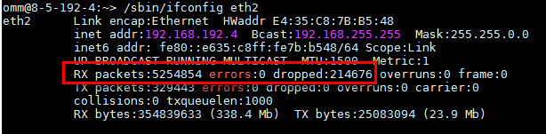
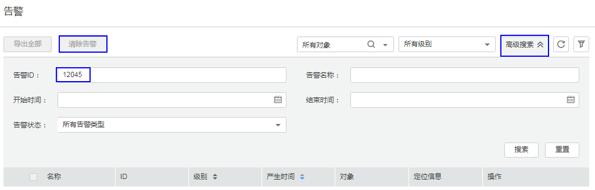
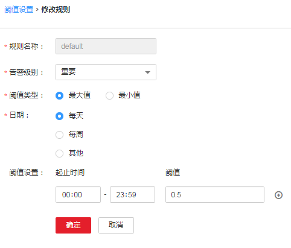

# ALM-12045 网络读包丢包率超过阈值<a name="ALM-12045"></a>

## 告警解释<a name="section5890016"></a>

系统每30秒周期性检测网络读包丢包率，并把实际丢包率和阈值（系统默认阈值0.5%）进行比较，当检测到网络读包丢包率连续多次（默认值为5）超过阈值时产生该告警。

用户可通过“运维 \> 告警 \> 阈值设置 \>  _待操作集群的名称_  \> 主机 \> 网络读信息 \> 读包丢包率”修改阈值。

平滑次数为1，网络读包丢包率小于或等于阈值时，告警恢复；平滑次数大于1，网络读包丢包率小于或等于阈值的90%时，告警恢复。

该告警检测默认关闭。若需要开启，请根据“检查系统环境”步骤，确认该系统是否可以开启该告警发送。

## 告警属性<a name="section53010144"></a>

<a name="table13729674"></a>
<table><thead align="left"><tr id="row33765803"><th class="cellrowborder" valign="top" width="33.33333333333333%" id="mcps1.1.4.1.1"><p id="p50675546"><a name="p50675546"></a><a name="p50675546"></a>告警ID</p>
</th>
<th class="cellrowborder" valign="top" width="33.33333333333333%" id="mcps1.1.4.1.2"><p id="p11078557"><a name="p11078557"></a><a name="p11078557"></a>告警级别</p>
</th>
<th class="cellrowborder" valign="top" width="33.33333333333333%" id="mcps1.1.4.1.3"><p id="p24947933"><a name="p24947933"></a><a name="p24947933"></a>是否自动清除</p>
</th>
</tr>
</thead>
<tbody><tr id="row7516673"><td class="cellrowborder" valign="top" width="33.33333333333333%" headers="mcps1.1.4.1.1 "><p id="p4870770"><a name="p4870770"></a><a name="p4870770"></a>12045</p>
</td>
<td class="cellrowborder" valign="top" width="33.33333333333333%" headers="mcps1.1.4.1.2 "><p id="p58988055"><a name="p58988055"></a><a name="p58988055"></a>重要</p>
</td>
<td class="cellrowborder" valign="top" width="33.33333333333333%" headers="mcps1.1.4.1.3 "><p id="p13303128"><a name="p13303128"></a><a name="p13303128"></a>是</p>
</td>
</tr>
</tbody>
</table>

## 告警参数<a name="section7329254"></a>

<a name="table3811615"></a>
<table><thead align="left"><tr id="row56035103"><th class="cellrowborder" valign="top" width="50%" id="mcps1.1.3.1.1"><p id="p42549504"><a name="p42549504"></a><a name="p42549504"></a>参数名称</p>
</th>
<th class="cellrowborder" valign="top" width="50%" id="mcps1.1.3.1.2"><p id="p23957801"><a name="p23957801"></a><a name="p23957801"></a>参数含义</p>
</th>
</tr>
</thead>
<tbody><tr id="row19518103418389"><td class="cellrowborder" valign="top" width="50%" headers="mcps1.1.3.1.1 "><p id="p17935380415"><a name="p17935380415"></a><a name="p17935380415"></a>来源</p>
</td>
<td class="cellrowborder" valign="top" width="50%" headers="mcps1.1.3.1.2 "><p id="p187931338134115"><a name="p187931338134115"></a><a name="p187931338134115"></a>产生告警的集群或系统名称。</p>
</td>
</tr>
<tr id="row61533763"><td class="cellrowborder" valign="top" width="50%" headers="mcps1.1.3.1.1 "><p id="p18178934"><a name="p18178934"></a><a name="p18178934"></a>服务名</p>
</td>
<td class="cellrowborder" valign="top" width="50%" headers="mcps1.1.3.1.2 "><p id="p63207529"><a name="p63207529"></a><a name="p63207529"></a>产生告警的服务名称。</p>
</td>
</tr>
<tr id="row31996850"><td class="cellrowborder" valign="top" width="50%" headers="mcps1.1.3.1.1 "><p id="p41608040"><a name="p41608040"></a><a name="p41608040"></a>角色名</p>
</td>
<td class="cellrowborder" valign="top" width="50%" headers="mcps1.1.3.1.2 "><p id="p14808116"><a name="p14808116"></a><a name="p14808116"></a>产生告警的角色名称。</p>
</td>
</tr>
<tr id="row66164180"><td class="cellrowborder" valign="top" width="50%" headers="mcps1.1.3.1.1 "><p id="p57698393"><a name="p57698393"></a><a name="p57698393"></a>主机名</p>
</td>
<td class="cellrowborder" valign="top" width="50%" headers="mcps1.1.3.1.2 "><p id="p43058279"><a name="p43058279"></a><a name="p43058279"></a>产生告警的主机名。</p>
</td>
</tr>
<tr id="row51980192"><td class="cellrowborder" valign="top" width="50%" headers="mcps1.1.3.1.1 "><p id="p49646029"><a name="p49646029"></a><a name="p49646029"></a>网口名</p>
</td>
<td class="cellrowborder" valign="top" width="50%" headers="mcps1.1.3.1.2 "><p id="p61905431"><a name="p61905431"></a><a name="p61905431"></a>产生告警的网口名。</p>
</td>
</tr>
<tr id="row20277970"><td class="cellrowborder" valign="top" width="50%" headers="mcps1.1.3.1.1 "><p id="p31902865"><a name="p31902865"></a><a name="p31902865"></a>Trigger Condition</p>
</td>
<td class="cellrowborder" valign="top" width="50%" headers="mcps1.1.3.1.2 "><p id="p33995297"><a name="p33995297"></a><a name="p33995297"></a>系统当前指标取值满足自定义的告警设置条件。</p>
</td>
</tr>
</tbody>
</table>

## 对系统的影响<a name="section65963290"></a>

业务性能下降或者个别业务出现超时问题。

风险提示：在SUSE内核版本3.0以上或RedHat 7.2版本，由于系统内核修改了网络读包丢包数的计数机制，在该系统下，即使网络正常运行，也可能会导致该告警出现，对业务无影响，建议优先按照“检查系统环境”进行排查。

## 可能原因<a name="section56798701"></a>

-   操作系统问题。
-   网卡配置了主备bond模式。
-   告警阈值配置不合理。
-   客户网络环境质量差。

## 处理步骤<a name="section41426264"></a>

**查看网络丢包率**

1.  打开FusionInsight Manager页面，选择“运维 \> 告警 \> 告警”，单击此告警所在行的，查看该告警的主机名称和网卡名称。
2.  以**omm**用户登录该告警所在节点，执行**/sbin/ifconfig **_网卡名称_命令检查网络中是否存在丢包。

    

    > **说明：** 
    >-   告警节点IP地址：根据告警定位信息中的“主机名“字段值，在FusionInsight Manager的“主机”查询对应的IP地址，管理平面和业务平面IP都需要检查。
    >-   丢包率=（dropped个数/RX packets总个数）\*100%，如果丢包率大于该指标所设置的系统阈值（系统默认阈值0.5%），则认为网络读包存在丢包现象。

    -   是，执行[11](#li4196511811134)。
    -   否，执行[3](#li6542838717657)。


**检查系统环境**

1.  <a name="li6542838717657"></a>以**omm**用户登录主OMS节点或者告警所在节点。
2.  执行**cat /etc/\*-release**命令，确认操作系统的类型。
    -   RedHat，执行[5](#li5563721171656)。

        ```
        # cat /etc/*-release
        Red Hat Enterprise Linux Server release 7.2 (Santiago)
        ```

    -   SUSE，执行[6](#li42309040172040)。

        ```
        # cat /etc/*-release
        SUSE Linux Enterprise Server 11 (x86_64)
        VERSION = 11
        PATCHLEVEL = 3
        ```

    -   其他，执行[11](#li4196511811134)。

3.  <a name="li5563721171656"></a>执行**cat /etc/redhat-release**命令，查询操作系统版本是否为RedHat 7.2（x86）或者RedHat 7.4（TaiShan）。

    ```
    # cat /etc/redhat-release
    Red Hat Enterprise Linux Server release 7.2 (Santiago)
    ```

    -   是，不能开启告警发送，执行[7](#li43950618195120)。
    -   否，执行[11](#li4196511811134)。

4.  <a name="li42309040172040"></a>执行**cat /proc/version**命令，查询SUSE内核版本是否为3.0及以上。

    ```
    # cat /proc/version
    Linux version 3.0.101-63-default (geeko@buildhost) (gcc version 4.3.4 [gcc-4_3-branch revision 152973] (SUSE Linux) ) #1 SMP Tue Jun 23 16:02:31 UTC 2015 (4b89d0c)
    ```

    -   是，不能开启告警发送，执行[7](#li43950618195120)。
    -   否，执行[11](#li4196511811134)。

5.  <a name="li43950618195120"></a>登录FusionInsight Manager，进入“运维 \> 告警 \> 阈值设置”页面。

1.  在“阈值设置”页面左侧树形结构中选择“_待操作集群名称_  \>主机 \> 网络读信息 \> 读包丢包率”，查看发送告警开关指示是否打开。
    -   是，说明开启了告警发送，执行[9](#li38517503111027)。
    -   否，已经关闭告警发送，执行[10](#li16613085112024)。

2.  <a name="li38517503111027"></a>关闭该告警“开关”开关，屏蔽对“网络读包丢包率超过阈值”的检测，操作后的结果如下图所示。

    

3.  <a name="li16613085112024"></a>在FusionInsight Manager的“告警”界面，搜索“12045”告警，将未自动清除的该告警全部手动清除，处理完毕。

    

    > **说明：** 
    >“网络读包丢包率超过阈值”的告警ID是12045。


**检查网卡是否配置了主备bond模式。**

1.  <a name="li4196511811134"></a>以**omm**用户登录告警所在节点，执行**ls -l /proc/net/bonding**命令，查看该节点是否存在“/proc/net/bonding“目录。
    -   是，如下所示，则该节点配置了bond模式，执行[12](#li56651960171744)。

        ```
        # ls -l /proc/net/bonding/
        total 0
        -r--r--r-- 1 root root 0 Oct 11 17:35 bond0
        ```

    -   否，如下所示，则该节点未配置bond模式，执行[14](#li61276131112834)。

        ```
        # ls -l /proc/net/bonding/
        ls: cannot access /proc/net/bonding/: No such file or directory
        ```

2.  <a name="li56651960171744"></a>执行**cat /proc/net/bonding/**_bond0_命令，查看配置文件中**Bonding Mode**参数的值是否为**fault-tolerance。**

    > **说明：** 
    >**bond0**为bond配置文件名称，请以[11](#li4196511811134)查询出的文件名称为准。

    ```
    # cat /proc/net/bonding/bond0 
    Ethernet Channel Bonding Driver: v3.7.1 (April 27, 2011)
    
    Bonding Mode: fault-tolerance (active-backup)
    Primary Slave: eth1 (primary_reselect always)
    Currently Active Slave: eth1
    MII Status: up
    MII Polling Interval (ms): 100
    Up Delay (ms): 0
    Down Delay (ms): 0
    
    Slave Interface: eth0
    MII Status: up
    Speed: 1000 Mbps
    Duplex: full
    Link Failure Count: 1
    Slave queue ID: 0
    
    Slave Interface: eth1
    MII Status: up
    Speed: 1000 Mbps
    Duplex: full
    Link Failure Count: 1
    Slave queue ID: 0
    ```

    -   是，该环境的网卡为主备bond模式，执行[13](#li44376005172456)。
    -   否，执行[14](#li61276131112834)。

3.  <a name="li44376005172456"></a>检查该告警中**NetworkCardName**参数对应的网卡是否为备网卡。
    -   是，备网卡的告警无法自动恢复，请在告警管理页面手动清除该告警，处理完毕。
    -   否，执行[14](#li61276131112834)。

        > **说明：** 
        >备网卡判断方式：查看配置文件**/proc/net/bonding/bond0，NetworkCardName**参数对应的网卡名称等于其中一个**Slave Interface**，但是不等于**Currently Active Slave**（当前主网卡），则该网卡为备网卡。


**检查阈值设置是否合理。**

1.  <a name="li61276131112834"></a>登录FusionInsight Manager，选择“运维 \> 告警 \> 阈值设置 \>  _待操作集群的名称_  \> 主机 \> 网络读信息 \> 读包丢包率”，查看该告警阈值是否合理（默认0.5%为合理值，用户可以根据自己的实际需求调整）。
    -   是，执行[17](#li56023883112834)。
    -   否，执行[15](#li47653126112834)。


1.  <a name="li47653126112834"></a>根据实际服务的使用情况在“运维 \> 告警 \> 阈值设置 \>  _待操作集群的名称_  \> 主机 \> 网络读信息 \> 读包丢包率”，单击“操作”列的“修改”，更改告警阈值。如[图1](#fig52784093112834)所示。

    **图 1**  设置告警阈值<a name="fig52784093112834"></a>  
    

2.  等待5分钟，检查该告警是否恢复。
    -   是，处理完毕。
    -   否，执行[17](#li56023883112834)。


**检查网络是否异常。**

1.  <a name="li56023883112834"></a>联系系统管理员，检查网络是否存在异常。
    -   是，恢复网络故障，执行[18](#li4503547112834)。
    -   否，执行[19](#li40531926112834)。

2.  <a name="li4503547112834"></a>等待5分钟，检查该告警是否恢复。
    -   是，处理完毕。
    -   否，执行[19](#li40531926112834)。


**收集故障信息。**

1.  <a name="li40531926112834"></a>在主集群的FusionInsight Manager界面，选择“运维 \> 日志 \> 下载”。
2.  在“服务”中勾选“OMS”，单击“确定”。
3.  设置“主机”为告警所在节点和主OMS节点。
4.  单击右上角的设置日志收集的“开始时间”和“结束时间”分别为告警产生时间的前后30分钟，单击“下载”。
5.  请联系运维人员，并发送已收集的故障日志信息。

## 告警清除<a name="section169311343318"></a>

此告警修复后，系统会自动清除此告警，无需手工清除。

## 参考信息<a name="section37292060"></a>

无。

