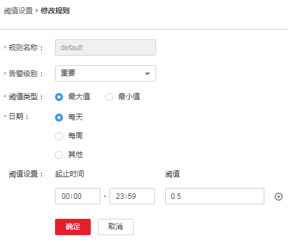

# ALM-12046 网络写包丢包率超过阈值

## 告警解释

系统每30秒周期性检测网络写包丢包率，并把实际丢包率和阈值（系统默认阈值0.5%）进行比较，当检测到网络写包丢包率连续多次（默认值为5）超过阈值时产生该告警。

用户可通过“运维 \> 告警 \> 阈值设置 \>  _待操作集群的名称_  \> 主机 \> 网络写信息 \> 写包丢包率”修改阈值。

平滑次数为1，网络写包丢包率小于或等于阈值时，告警恢复；平滑次数大于1，网络写包丢包率小于或等于阈值的90%时，告警恢复。

## 告警属性

<table><thead align="left"><tr id="row11203870"><th class="cellrowborder" valign="top" width="33.33333333333333%" id="mcps1.1.4.1.1">
告警ID

</th>
<th class="cellrowborder" valign="top" width="33.33333333333333%" id="mcps1.1.4.1.2">
告警级别

</th>
<th class="cellrowborder" valign="top" width="33.33333333333333%" id="mcps1.1.4.1.3">
是否自动清除

</th>
</tr>
</thead>
<tbody><tr id="row26012865"><td class="cellrowborder" valign="top" width="33.33333333333333%" headers="mcps1.1.4.1.1 ">
12046

</td>
<td class="cellrowborder" valign="top" width="33.33333333333333%" headers="mcps1.1.4.1.2 ">
重要

</td>
<td class="cellrowborder" valign="top" width="33.33333333333333%" headers="mcps1.1.4.1.3 ">
是

</td>
</tr>
</tbody>
</table>

## 告警参数

<table><thead align="left"><tr id="row57092581"><th class="cellrowborder" valign="top" width="50%" id="mcps1.1.3.1.1">
参数名称

</th>
<th class="cellrowborder" valign="top" width="50%" id="mcps1.1.3.1.2">
参数含义

</th>
</tr>
</thead>
<tbody><tr id="row153946297383"><td class="cellrowborder" valign="top" width="50%" headers="mcps1.1.3.1.1 ">
来源

</td>
<td class="cellrowborder" valign="top" width="50%" headers="mcps1.1.3.1.2 ">
产生告警的集群或系统名称。

</td>
</tr>
<tr id="row11639714"><td class="cellrowborder" valign="top" width="50%" headers="mcps1.1.3.1.1 ">
服务名

</td>
<td class="cellrowborder" valign="top" width="50%" headers="mcps1.1.3.1.2 ">
产生告警的服务名称。

</td>
</tr>
<tr id="row51653081"><td class="cellrowborder" valign="top" width="50%" headers="mcps1.1.3.1.1 ">
角色名

</td>
<td class="cellrowborder" valign="top" width="50%" headers="mcps1.1.3.1.2 ">
产生告警的角色名称。

</td>
</tr>
<tr id="row32022916"><td class="cellrowborder" valign="top" width="50%" headers="mcps1.1.3.1.1 ">
主机名

</td>
<td class="cellrowborder" valign="top" width="50%" headers="mcps1.1.3.1.2 ">
产生告警的主机名。

</td>
</tr>
<tr id="row61829697"><td class="cellrowborder" valign="top" width="50%" headers="mcps1.1.3.1.1 ">
网口名

</td>
<td class="cellrowborder" valign="top" width="50%" headers="mcps1.1.3.1.2 ">
产生告警的网口名。

</td>
</tr>
<tr id="row58284214"><td class="cellrowborder" valign="top" width="50%" headers="mcps1.1.3.1.1 ">
Trigger Condition

</td>
<td class="cellrowborder" valign="top" width="50%" headers="mcps1.1.3.1.2 ">
系统当前指标取值满足自定义的告警设置条件。

</td>
</tr>
</tbody>
</table>

## 对系统的影响

业务性能下降或者个别业务出现超时问题。

## 可能原因

-   告警阈值配置不合理。
-   客户网络环境质量差。

## 处理步骤

**检查阈值设置是否合理。**

1.  在FusionInsight Manager，选择“运维 \> 告警 \> 阈值设置 \>  _待操作集群的名称_  \> 主机 \> 网络写信息 \> 写包丢包率”，查看该告警阈值是否合理（默认0.5%为合理值，用户可以根据自己的实际需求调节）。
    -   是，执行[4](#li4369794811450)。
    -   否，执行[2](#li5699560811450)。

2.  根据实际服务的使用情况在“运维 \> 告警 \> 阈值设置 \>  _待操作集群的名称_  \> 主机 \> 网络写信息 \> 写包丢包率”，单击“操作”列的“修改”更改告警阈值。

    如[图1](#fig153215311450)所示：

    **图 1**  设置告警阈值  
    

3.  等待5分钟，检查该告警是否恢复。
    -   是，处理完毕。
    -   否，执行[4](#li4369794811450)。

**检查网络是否异常。**

1.  联系系统管理员，检查网络是否存在异常。
    -   是，恢复网络故障，执行[5](#li6056359711450)。
    -   否，执行[6](#li820146511450)。

2.  等待5分钟，检查该告警是否恢复。
    -   是，处理完毕。
    -   否，执行[6](#li820146511450)。

**收集故障信息。**

1.  在主集群的FusionInsight Manager界面，选择“运维 \> 日志 \> 下载”。
2.  在“服务”中勾选“OMS”，单击“确定”。
3.  设置“主机”为告警所在节点和主OMS节点。
4.  单击右上角的设置日志收集的“开始时间”和“结束时间”分别为告警产生时间的前后30分钟，单击“下载”。
5.  请联系运维人员，并发送已收集的故障日志信息。

## 告警清除

此告警修复后，系统会自动清除此告警，无需手工清除。

## 参考信息

无。

