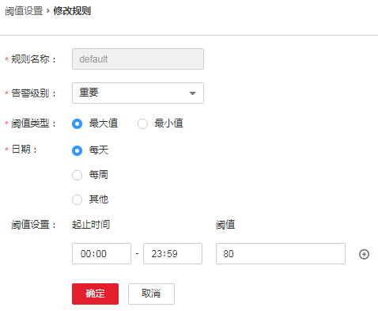

# ALM-12049 网络读吞吐率超过阈值

## 告警解释

系统每30秒周期性检测网络读吞吐率，并把实际吞吐率和阈值（系统默认阈值80%）进行比较，当检测到网络读吞吐率连续多次（默认值为5）超过阈值时产生该告警。

用户可通过“运维 \> 告警 \> 阈值设置 \>  _待操作集群的名称_  \> 主机 \> 网络读信息 \> 读吞吐率”修改阈值。

平滑次数为1，网络读吞吐率小于或等于阈值时，告警恢复；平滑次数大于1，网络读吞吐率小于或等于阈值的90%时，告警恢复。

## 告警属性

<table><thead align="left"><tr id="row63859292"><th class="cellrowborder" valign="top" width="33.33333333333333%" id="mcps1.1.4.1.1">
告警ID

</th>
<th class="cellrowborder" valign="top" width="33.33333333333333%" id="mcps1.1.4.1.2">
告警级别

</th>
<th class="cellrowborder" valign="top" width="33.33333333333333%" id="mcps1.1.4.1.3">
是否自动清除

</th>
</tr>
</thead>
<tbody><tr id="row43800542"><td class="cellrowborder" valign="top" width="33.33333333333333%" headers="mcps1.1.4.1.1 ">
12049

</td>
<td class="cellrowborder" valign="top" width="33.33333333333333%" headers="mcps1.1.4.1.2 ">
重要

</td>
<td class="cellrowborder" valign="top" width="33.33333333333333%" headers="mcps1.1.4.1.3 ">
是

</td>
</tr>
</tbody>
</table>

## 告警参数

<table><thead align="left"><tr id="row55462462"><th class="cellrowborder" valign="top" width="50%" id="mcps1.1.3.1.1">
参数名称

</th>
<th class="cellrowborder" valign="top" width="50%" id="mcps1.1.3.1.2">
参数含义

</th>
</tr>
</thead>
<tbody><tr id="row1819516712383"><td class="cellrowborder" valign="top" width="50%" headers="mcps1.1.3.1.1 ">
来源

</td>
<td class="cellrowborder" valign="top" width="50%" headers="mcps1.1.3.1.2 ">
产生告警的集群或系统名称。

</td>
</tr>
<tr id="row8159332"><td class="cellrowborder" valign="top" width="50%" headers="mcps1.1.3.1.1 ">
服务名

</td>
<td class="cellrowborder" valign="top" width="50%" headers="mcps1.1.3.1.2 ">
产生告警的服务名称。

</td>
</tr>
<tr id="row25888406"><td class="cellrowborder" valign="top" width="50%" headers="mcps1.1.3.1.1 ">
角色名

</td>
<td class="cellrowborder" valign="top" width="50%" headers="mcps1.1.3.1.2 ">
产生告警的角色名称。

</td>
</tr>
<tr id="row11705245"><td class="cellrowborder" valign="top" width="50%" headers="mcps1.1.3.1.1 ">
主机名

</td>
<td class="cellrowborder" valign="top" width="50%" headers="mcps1.1.3.1.2 ">
产生告警的主机名。

</td>
</tr>
<tr id="row28866071"><td class="cellrowborder" valign="top" width="50%" headers="mcps1.1.3.1.1 ">
网口名

</td>
<td class="cellrowborder" valign="top" width="50%" headers="mcps1.1.3.1.2 ">
产生告警的网口名。

</td>
</tr>
<tr id="row14594471"><td class="cellrowborder" valign="top" width="50%" headers="mcps1.1.3.1.1 ">
Trigger Condition

</td>
<td class="cellrowborder" valign="top" width="50%" headers="mcps1.1.3.1.2 ">
系统当前指标取值满足自定义的告警设置条件。

</td>
</tr>
</tbody>
</table>

## 对系统的影响

业务系统运行不正常或不可用。

## 可能原因

-   告警阈值配置不合理。
-   网口速率不满足当前业务需求。

## 处理步骤

**检查阈值设置是否合理。**

1.  在FusionInsight Manager，选择“运维 \> 告警 \> 阈值设置 \>  _待操作集群的名称_  \> 主机 \> 网络读信息 \> 读吞吐率”，查看该告警阈值是否不合理（默认80%为合理值，用户可以根据自己的实际需求调节）。
    -   是，执行[2](#li5311586145835)。
    -   否，执行[4](#li17726490145835)。

2.  根据实际服务的使用情况在“运维 \> 告警 \> 阈值设置 \>  _待操作集群的名称_  \> 主机 \> 网络读信息 \> 读吞吐率”，单击“操作”列的“修改”更改告警阈值。

    如[图1](#fig18292674145835)所示：

    **图 1**  设置告警阈值  
    

3.  等待5分钟，检查该告警是否恢复。
    -   是，处理完毕。
    -   否，执行[4](#li17726490145835)。

**检查网口速率是否满足需求。**

1.  打开FusionInsight Manager页面，在实时告警列表中，单击此告警所在行的，获取告警所在主机地址及网口名称。
2.  以**root**用户登录告警所在主机，用户密码为安装前用户自定义，请咨询系统管理员。
3.  执行命令**ethtool **_网口名称_，查看当前网口速率最大值Speed。

    > **说明：** 
    >对于虚拟机环境，通过命令可能无法查询到网口速率，建议直接联系系统管理确认网口速率是否满足需求。

4.  若网络读吞吐率超过阈值，直接联系系统管理员，提升网口速率。
5.  检查该告警是否恢复。
    -   是，处理完毕。
    -   否，执行[9](#li41384284145835)。

**收集故障信息。**

1.  在主集群的FusionInsight Manager界面，选择“运维 \> 日志 \> 下载”。
2.  在“服务”中勾选“OMS”，单击“确定”。
3.  设置“主机”为告警所在节点和主OMS节点。
4.  单击右上角的设置日志收集的“开始时间”和“结束时间”分别为告警产生时间的前后30分钟，单击“下载”。
5.  请联系运维人员，并发送已收集的故障日志信息。

## 告警清除

此告警修复后，系统会自动清除此告警，无需手工清除。

## 参考信息

无。

