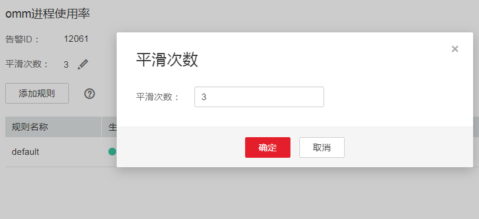
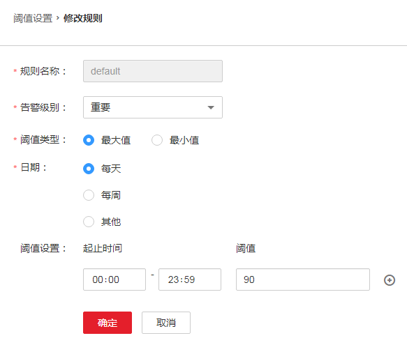

# ALM-12061 进程使用率超过阈值

## 告警解释

系统每30秒周期性检测omm进程使用情况，执行**ps -o nlwp,pid,args, -u omm | awk '\{sum+=$1\} END \{print "", sum\}'**命令，获取当前omm用户并发的所有进程数，在omm用户下，执行**ulimit -u**，获取omm用户可以同时打开的进程最大数。

结果相除，获取到对应的omm用户进程使用率。进程使用率默认提供一个阈值范围。当检测到进程使用率超出阈值范围时产生该告警。

平滑次数为3，进程使用率小于或等于阈值时，告警恢复；如果当前平滑次数大于1，进程使用率小于或等于阈值的90%时，告警恢复。

## 告警属性

<table><thead align="left"><tr id="row1697067"><th class="cellrowborder" valign="top" width="33.33333333333333%" id="mcps1.1.4.1.1">
告警ID

</th>
<th class="cellrowborder" valign="top" width="33.33333333333333%" id="mcps1.1.4.1.2">
告警级别

</th>
<th class="cellrowborder" valign="top" width="33.33333333333333%" id="mcps1.1.4.1.3">
是否自动清除

</th>
</tr>
</thead>
<tbody><tr id="row13993929"><td class="cellrowborder" valign="top" width="33.33333333333333%" headers="mcps1.1.4.1.1 ">
12061

</td>
<td class="cellrowborder" valign="top" width="33.33333333333333%" headers="mcps1.1.4.1.2 ">
重要

</td>
<td class="cellrowborder" valign="top" width="33.33333333333333%" headers="mcps1.1.4.1.3 ">
是

</td>
</tr>
</tbody>
</table>

## 告警参数

<table><thead align="left"><tr id="row8844317"><th class="cellrowborder" valign="top" width="50%" id="mcps1.1.3.1.1">
参数名称

</th>
<th class="cellrowborder" valign="top" width="50%" id="mcps1.1.3.1.2">
参数含义

</th>
</tr>
</thead>
<tbody><tr id="row22512557361"><td class="cellrowborder" valign="top" width="50%" headers="mcps1.1.3.1.1 ">
来源

</td>
<td class="cellrowborder" valign="top" width="50%" headers="mcps1.1.3.1.2 ">
产生告警的集群或系统名称。

</td>
</tr>
<tr id="row62154648"><td class="cellrowborder" valign="top" width="50%" headers="mcps1.1.3.1.1 ">
服务名

</td>
<td class="cellrowborder" valign="top" width="50%" headers="mcps1.1.3.1.2 ">
产生告警的服务名称。

</td>
</tr>
<tr id="row53155797"><td class="cellrowborder" valign="top" width="50%" headers="mcps1.1.3.1.1 ">
角色名

</td>
<td class="cellrowborder" valign="top" width="50%" headers="mcps1.1.3.1.2 ">
产生告警的角色名称。

</td>
</tr>
<tr id="row48022388"><td class="cellrowborder" valign="top" width="50%" headers="mcps1.1.3.1.1 ">
主机名

</td>
<td class="cellrowborder" valign="top" width="50%" headers="mcps1.1.3.1.2 ">
产生告警的主机名。

</td>
</tr>
<tr id="row56075505"><td class="cellrowborder" valign="top" width="50%" headers="mcps1.1.3.1.1 ">
Trigger Condition

</td>
<td class="cellrowborder" valign="top" width="50%" headers="mcps1.1.3.1.2 ">
系统当前指标取值满足自定义的告警设置条件。

</td>
</tr>
</tbody>
</table>

## 对系统的影响

-   无法切换到omm用户。
-   无法创建新的omm线程。

## 可能原因

-   告警阈值配置不合理。
-   omm用户可以同时打开的进程（包括线程）的最大个数配置不合理。
-   同时打开的进程过多。

## 处理步骤

**检查告警阈值配置或者平滑次数配置是否合理。**

1.  在FusionInsight Manager界面，基于实际CPU使用情况，修改告警阈值和平滑次数配置项。

    根据实际服务的使用情况在“运维 \> 告警 \> 阈值设置 \>  _待操作集群的名称_  \> 主机 \> 进程 \> omm 进程使用率”中更改告警的平滑次数，如[图1](#fig1121518322278)所示。

    > **说明：** 
    >该选项的含义为告警检查阶段，“平滑次数”为连续检查多少次超过阈值，则发送告警。

    **图 1**  设置告警平滑次数  
    

    根据实际服务的使用情况在“运维 \> 告警 \> 阈值设置 \>  _待操作集群的名称_  \> 主机 \> 进程 \> omm 进程使用率”中修改对应规则的阈值，如[图2](#fig443025216343)所示。

    **图 2**  设置告警阈值  
    

2.  等待2分钟，查看告警是否自动恢复。
    -   是，处理完毕。
    -   否，执行[3](#li9261523114510)。

**检查系统omm用户同时打开的进程（包括线程）最大数的配置是否合理。**

1.  打开FusionInsight Manager页面，在告警列表中，单击此告警所在行的，查看该告警的主机地址
2.  以**root**用户登录告警所在主机，用户密码为安装前用户自定义，请咨询系统管理员。
3.  执行命令**su - omm**，切换到**omm**用户。
4.  执行命令**ulimit -u**，获取到当前配置的omm用户同时打开的线程最大数的配置值，查看该值是否大于等于60000。
    -   是，执行[8](#li591581469423)。
    -   否，执行[7](#li123911910143911)。

1.  执行命令**ulimit -u 60000**，将**omm**用户的该配置修改为60000，等待2分钟，查看告警是否消失。
    -   是，处理完毕。
    -   否，执行[12](#li244776269423)。

**检查是否同时打开的进程过多。**

1.  打开FusionInsight Manager页面，在告警列表中，单击此告警所在行的，查看该告警的主机地址。
2.  以**root**用户登录告警所在主机。
3.  执行命令**ps -o nlwp,pid,lwp,args, -u omm|sort -n**，查看系统当前使用的线程数量。

    命令回显结果是基于线程数排序的，分析线程数最大的top5线程，结合业务分析是否异常使用，如果是，则需要联系相关维护人员修复该异常，如果所有线程均正常使用，则需要执行**ulimit -u**命令，将该值调整到大于60000。

4.  等待5分钟，检查该告警是否恢复。
    -   是，处理完毕。
    -   否，执行[12](#li244776269423)。

**收集故障信息。**

1.  在集群的FusionInsight Manager界面，选择“运维 \> 日志 \> 下载”。
2.  在“服务”中勾选“OmmServer”和“NodeAgent”，单击“确定”。
3.  单击右上角的设置日志收集的“开始时间”和“结束时间”分别为告警产生时间的前后10分钟，单击“下载”。
4.  请联系运维人员，并发送已收集的故障日志信息。

## 告警清除

此告警修复后，系统会自动清除此告警，无需手工清除。

## 参考信息

无。

