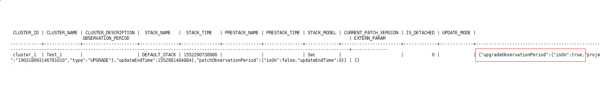

# ALM-12087 系统处于升级观察期

## 告警解释

系统定时在每天零点查看当前系统是否处于升级观察期，同时检查进入升级观察时间是否超过了为客户预留的升级观察期时间（默认为10天）。当系统处于升级观察期，并且进入升级观察期时间超过了为客户预留的升级观察期时间（默认时间为10天）时，系统触发此告警。如果用户进行了回滚或者提交操作，使得系统退出升级观察期，该告警将会自动清除。

## 告警属性

<table><thead align="left"><tr id="row863916477305"><th class="cellrowborder" valign="top" width="33.33333333333333%" id="mcps1.1.4.1.1">
<strong id="b1364011475301">告警ID</strong>

</th>
<th class="cellrowborder" valign="top" width="33.33333333333333%" id="mcps1.1.4.1.2">
<strong id="b364314472307">告警级别</strong>

</th>
<th class="cellrowborder" valign="top" width="33.33333333333333%" id="mcps1.1.4.1.3">
<strong id="b1164794712304">是否自动清除</strong>

</th>
</tr>
</thead>
<tbody><tr id="row9649184714301"><td class="cellrowborder" valign="top" width="33.33333333333333%" headers="mcps1.1.4.1.1 ">
12087

</td>
<td class="cellrowborder" valign="top" width="33.33333333333333%" headers="mcps1.1.4.1.2 ">
重要

</td>
<td class="cellrowborder" valign="top" width="33.33333333333333%" headers="mcps1.1.4.1.3 ">
是

</td>
</tr>
</tbody>
</table>

## 告警参数

<table><thead align="left"><tr id="row113281829183119"><th class="cellrowborder" valign="top" width="50%" id="mcps1.1.3.1.1">
<strong id="b1333072963118">参数名称</strong>

</th>
<th class="cellrowborder" valign="top" width="50%" id="mcps1.1.3.1.2">
<strong id="b0331429203119">参数含义</strong>

</th>
</tr>
</thead>
<tbody><tr id="row1439552417346"><td class="cellrowborder" valign="top" width="50%" headers="mcps1.1.3.1.1 ">
来源

</td>
<td class="cellrowborder" valign="top" width="50%" headers="mcps1.1.3.1.2 ">
产生告警的集群或系统名称。

</td>
</tr>
<tr id="row15331329113114"><td class="cellrowborder" valign="top" width="50%" headers="mcps1.1.3.1.1 ">
服务名

</td>
<td class="cellrowborder" valign="top" width="50%" headers="mcps1.1.3.1.2 ">
产生告警的服务名称。

</td>
</tr>
<tr id="row73341329113119"><td class="cellrowborder" valign="top" width="50%" headers="mcps1.1.3.1.1 ">
角色名

</td>
<td class="cellrowborder" valign="top" width="50%" headers="mcps1.1.3.1.2 ">
产生告警的角色名称。

</td>
</tr>
<tr id="row14826113412581"><td class="cellrowborder" valign="top" width="50%" headers="mcps1.1.3.1.1 ">
主机名

</td>
<td class="cellrowborder" valign="top" width="50%" headers="mcps1.1.3.1.2 ">
产生告警的主机名。

</td>
</tr>
<tr id="row18335112918313"><td class="cellrowborder" valign="top" width="50%" headers="mcps1.1.3.1.1 ">
Upgrade Observation Period (Days)

</td>
<td class="cellrowborder" valign="top" width="50%" headers="mcps1.1.3.1.2 ">
进入升级观察期的时间（天）。

</td>
</tr>
</tbody>
</table>

## 对系统的影响

会导致下一次升级或者补丁失败。

## 可能原因

系统升级之后超过一定时间（默认为10天）未做升级提交。

## 处理步骤

**查看系统是否处于升级观察期。**

1.  以**root**用户登录主管理节点，用户密码为安装前用户自定义，请咨询系统管理员。管理节点的主备状态及对应IP地址可在FusionInsight Manager主机管理界面查看。

1.  执行以下命令，切换至omm用户并登录omm数据库。

    **su - omm**

    **gsql -U omm**_ _**-W **_ __omm数据库密码__ _**-p 20015**

2.  执行命令** select \* from OM\_CLUSTERS;**，查看集群信息。
3.  查看图中upgradObservationPeriod isON值是否为true，如[图1](#fig1299312444469)所示。
    -   是，表示系统当前处于升级观察期，请使用UpdateTool工具提交该次升级，具体操作参考相应版本的升级指导书。
    -   否，执行[6](#li1479263012376)。

        **图 1**  集群信息  
        

4.  等待第二天凌晨，查看告警是否清除。
    -   是，操作结束。
    -   否，执行[6](#li1479263012376)。

**收集故障信息**

1.  在FusionInsight Manager界面，选择“运维 \> 日志 \> 下载”。
2.  在“服务”中勾选“Controller”，单击“确定”。
3.  单击右上角的设置日志收集的时间范围，一般为告警产生时间的前后10分钟，单击“下载”。
4.  请联系运维人员，并发送已收集的故障日志信息。

## 告警清除

此告警修复后，系统会自动清除此告警，无需手工清除。

## 参考信息

无。

