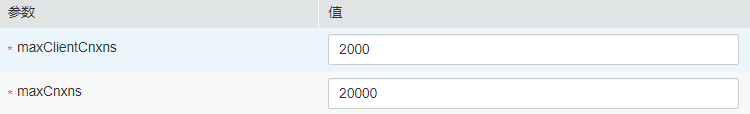

# ALM-13001 ZooKeeper可用连接数不足

## 告警解释

系统每60秒周期性检测ZooKeeper服务连接数状态，当检测到ZooKeeper实例连接数超出阈值（最大连接数的80%）时产生该告警。

平滑次数为1，ZooKeeper可用连接数小于或等于阈值时，告警恢复；平滑次数大于1，ZooKeeper可用连接数小于或等于阈值的90%时，告警恢复。

## 告警属性

<table><thead align="left"><tr id="row7891871"><th class="cellrowborder" valign="top" width="33.33333333333333%" id="mcps1.1.4.1.1">
告警ID

</th>
<th class="cellrowborder" valign="top" width="33.33333333333333%" id="mcps1.1.4.1.2">
告警级别

</th>
<th class="cellrowborder" valign="top" width="33.33333333333333%" id="mcps1.1.4.1.3">
是否自动清除

</th>
</tr>
</thead>
<tbody><tr id="row40389877"><td class="cellrowborder" valign="top" width="33.33333333333333%" headers="mcps1.1.4.1.1 ">
13001

</td>
<td class="cellrowborder" valign="top" width="33.33333333333333%" headers="mcps1.1.4.1.2 ">
重要

</td>
<td class="cellrowborder" valign="top" width="33.33333333333333%" headers="mcps1.1.4.1.3 ">
是

</td>
</tr>
</tbody>
</table>

## 告警参数

<table><thead align="left"><tr id="row27794227"><th class="cellrowborder" valign="top" width="50%" id="mcps1.1.3.1.1">
参数名称

</th>
<th class="cellrowborder" valign="top" width="50%" id="mcps1.1.3.1.2">
参数含义

</th>
</tr>
</thead>
<tbody><tr id="row5210193243314"><td class="cellrowborder" valign="top" width="50%" headers="mcps1.1.3.1.1 ">
来源

</td>
<td class="cellrowborder" valign="top" width="50%" headers="mcps1.1.3.1.2 ">
产生告警的集群名称。

</td>
</tr>
<tr id="row62714135"><td class="cellrowborder" valign="top" width="50%" headers="mcps1.1.3.1.1 ">
服务名

</td>
<td class="cellrowborder" valign="top" width="50%" headers="mcps1.1.3.1.2 ">
产生告警的服务名称。

</td>
</tr>
<tr id="row5673382"><td class="cellrowborder" valign="top" width="50%" headers="mcps1.1.3.1.1 ">
角色名

</td>
<td class="cellrowborder" valign="top" width="50%" headers="mcps1.1.3.1.2 ">
产生告警的角色名称。

</td>
</tr>
<tr id="row101352"><td class="cellrowborder" valign="top" width="50%" headers="mcps1.1.3.1.1 ">
主机名

</td>
<td class="cellrowborder" valign="top" width="50%" headers="mcps1.1.3.1.2 ">
产生告警的主机名。

</td>
</tr>
<tr id="row12096212"><td class="cellrowborder" valign="top" width="50%" headers="mcps1.1.3.1.1 ">
Trigger Condition

</td>
<td class="cellrowborder" valign="top" width="50%" headers="mcps1.1.3.1.2 ">
系统当前指标取值满足自定义的告警设置条件。

</td>
</tr>
</tbody>
</table>

## 对系统的影响

ZooKeeper可用连接数不足，当连接率超过100%时无法处理外部连接。

## 可能原因

该节点ZooKeeper连接量过大，超过阈值。某些连接进程存在连接泄露，或配置的最大连接数不符合实际使用场景。

## 处理步骤

**检查连接状态。**

1.  在FusionInsight Manager首页，选择“运维 \> 告警 \> 告警”，单击告警“ZooKeeper可用连接数不足”所在行的下拉菜单，在定位信息中确认告警上报的主机名所在的节点IP地址。
2.  获取ZooKeeper进程pid。以**root**用户登录到告警上报的节点，用户密码为安装前用户自定义，请咨询系统管理员，执行命令：**pgrep -f proc\_zookeeper**。
3.  是否正常获取pid。
    -   是，执行[4](#li4771552716024)。
    -   否，执行[15](#li3558651916024)。

4.  获取所有与当前ZooKeeper实例连接的IP及连接数量，取连接数最多的前十个进行检查。根据获取到的pid值，执行命令**lsof -i|grep **_$pid_** | awk '\{print $9\}' | cut -d : -f 2 | cut -d \\\> -f 2 | awk '\{a\[$1\]++\} END \{for\(i in a\)\{print i,a\[i\] | "sort -r -g -k 2"\}\}' | head -10 **。（$pid为上一步获取的pid值）
5.  获取节点IP与连接数是否成功。
    -   是，执行[6](#li3591731816024)。
    -   否，执行[15](#li3558651916024)。

6.  获取连接进程的端口号。根据获取到的pid与IP值，执行命令**lsof -i|grep **_$pid_** | awk '\{print $9\}'|cut -d \\\> -f 2 |grep **_$IP_**| cut -d : -f 2 **。（$pid与$IP为上一步获取的pid值与IP值）
7.  获取端口号port成功。
    -   是，执行[8](#li5425953216024)。
    -   否，执行[15](#li3558651916024)。

8.  获取连接进程的进程号。依次登录到各IP，根据获取到的port号，执行命令**lsof -i|grep **_$port_。（$port为上一步获取端口号）
9.  获取进程号成功。
    -   是，执行[10](#li6614378116024)。
    -   否，执行[15](#li3558651916024)。

10. 根据获取到的进程号，查看进程是否存在连接泄露。
    -   是，执行[11](#li5540288416024)。
    -   否，执行[12](#li2886390916024)。

11. 将存在连接泄露的进程关掉，观察界面上告警是否消除。
    -   是，处理完毕。
    -   否，执行[12](#li2886390916024)。

12. 在FusionInsight Manager首页，选择“集群 \>  _待操作集群的名称_  \> 服务 \> ZooKeeper \> 配置 \> 全部配置 \> quorumpeer \> 性能”中，将“maxCnxns”的值根据实际情况调大。

    **图 1**  maxCnxns  
    

13. 保存配置，并重启ZooKeeper服务。
14. 界面上告警是否消除。
    -   是，处理完毕。
    -   否，执行[15](#li3558651916024)。

**收集故障信息。**

1.  在FusionInsight Manager界面，选择“运维 \> 日志 \> 下载”。
2.  在“服务”中勾选待操作集群的“ZooKeeper”。
3.  单击右上角的设置日志收集的“开始时间”和“结束时间”分别为告警产生时间的前后10分钟，单击“下载”。
4.  请联系运维人员，并发送已收集的故障日志信息。

## 告警清除

此告警修复后，系统会自动清除此告警，无需手工清除。

## 参考信息

无。

