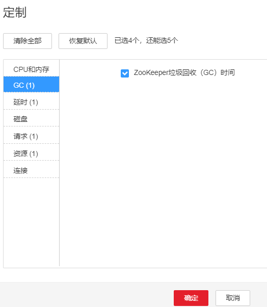

# ALM-13003 ZooKeeper进程垃圾回收（GC）时间超过阈值

## 告警解释

系统每60秒周期性检测ZooKeeper进程的垃圾回收（GC）占用时间，当检测到ZooKeeper进程的垃圾回收（GC）时间超出阈值（默认12秒）时，产生该告警。

垃圾回收（GC）时间小于阈值时，告警恢复。

## 告警属性

<table><thead align="left"><tr id="row39131625"><th class="cellrowborder" valign="top" width="33.33333333333333%" id="mcps1.1.4.1.1">
告警ID

</th>
<th class="cellrowborder" valign="top" width="33.33333333333333%" id="mcps1.1.4.1.2">
告警级别

</th>
<th class="cellrowborder" valign="top" width="33.33333333333333%" id="mcps1.1.4.1.3">
是否自动清除

</th>
</tr>
</thead>
<tbody><tr id="row54354670"><td class="cellrowborder" valign="top" width="33.33333333333333%" headers="mcps1.1.4.1.1 ">
13003

</td>
<td class="cellrowborder" valign="top" width="33.33333333333333%" headers="mcps1.1.4.1.2 ">
重要

</td>
<td class="cellrowborder" valign="top" width="33.33333333333333%" headers="mcps1.1.4.1.3 ">
是

</td>
</tr>
</tbody>
</table>

## 告警参数

<table><thead align="left"><tr id="row66416598"><th class="cellrowborder" valign="top" width="50%" id="mcps1.1.3.1.1">
参数名称

</th>
<th class="cellrowborder" valign="top" width="50%" id="mcps1.1.3.1.2">
参数含义

</th>
</tr>
</thead>
<tbody><tr id="row1972162216335"><td class="cellrowborder" valign="top" width="50%" headers="mcps1.1.3.1.1 ">
来源

</td>
<td class="cellrowborder" valign="top" width="50%" headers="mcps1.1.3.1.2 ">
产生告警的集群名称。

</td>
</tr>
<tr id="row59582941"><td class="cellrowborder" valign="top" width="50%" headers="mcps1.1.3.1.1 ">
服务名

</td>
<td class="cellrowborder" valign="top" width="50%" headers="mcps1.1.3.1.2 ">
产生告警的服务名称。

</td>
</tr>
<tr id="row63830828"><td class="cellrowborder" valign="top" width="50%" headers="mcps1.1.3.1.1 ">
角色名

</td>
<td class="cellrowborder" valign="top" width="50%" headers="mcps1.1.3.1.2 ">
产生告警的角色名称。

</td>
</tr>
<tr id="row44336985"><td class="cellrowborder" valign="top" width="50%" headers="mcps1.1.3.1.1 ">
主机名

</td>
<td class="cellrowborder" valign="top" width="50%" headers="mcps1.1.3.1.2 ">
产生告警的主机名。

</td>
</tr>
<tr id="row3663763"><td class="cellrowborder" valign="top" width="50%" headers="mcps1.1.3.1.1 ">
Trigger Condition

</td>
<td class="cellrowborder" valign="top" width="50%" headers="mcps1.1.3.1.2 ">
系统当前指标取值满足自定义的告警设置条件。

</td>
</tr>
</tbody>
</table>

## 对系统的影响

ZooKeeper进程的垃圾回收时间过长，可能影响该ZooKeeper进程正常提供服务。

## 可能原因

该节点ZooKeeper实例堆内存使用率过大，或配置的堆内存不合理，导致进程GC频繁。

## 处理步骤

**检查GC时间。**

1.  在FusionInsight Manager首页，选择“运维 \> 告警 \> 告警”，单击告警“ZooKeeper进程垃圾回收（GC）时间超过阈值”所在行的下拉菜单。查看告警上报的实例的IP地址。
2.  在FusionInsight Manager首页，选择“集群 \>  _待操作集群的名称_  \> 服务 \> ZooKeeper \> 实例 \> quorumpeer”。单击图表区域右上角的下拉菜单，选择“定制 \> GC”，勾选“ZooKeeper垃圾回收（GC）时间”，单击“确定”，查看ZooKeeper每分钟的垃圾回收时间统计情况。

    **图 1**  ZooKeeper垃圾回收（GC）时间  
    

3.  查看ZooKeeper每分钟的垃圾回收时间统计值是否大于告警阈值（默认12秒）。
    -   是，执行[4](#li1332215316392)。
    -   否，执行[8](#li12535847161327)。

4.  请先排查应用程序是否存在内存泄露等问题。
5.  在FusionInsight Manager首页，选择“集群 \>  _待操作集群的名称_  \> 服务 \> ZooKeeper \> 配置 \> 全部配置 \> quorumpeer \> 系统”。将“GC\_OPTS”参数值根据实际情况调大。

    > **说明：** 
    >-Xmx一般配置为ZooKeeper数据容量的2倍，如果ZooKeeper容量达到2G，则GC\_OPTS建议配置为：
    >-Xms4G -Xmx4G -XX:NewSize=512M -XX:MaxNewSize=512M -XX:MetaspaceSize=64M -XX:MaxMetaspaceSize=64M -XX:CMSFullGCsBeforeCompaction=1

6.  保存配置，并重启ZooKeeper服务。
7.  观察界面告警是否清除。
    -   是，处理完毕。
    -   否，执行[8](#li12535847161327)。

**收集故障信息。**

1.  在FusionInsight Manager界面，选择“运维 \> 日志 \> 下载”。
2.  在“服务”中勾选待操作集群的“ZooKeeper”。
3.  单击右上角的设置日志收集的“开始时间”和“结束时间”分别为告警产生时间的前后10分钟，单击“下载”。
4.  请联系运维人员，并发送已收集的故障日志信息。

## 告警清除

此告警修复后，系统会自动清除此告警，无需手工清除。

## 参考信息

无。

