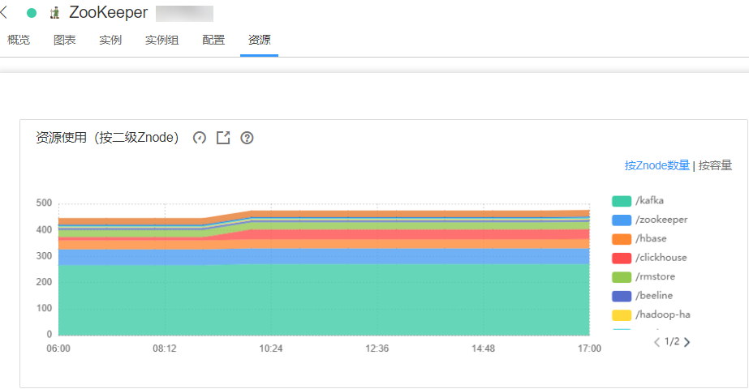
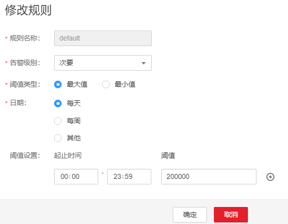

# ALM-13006 Znode数量或容量超过阈值

## 告警解释

系统每4小时周期性检测ZooKeeper服务数据目录下二级znode状态，当检测到二级Znode数量或者容量超过阈值时产生该告警。

## 告警属性

<table><thead align="left"><tr id="row24697033"><th class="cellrowborder" valign="top" width="33.33333333333333%" id="mcps1.1.4.1.1">
告警ID

</th>
<th class="cellrowborder" valign="top" width="33.33333333333333%" id="mcps1.1.4.1.2">
告警级别

</th>
<th class="cellrowborder" valign="top" width="33.33333333333333%" id="mcps1.1.4.1.3">
是否自动清除

</th>
</tr>
</thead>
<tbody><tr id="row37919625"><td class="cellrowborder" valign="top" width="33.33333333333333%" headers="mcps1.1.4.1.1 ">
13006

</td>
<td class="cellrowborder" valign="top" width="33.33333333333333%" headers="mcps1.1.4.1.2 ">
次要

</td>
<td class="cellrowborder" valign="top" width="33.33333333333333%" headers="mcps1.1.4.1.3 ">
是

</td>
</tr>
</tbody>
</table>

## 告警参数

<table><thead align="left"><tr id="row55869420"><th class="cellrowborder" valign="top" width="50%" id="mcps1.1.3.1.1">
参数名称

</th>
<th class="cellrowborder" valign="top" width="50%" id="mcps1.1.3.1.2">
参数含义

</th>
</tr>
</thead>
<tbody><tr id="row184926319331"><td class="cellrowborder" valign="top" width="50%" headers="mcps1.1.3.1.1 ">
来源

</td>
<td class="cellrowborder" valign="top" width="50%" headers="mcps1.1.3.1.2 ">
产生告警的集群名称。

</td>
</tr>
<tr id="row57640736"><td class="cellrowborder" valign="top" width="50%" headers="mcps1.1.3.1.1 ">
服务名

</td>
<td class="cellrowborder" valign="top" width="50%" headers="mcps1.1.3.1.2 ">
产生告警的服务名称。

</td>
</tr>
<tr id="row477048"><td class="cellrowborder" valign="top" width="50%" headers="mcps1.1.3.1.1 ">
服务目录

</td>
<td class="cellrowborder" valign="top" width="50%" headers="mcps1.1.3.1.2 ">
产生告警的目录名称。

</td>
</tr>
<tr id="row50597141"><td class="cellrowborder" valign="top" width="50%" headers="mcps1.1.3.1.1 ">
Trigger Condition

</td>
<td class="cellrowborder" valign="top" width="50%" headers="mcps1.1.3.1.2 ">
系统当前指标取值满足自定义的告警设置条件。

</td>
</tr>
</tbody>
</table>

## 对系统的影响

向ZooKeeper数据目录空间写入大量数据，导致ZooKeeper无法对外正常提供服务。

## 可能原因

往ZooKeeper数据目录空间写入大量数据，或者自定义阈值设置不合理。

## 处理步骤

**检查告警目录是否写入大量数据**

1.  在FusionInsight Manager首页，选择“运维 \> 告警 \> 告警”，单击告警“Znode数量或容量超过阈值”所在行的下拉菜单，在定位信息中确认告警上报的Znode。
2.  登录FusionInsight Manager，选择“集群 \>  _待操作集群的名称_  \> 服务 \> ZooKeeper”，单击“资源”，在表“资源使用（按二级Znode）”中，查看告警对应Znode是否被写入较多数据。

    -   是，执行[3](#li40737202161840)。
    -   否，执行[4](#li1932073512913)。

    **图 1**  资源使用（按二级Znode）  
    

3.  登录ZooKeeper客户端，删除告警对应Znode下的无用数据。
4.  登录FusionInsight Manager，选择“集群 \>  _待操作集群的名称_  \> 服务 \> ZooKeeper”，在“资源”页面中，单击“资源使用\(按二级Znode\)”中的“按Znode数量”然后单击，进入“按Znode数量”的“阈值设置”页面，单击“操作”下的“修改”。参考“集群 \>  _待操作集群的名称_  \> 服务 \> ZooKeeper \> 配置 \> 全部配置 \> 配额”中参数“max.znode.count”的值，调大阈值。

    **图 2**  修改规则  
    

5.  单击“资源使用\(按二级Znode\)”中的“按容量”然后单击，进入“按容量”的“阈值设置”页面，单击“操作”下的“修改”。参考“集群 \>  _待操作集群的名称_  \> 服务 \> ZooKeeper \> 配置 \> 全部配置 \> 配额”中参数“max.data.size”的值，调大阈值。
6.  观察界面告警是否清除。
    -   是，处理完毕。
    -   否，执行[7](#li57092876161840)。

**收集故障信息**

1.  在FusionInsight Manager界面，选择“运维 \> 日志 \> 下载”。
2.  在“服务”中勾选待操作集群的“ZooKeeper”。
3.  单击右上角的设置日志收集的“开始时间”和“结束时间”分别为告警产生时间的前后10分钟，单击“下载”。
4.  请联系运维人员，并发送已收集的故障日志信息。

## 告警清除

此告警修复后，系统会自动清除此告警，无需手工清除。

## 参考信息

无。

