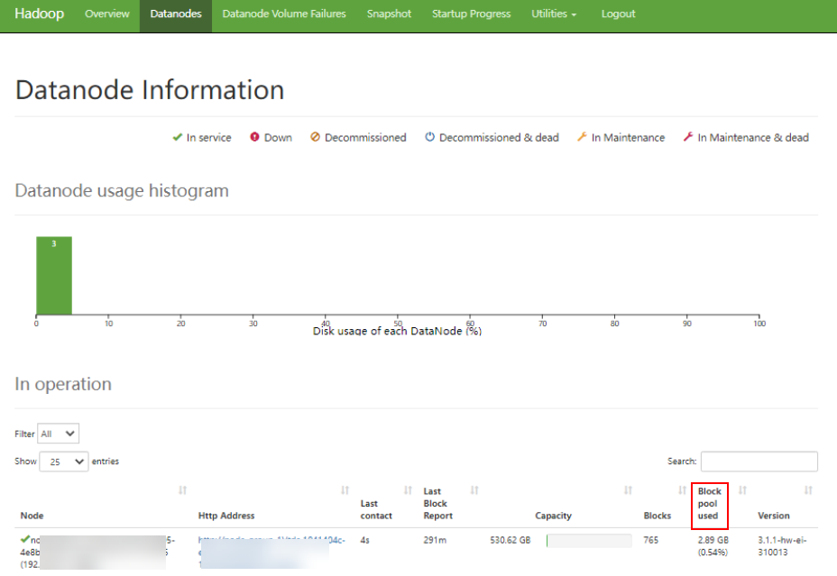

# ALM-14001 HDFS磁盘空间使用率超过阈值

## 告警解释

系统每30秒周期性检测HDFS磁盘空间使用率，并把实际的HDFS磁盘空间使用率和阈值相比较。HDFS磁盘使用率指标默认提供一个阈值范围。当HDFS磁盘空间使用率超出阈值范围时，产生该告警。

用户可通过“运维 \> 告警 \> 阈值设置 \>  _待操作集群的名称_  \> HDFS”修改阈值。

平滑次数为1，HDFS磁盘使用率小于或等于阈值时，告警恢复；平滑次数大于1，HDFS磁盘使用率小于或等于阈值的90%时，告警恢复。

## 告警属性

<table><thead align="left"><tr id="row40817340"><th class="cellrowborder" valign="top" width="33.33333333333333%" id="mcps1.1.4.1.1">
告警ID

</th>
<th class="cellrowborder" valign="top" width="33.33333333333333%" id="mcps1.1.4.1.2">
告警级别

</th>
<th class="cellrowborder" valign="top" width="33.33333333333333%" id="mcps1.1.4.1.3">
是否自动清除

</th>
</tr>
</thead>
<tbody><tr id="row10092231"><td class="cellrowborder" valign="top" width="33.33333333333333%" headers="mcps1.1.4.1.1 ">
14001

</td>
<td class="cellrowborder" valign="top" width="33.33333333333333%" headers="mcps1.1.4.1.2 ">
重要

</td>
<td class="cellrowborder" valign="top" width="33.33333333333333%" headers="mcps1.1.4.1.3 ">
是

</td>
</tr>
</tbody>
</table>

## 告警参数

<table><thead align="left"><tr id="row44686168"><th class="cellrowborder" valign="top" width="50%" id="mcps1.1.3.1.1">
参数名称

</th>
<th class="cellrowborder" valign="top" width="50%" id="mcps1.1.3.1.2">
参数含义

</th>
</tr>
</thead>
<tbody><tr id="row11425192310327"><td class="cellrowborder" valign="top" width="50%" headers="mcps1.1.3.1.1 ">
来源

</td>
<td class="cellrowborder" valign="top" width="50%" headers="mcps1.1.3.1.2 ">
产生告警的集群名称。

</td>
</tr>
<tr id="row46845284"><td class="cellrowborder" valign="top" width="50%" headers="mcps1.1.3.1.1 ">
服务名

</td>
<td class="cellrowborder" valign="top" width="50%" headers="mcps1.1.3.1.2 ">
产生告警的服务名称。

</td>
</tr>
<tr id="row6915351"><td class="cellrowborder" valign="top" width="50%" headers="mcps1.1.3.1.1 ">
角色名

</td>
<td class="cellrowborder" valign="top" width="50%" headers="mcps1.1.3.1.2 ">
产生告警的角色名称。

</td>
</tr>
<tr id="row54242887"><td class="cellrowborder" valign="top" width="50%" headers="mcps1.1.3.1.1 ">
主机名

</td>
<td class="cellrowborder" valign="top" width="50%" headers="mcps1.1.3.1.2 ">
产生告警的主机名。

</td>
</tr>
<tr id="row16395729"><td class="cellrowborder" valign="top" width="50%" headers="mcps1.1.3.1.1 ">
NameService名

</td>
<td class="cellrowborder" valign="top" width="50%" headers="mcps1.1.3.1.2 ">
产生告警的NameService名称。

</td>
</tr>
<tr id="row38971291"><td class="cellrowborder" valign="top" width="50%" headers="mcps1.1.3.1.1 ">
Trigger condition

</td>
<td class="cellrowborder" valign="top" width="50%" headers="mcps1.1.3.1.2 ">
系统当前指标取值满足自定义的告警设置条件。

</td>
</tr>
</tbody>
</table>

## 对系统的影响

HDFS集群磁盘容量不足，会影响到HDFS的数据写入。

## 可能原因

HDFS集群配置的磁盘空间不足。

## 处理步骤

**查看磁盘容量，清除无用文件。**

1.  在FusionInsight Manager首页，选择“集群 \>  _待操作集群的名称_  \> 服务 \> HDFS”。
2.  在“图表”区域“实时”栏中，通过监控项“HDFS磁盘容量比率”查看HDFS磁盘使用率是否超过阈值（默认为80%）。若未查看到该监控项，可单击图表区域右上角的下拉菜单，选择“定制 \> 磁盘”，勾选“HDFS磁盘容量比率”。
    -   是，执行[3](#li709426216241)。
    -   否，执行[11](#li162921216241)。

3.  在“基本信息”区域，单击发生故障的NameService的“NameNode\(主\)”，进入HDFS WebUI页面。

    > **说明：** 
    >**admin**用户默认不具备其他组件的管理权限，如果访问组件原生界面时出现因权限不足而打不开页面或内容显示不全时，可手动创建具备对应组件管理权限的用户进行登录。

4.  在HDFS WebUI，单击“Datanodes”，在“Block pool used”列查看所有DataNode节点的磁盘使用率，判断有无DataNode节点的磁盘使用率超过阈值。

    -   是，执行[6](#li2888071316241)。
    -   否，执行[11](#li162921216241)。

    **图 1**  Datanode Information  
    

5.  以**root**用户登录集客户端所在节点的主机，用户密码为安装前用户自定义，请咨询系统管理员。
6.  执行命令**cd /opt/Bigdata/client**进入客户端安装目录，然后执行**source bigdata\_env**。如果集群采用安全版本，要进行安全认证。执行**kinit hdfs**命令，按提示输入密码。向管理员获取密码。
7.  执行**hdfs dfs -rm -r **_文件或目录路径_命令，确认删除无用的文件。
8.  检查本告警是否恢复。
    -   是，处理完毕。
    -   否，执行[9](#li317633416241)。

**对系统进行扩容。**

1.  对磁盘进行扩容。
2.  检查本告警是否恢复。
    -   是，处理完毕。
    -   否，执行[11](#li162921216241)。

**收集故障信息。**

1.  在FusionInsight Manager首页，选择“运维 \> 日志 \> 下载”。
2.  在“服务”中勾选待操作集群的如下节点信息。
    -   ZooKeeper
    -   HDFS

3.  单击右上角的设置日志收集的“开始时间”和“结束时间”分别为告警产生时间的前后10分钟，单击“下载”。
4.  请联系运维人员，并发送已收集的故障日志信息。

## 告警清除

此告警修复后，系统会自动清除此告警，无需手工清除。

## 参考信息

无。

