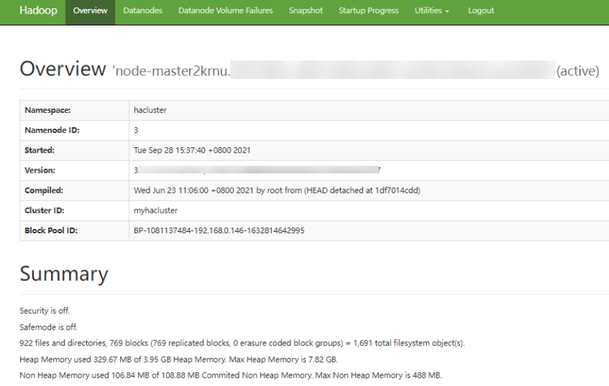

# ALM-14010 NameService服务异常

## 告警解释

系统每180秒周期性检测NameService服务状态，当检测到NameService服务不可用时产生该告警。

NameService服务恢复时，告警清除。

## 告警属性

<table><thead align="left"><tr id="row18244538"><th class="cellrowborder" valign="top" width="33.33333333333333%" id="mcps1.1.4.1.1">
告警ID

</th>
<th class="cellrowborder" valign="top" width="33.33333333333333%" id="mcps1.1.4.1.2">
告警级别

</th>
<th class="cellrowborder" valign="top" width="33.33333333333333%" id="mcps1.1.4.1.3">
是否自动清除

</th>
</tr>
</thead>
<tbody><tr id="row29379026"><td class="cellrowborder" valign="top" width="33.33333333333333%" headers="mcps1.1.4.1.1 ">
14010

</td>
<td class="cellrowborder" valign="top" width="33.33333333333333%" headers="mcps1.1.4.1.2 ">
重要

</td>
<td class="cellrowborder" valign="top" width="33.33333333333333%" headers="mcps1.1.4.1.3 ">
是

</td>
</tr>
</tbody>
</table>

## 告警参数

<table><thead align="left"><tr id="row35526989"><th class="cellrowborder" valign="top" width="50%" id="mcps1.1.3.1.1">
参数名称

</th>
<th class="cellrowborder" valign="top" width="50%" id="mcps1.1.3.1.2">
参数含义

</th>
</tr>
</thead>
<tbody><tr id="row149727275317"><td class="cellrowborder" valign="top" width="50%" headers="mcps1.1.3.1.1 ">
来源

</td>
<td class="cellrowborder" valign="top" width="50%" headers="mcps1.1.3.1.2 ">
产生告警的集群名称。

</td>
</tr>
<tr id="row23904675"><td class="cellrowborder" valign="top" width="50%" headers="mcps1.1.3.1.1 ">
服务名

</td>
<td class="cellrowborder" valign="top" width="50%" headers="mcps1.1.3.1.2 ">
产生告警的服务名称。

</td>
</tr>
<tr id="row46473036"><td class="cellrowborder" valign="top" width="50%" headers="mcps1.1.3.1.1 ">
角色名

</td>
<td class="cellrowborder" valign="top" width="50%" headers="mcps1.1.3.1.2 ">
产生告警的角色名称。

</td>
</tr>
<tr id="row37790264"><td class="cellrowborder" valign="top" width="50%" headers="mcps1.1.3.1.1 ">
主机名

</td>
<td class="cellrowborder" valign="top" width="50%" headers="mcps1.1.3.1.2 ">
产生告警的主机名。

</td>
</tr>
<tr id="row40504628"><td class="cellrowborder" valign="top" width="50%" headers="mcps1.1.3.1.1 ">
NameService名

</td>
<td class="cellrowborder" valign="top" width="50%" headers="mcps1.1.3.1.2 ">
产生告警的NameService名称。

</td>
</tr>
</tbody>
</table>

## 对系统的影响

无法为基于该NameService服务的HBase和MapReduce等上层部件提供服务。用户无法读写文件。

## 可能原因

-   KrbServer服务异常。
-   JournalNode节点故障。
-   DataNode节点故障。
-   磁盘容量不足。
-   NameNode节点进入安全模式。

## 处理步骤

**检查KrbServer服务状态。**

1.  在FusionInsight Manager首页，选择“集群 \>  _待操作集群的名称_  \> 服务”。
2.  查看KrbServer服务是否存在。
    -   是，执行[3](#li4671216717852)。
    -   否，执行[6](#li2979505817852)。

3.  单击“KrbServer”。
4.  单击“实例”。在KrbServer管理页面，选择故障实例，选择“更多 \> 重启实例”。查看实例能否成功启动。
    -   是，执行[5](#li1076710217852)。
    -   否，执行[24](#li5097747017852)。

5.  在“运维 \> 告警 \> 告警”页签，查看该告警是否恢复。
    -   是，处理完毕。
    -   否，执行[6](#li2979505817852)。

**检查JournalNode实例状态。**

1.  在FusionInsight Manager首页，选择“集群 \>  _待操作集群的名称_  \> 服务”。
2.  选择“HDFS \> 实例”。
3.  在实例页面中，查看JournalNode的“运行状态”是否为“良好”。
    -   是，执行[11](#li1229459717852)。
    -   否，执行[9](#li34233917852)。

4.  选择故障的JournalNode，选择“更多 \> 重启实例”。查看JournalNode能否成功启动。
    -   是，执行[10](#li136606617852)。
    -   否，执行[24](#li5097747017852)。

5.  在“运维 \> 告警 \> 告警”页签，查看该告警是否恢复。
    -   是，处理完毕。
    -   否，执行[11](#li1229459717852)。

**检查DataNode实例状态。**

1.  在FusionInsight Manager首页，选择“集群 \>  _待操作集群的名称_  \> 服务 \> HDFS”。
2.  单击“实例”查看所有DataNode节点的“运行状态”是否为“良好”。
    -   是，执行[15](#li6155970417852)。
    -   否，执行[13](#li6039615117852)。

3.  单击“实例”。在DataNode管理页面，选择故障DataNode，选择“更多 \> 重启实例”。查看DataNode能否成功启动。
    -   是，执行[14](#li2920958817852)。
    -   否，执行[15](#li6155970417852)。

4.  在“运维 \> 告警 \> 告警”页签，查看该告警是否恢复。
    -   是，处理完毕。
    -   否，执行[15](#li6155970417852)。

**检查磁盘状态。**

1.  在FusionInsight Manager首页，选择“集群 \>  _待操作集群的名称_  \> 主机”。
2.  在“磁盘”列，检查磁盘空间是否不足。
    -   是，执行[17](#li3082265617852)。
    -   否，执行[19](#li6295063617852)。

3.  对磁盘进行扩容。
4.  在“运维 \> 告警 \> 告警”页签，查看该告警是否恢复。
    -   是，处理完毕。
    -   否，执行[19](#li6295063617852)。

**检查NameNode节点是否进入安全模式。**

1.  在FusionInsight Manager首页，选择“集群 \>  _待操作集群的名称_  \> 服务 \> HDFS”，单击服务异常的NameService的“NameNode\(主\)”，显示NameNode WebUI页面。

    > **说明：** 
    >**admin**用户默认不具备其他组件的管理权限，如果访问组件原生界面时出现因权限不足而打不开页面或内容显示不全时，可手动创建具备对应组件管理权限的用户进行登录。

2.  在NameNode WebUI，查看是否显示如下信息：“Safe mode is ON.”

    “Safe mode is ON.”表示安全模式已打开，后面的提示信息为告警信息，根据实际情况展现。

    -   是，执行[21](#li5459096817852)。
    -   否，执行[24](#li5097747017852)。

    **图 1**  Overview  
    

3.  以**root**用户登录客户端，用户密码为安装前用户自定义，请咨询系统管理员。执行**cd**命令进入客户端安装目录，然后执行**source bigdata\_env**。如果集群采用安全版本，要进行安全认证，执行**kinit hdfs**命令，按提示输入密码（向管理员获取密码）。如果集群采用非安全版本，需使用**omm**用户登录并执行命令，请确保**omm**用户具有客户端执行权限。
4.  执行**hdfs dfsadmin -safemode leave**。
5.  在“运维 \> 告警 \> 告警”页签，查看该告警是否恢复。
    -   是，处理完毕。
    -   否，执行[24](#li5097747017852)。

**收集故障信息。**

1.  在FusionInsight Manager首页，选择“运维 \> 日志 \> 下载”。
2.  在“服务”中勾选待操作集群的如下节点信息。
    -   ZooKeeper
    -   HDFS

3.  单击右上角的设置日志收集的“开始时间”和“结束时间”分别为告警产生时间的前后10分钟，单击“下载”。
4.  请联系运维人员，并发送已收集的故障日志信息。

## 告警清除

此告警修复后，系统会自动清除此告警，无需手工清除。

## 参考信息

无。

