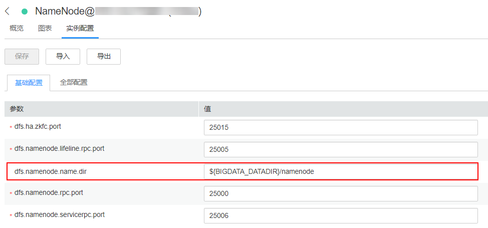

# ALM-14013 NameNode FsImage文件更新失败

## 告警解释

HDFS的元数据信息存储在NameNode数据目录（由配置项“dfs.namenode.name.dir”指定）中的FsImage文件中。备NameNode会周期将已有的FsImage和JournalNode中存储的Editlog合并生成新的FsImage，然后推送到主NameNode的数据目录。这个周期由HDFS的配置项“dfs.namenode.checkpoint.period”指定，默认为3600秒，即1个小时。如果主NameNode数据目录的FsImage没有更新，则说明HDFS元数据合并功能异常，需要修复。

在主NameNode节点上，系统每5分钟检测其上的FsImage文件的信息。如果在三个合并周期没有新的FsImage文件生成，则系统产生该告警。

当新的FsImage文件生成并成功推送到主NameNode，说明HDFS元数据合并功能恢复正常，告警自动恢复。

## 告警属性

<table><thead align="left"><tr id="row64147509"><th class="cellrowborder" valign="top" width="33.33333333333333%" id="mcps1.1.4.1.1">
告警ID

</th>
<th class="cellrowborder" valign="top" width="33.33333333333333%" id="mcps1.1.4.1.2">
告警级别

</th>
<th class="cellrowborder" valign="top" width="33.33333333333333%" id="mcps1.1.4.1.3">
是否自动清除

</th>
</tr>
</thead>
<tbody><tr id="row23591345"><td class="cellrowborder" valign="top" width="33.33333333333333%" headers="mcps1.1.4.1.1 ">
14013

</td>
<td class="cellrowborder" valign="top" width="33.33333333333333%" headers="mcps1.1.4.1.2 ">
重要

</td>
<td class="cellrowborder" valign="top" width="33.33333333333333%" headers="mcps1.1.4.1.3 ">
是

</td>
</tr>
</tbody>
</table>

## 告警参数

<table><thead align="left"><tr id="row53105736"><th class="cellrowborder" valign="top" width="50%" id="mcps1.1.3.1.1">
参数名称

</th>
<th class="cellrowborder" valign="top" width="50%" id="mcps1.1.3.1.2">
参数含义

</th>
</tr>
</thead>
<tbody><tr id="row1937134112718"><td class="cellrowborder" valign="top" width="50%" headers="mcps1.1.3.1.1 ">
来源

</td>
<td class="cellrowborder" valign="top" width="50%" headers="mcps1.1.3.1.2 ">
产生告警的集群名称。

</td>
</tr>
<tr id="row215466"><td class="cellrowborder" valign="top" width="50%" headers="mcps1.1.3.1.1 ">
服务名

</td>
<td class="cellrowborder" valign="top" width="50%" headers="mcps1.1.3.1.2 ">
产生告警的服务名称。

</td>
</tr>
<tr id="row39491415"><td class="cellrowborder" valign="top" width="50%" headers="mcps1.1.3.1.1 ">
角色名

</td>
<td class="cellrowborder" valign="top" width="50%" headers="mcps1.1.3.1.2 ">
产生告警的角色名称。

</td>
</tr>
<tr id="row29792316"><td class="cellrowborder" valign="top" width="50%" headers="mcps1.1.3.1.1 ">
主机名

</td>
<td class="cellrowborder" valign="top" width="50%" headers="mcps1.1.3.1.2 ">
产生告警的主机名。

</td>
</tr>
<tr id="row14708548"><td class="cellrowborder" valign="top" width="50%" headers="mcps1.1.3.1.1 ">
NameService名

</td>
<td class="cellrowborder" valign="top" width="50%" headers="mcps1.1.3.1.2 ">
产生告警的NameService名称。

</td>
</tr>
</tbody>
</table>

## 对系统的影响

如果主NameNode数据目录的FsImage没有更新，则说明HDFS元数据合并功能异常，需要修复。如不修复，HDFS在运行一段时间后，Editlog会一直增长。此时如果重启HDFS，由于要加载非常多的Editlog，会导致启动非常耗时。另外，该告警的产生也说明备NameNode功能异常，导致NameNode的HA机制失效。一旦主NameNode故障，则整个HDFS服务将不可用。

## 可能原因

-   备NameNode被停止。
-   备NameNode实例运行状态异常。
-   备NameNode合并新的FsImage失败。
-   备NameNode数据目录空间不足。
-   备NameNode推送FsImage到主NameNode失败。
-   主NameNode数据目录空间不足。

## 处理步骤

**查看备NameNode是否被停止。**

1.  在FusionInsight Manager首页，选择“运维 \> 告警 \> 告警”，在告警列表中单击此告警。
2.  在告警详情区域，查看“定位信息”，获取告警产生的主NameNode的主机名和所在的NameService名称。
3.  选择“集群 \>  _待操作集群的名称_  \> 服务 \> HDFS \> 实例”，在实例列表中找到该NameService的备NameNode实例，查看其“配置状态”是否为“已同步”。
    -   是，执行[6](#li296942739949)。
    -   否，执行[4](#li314799189949)。

4.  勾选该备NameNode实例，单击“启动实例”，等待启动完成。
5.  等待1个NameNode合并元数据的周期时间后，查看告警是否清除。
    -   是，处理完毕。
    -   否，执行[6](#li296942739949)。

**查看备NameNode实例运行状态是否正常。**

1.  查看该备NameNode实例的“运行状态”是否为“良好”。
    -   是，执行[9](#li51510919949)。
    -   否，执行[7](#li659218739949)。

2.  勾选该备NameNode实例，单击“更多 \> 重启实例”，等待启动完成。
3.  启动完成后，等待1个NameNode合并元数据的周期时间，然后查看告警是否清除。
    -   是，处理完毕。
    -   否，执行[30](#li366991189949)。

**备NameNode合并新的FsImage是否失败。**

1.  在FusionInsight Manager首页，选择“集群 \>  _待操作集群的名称_  \> 服务 \> HDFS \> 配置 \> 全部配置”，搜索并获取“dfs.namenode.checkpoint.period”的值，该值即为NameNode合并元数据的周期。
2.  选择“集群 \>  _待操作集群的名称_  \> 服务 \> HDFS \> 实例”，获取产生该告警的NameService的主、备NameNode节点的业务IP地址。
3.  单击“NameNode\(_xx_,备\)”，单击“实例配置”，获取配置项“dfs.namenode.name.dir”的值，该值即为备NameNode的FsImage存储目录。

    

4.  以**root**或**omm**用户登录备NameNode节点，用户密码为安装前用户自定义，请咨询系统管理员。
5.  进入到FsImage存储目录，查看最新的FsImage的生成时间。

    **cd **_备NameNode__存储目录_**/current**

    **stat -c %y $\(ls -t | grep "fsimage\_\[0-9\]\*$" | head -1\)**

6.  执行**date**命令获取系统当前时间。
7.  计算最新FsImage的生成时间和当前时间的时间差，判断该时间差是否大于元数据合并周期的三倍。
    -   是，执行[16](#li297375669949)。
    -   否，执行[20](#li112146149949)。

8.  备NameNode合并元数据的功能异常。执行以下命令查看是否为存储空间不足造成。

    进入到FsImage存储目录，查看最近一个的FsImage的大小（单位为MB）。

    **cd **_备NameNode__存储目录_**/current**

    **du -m $\(ls -t | grep "fsimage\_\[0-9\]\*$" | head -1\) | awk '\{print $1\}'**

9.  执行命令查看备NameNode的磁盘剩余空间（单位为MB）。

    **df -m ./ | awk 'END\{print $4\}'**

10. 对比FsImage的大小和目录剩余空间大小，看剩余空间是否还能存储一个FsImage文件。
    -   是，执行[7](#li659218739949)。
    -   否，执行[19](#li664188119949)。

11. 清理该目录所在磁盘的冗余文件，以便给元数据存放预留足够的空间。空间清理完毕后等待1个NameNode合并元数据的周期时间，查看告警是否清除。
    -   是，处理完毕。
    -   否，执行[20](#li112146149949)。

**查看备NameNode推送FsImage到主NameNode是否失败。**

1.  以**root**用户登录备NameNode节点，用户密码为安装前用户自定义，请咨询系统管理员。
2.  执行**su - omm**命令切换到**omm**用户。
3.  使用如下命令查看备NameNode是否能将文件推送到主NameNode上。

    **tmpFile=/tmp/tmp\_test\_$\(date +%s\)**

    **echo "test" \> $tmpFile**

    **scp $tmpFile **_主NameNode__的业务IP_**:/tmp**

    -   是，执行[24](#li324043149949)。
    -   否，执行[23](#li408831819949)。

4.  联系系统管理员，处理在**omm**用户下备NameNode无法推送数据到主NameNode的原因。故障恢复后等待1个NameNode合并元数据的周期时间，查看告警是否清除。
    -   是，处理完毕。
    -   否，执行[24](#li324043149949)。

**查看主NameNode数据目录空间是否不足。**

1.  在FusionInsight Manager首页，选择“集群 \>  _待操作集群的名称_  \> 服务 \> HDFS \> 实例”，单击产生告警的NameService的主NameNode，单击“实例配置”，获取配置项“dfs.namenode.name.dir”的值，该值即为主NameNode的FsImage存储目录。

    

2.  以**root**或**omm**用户登录主NameNode节点。
3.  进入到FsImage存储目录，查看最近一个的FsImage的大小（单位为MB）。

    **cd **_主NameNode__存储目录_**/current**

    **du -m $\(ls -t | grep "fsimage\_\[0-9\]\*$" | head -1\) | awk '\{print $1\}'**

4.  执行如下命令查看主NameNode的磁盘剩余空间（单位为MB）。

    **df -m ./ | awk 'END\{print $4\}'**

5.  对比FsImage的大小和目录剩余空间大小，看剩余空间是否还能存储一个FsImage文件。
    -   是，执行[30](#li366991189949)。
    -   否，执行[29](#li40776799949)。

6.  清理该目录所在磁盘的冗余文件，以便给元数据存放预留足够的空间。空间清理完毕后等待1个NameNode合并元数据的周期时间，查看告警是否清除。
    -   是，处理完毕。
    -   否，执行[30](#li366991189949)。

**收集故障信息。**

1.  在FusionInsight Manager首页，选择“运维 \> 日志 \> 下载”。
2.  在“服务”中勾选待操作集群的“NameNode”。
3.  单击右上角的设置日志收集的“开始时间”和“结束时间”分别为告警产生时间的前后30分钟，单击“下载”。
4.  请联系运维人员，并发送已收集的故障日志信息。

## 告警清除

此告警修复后，系统会自动清除此告警，无需手工清除。

## 参考信息

无。

