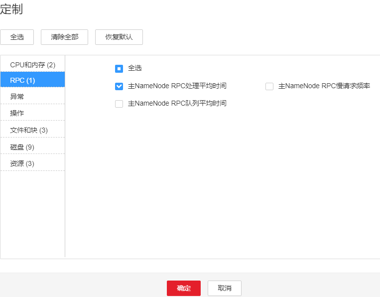
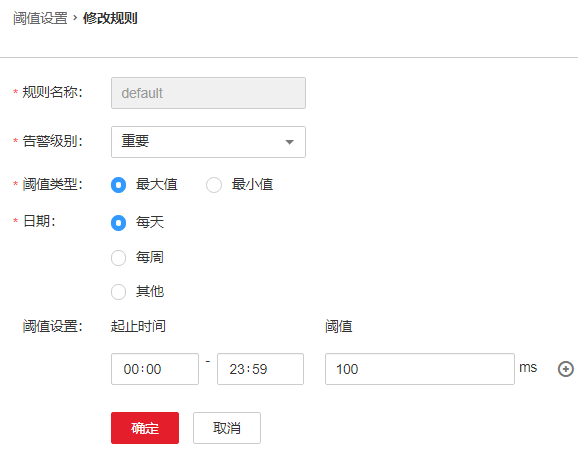

# ALM-14021 NameNode RPC处理平均时间超过阈值

## 告警解释

系统每30秒周期性检测NameNode的RPC处理平均时间，并把实际的NameNode的RPC处理平均时间和阈值（默认为100ms）相比较。当检测到NameNode的RPC处理平均时间连续多次（默认为10次）超出阈值范围时，产生该告警。

用户可通过“运维 \> 告警 \> 阈值设置 \>  _待操作集群的名称_  \> HDFS”修改阈值。

如果平滑次数为1，NameNode的RPC处理平均时间小于或等于阈值时，告警恢复；如果平滑次数大于1，NameNode的RPC处理平均时间小于或等于阈值的90%时，告警恢复。

## 告警属性

<table><thead align="left"><tr id="row40817340"><th class="cellrowborder" valign="top" width="33.33333333333333%" id="mcps1.1.4.1.1">
告警ID

</th>
<th class="cellrowborder" valign="top" width="33.33333333333333%" id="mcps1.1.4.1.2">
告警级别

</th>
<th class="cellrowborder" valign="top" width="33.33333333333333%" id="mcps1.1.4.1.3">
是否自动清除

</th>
</tr>
</thead>
<tbody><tr id="row10092231"><td class="cellrowborder" valign="top" width="33.33333333333333%" headers="mcps1.1.4.1.1 ">
14021

</td>
<td class="cellrowborder" valign="top" width="33.33333333333333%" headers="mcps1.1.4.1.2 ">
重要

</td>
<td class="cellrowborder" valign="top" width="33.33333333333333%" headers="mcps1.1.4.1.3 ">
是

</td>
</tr>
</tbody>
</table>

## 告警参数

<table><thead align="left"><tr id="row44686168"><th class="cellrowborder" valign="top" width="50%" id="mcps1.1.3.1.1">
参数名称

</th>
<th class="cellrowborder" valign="top" width="50%" id="mcps1.1.3.1.2">
参数含义

</th>
</tr>
</thead>
<tbody><tr id="row135167459266"><td class="cellrowborder" valign="top" width="50%" headers="mcps1.1.3.1.1 ">
来源

</td>
<td class="cellrowborder" valign="top" width="50%" headers="mcps1.1.3.1.2 ">
产生告警的集群名称。

</td>
</tr>
<tr id="row46845284"><td class="cellrowborder" valign="top" width="50%" headers="mcps1.1.3.1.1 ">
服务名

</td>
<td class="cellrowborder" valign="top" width="50%" headers="mcps1.1.3.1.2 ">
产生告警的服务名称。

</td>
</tr>
<tr id="row6915351"><td class="cellrowborder" valign="top" width="50%" headers="mcps1.1.3.1.1 ">
角色名

</td>
<td class="cellrowborder" valign="top" width="50%" headers="mcps1.1.3.1.2 ">
产生告警的角色名称。

</td>
</tr>
<tr id="row54242887"><td class="cellrowborder" valign="top" width="50%" headers="mcps1.1.3.1.1 ">
主机名

</td>
<td class="cellrowborder" valign="top" width="50%" headers="mcps1.1.3.1.2 ">
产生告警的主机名。

</td>
</tr>
<tr id="row16395729"><td class="cellrowborder" valign="top" width="50%" headers="mcps1.1.3.1.1 ">
NameService名

</td>
<td class="cellrowborder" valign="top" width="50%" headers="mcps1.1.3.1.2 ">
产生告警的NameService名称。

</td>
</tr>
<tr id="row38971291"><td class="cellrowborder" valign="top" width="50%" headers="mcps1.1.3.1.1 ">
Trigger condition

</td>
<td class="cellrowborder" valign="top" width="50%" headers="mcps1.1.3.1.2 ">
系统当前指标取值满足自定义的告警设置条件。

</td>
</tr>
</tbody>
</table>

## 对系统的影响

NameNode无法及时处理来自HDFS客户端、依赖于HDFS的上层服务、DataNode等的RPC请求，表现为访问HDFS服务的业务运行缓慢，严重时会导致HDFS服务不可用。

## 可能原因

-   NameNode节点的CPU性能不足，导致NameNode无法及时处理消息。
-   NameNode所设置的内存太小，频繁Full GC造成JVM卡顿。
-   NameNode配置参数不合理，导致NameNode无法充分利用机器性能。

## 处理步骤

**获取该告警的信息。**

1.  在FusionInsight Manager首页，选择“运维 \> 告警 \> 告警“，在告警列表中找到该告警。
2.  单击该告警，查看下面的告警详情。从“定位信息“中的“主机名”信息可知发出该告警的NameNode节点主机名；从“定位信息“中的NameServiceName信息可知发出该告警的NameService名称。

**查看阈值是否设置过低。**

1.  查看依赖于HDFS的业务的运行状态是否正常运行。查看是否存在运行慢、执行任务超时的情况。
    -   是，执行[8](#li2190062915649)
    -   否，执行[4](#li12794575145018)

2.  在FusionInsight Manager首页，选择“集群 \>  _待操作集群的名称_  \> 服务 \> HDFS”，单击图表区域右上角的下拉菜单，选择“定制 \> RPC”，在弹出的对话框中选择“主NameNode RPC处理平均时间“，单击“确定“。

    **图 1**  主NameNode RPC处理平均时间  
    

3.  查看“主NameNode RPC处理平均时间“监控中，获取发出告警的NameService的当前的监控值。
4.  在FusionInsight Manager首页，选择“运维 \> 告警 \> 阈值设置 \>  _待操作集群的名称_  \> HDFS”，找到“主NameNode RPC处理平均时间“，单击default规则中“操作“栏中的“修改”，修改“阈值“为告警出现前后1天内监控值的峰值的150%。单击“确定“，保存新阈值。

    **图 2**  修改阈值  
    

5.  等待5分钟，查看该告警是否自动消除。
    -   是，处理结束。
    -   否，执行[8](#li2190062915649)

**查看NameNode节点的CPU性能是否不足。**

1.  在FusionInsight Manager首页，选择“运维 \> 告警 \> 告警”，查看是否有该NameNode节点的ID为“12016““ALM-12016 CPU使用率超过阈值“告警。
    -   是，执行[9](#li4691210415930)
    -   否，[11](#li1696839151443)

2.  按照“ALM-12016 CPU使用率超过阈值“告警处理文档，处理该告警。
3.  处理完12016告警后，等待10分钟，查看该告警是否自动消除。
    -   是，处理结束。
    -   否，执行[11](#li1696839151443)

**查看NameNode节点的内存是否设置过小。**

1.  在FusionInsight Manager首页，选择“运维 \> 告警 \> 告警”，查看是否有该NameNode节点的ID为“14007““ALM-14007 HDFS NameNode堆内存使用率超过阈值“告警。
    -   是，执行[12](#li51365499151443)
    -   否，执行[14](#li2489812715139)

2.  按照“ALM-14007 HDFS NameNode堆内存使用率超过阈值“告警处理文档，处理该告警。
3.  处理完14007告警后，等待10分钟，查看该告警是否自动消除。
    -   是，处理结束。
    -   否，执行[14](#li2489812715139)

**查看该NameNode配置参数是否合理。**

1.  在FusionInsight Manager首页，选择“集群 \>  _待操作集群的名称_  \> 服务 \> HDFS \> 配置”，搜索配置项“dfs.namenode.handler.count“，查看其值。如果值小于或等于128，则设置为128；如果大于128但小于192，则设置为192。
2.  搜索配置项“ipc.server.read.threadpool.size“，查看其值。如果值小于5，则设置为5。
3.  单击“保存“，单击“确定“。
4.  在HDFS的“实例“页面，先勾选发出该告警的NameService的备NameNode，在“更多“中单击“重启实例“，输入密码后单击“确定“，等待备NameNode启动完毕。
5.  在HDFS的“实例“页面，先勾选发出该告警的NameService的主NameNode，在“更多“中单击“重启实例“，输入密码后单击“确定“，等待主NameNode启动完毕。
6.  等待1小时，查看该告警是否自动消除。
    -   是，处理结束。
    -   否，执行[20](#li162921216241)

**收集故障信息。**

1.  在FusionInsight Manager首页，选择“运维 \> 日志 \> 下载”。
2.  在“服务”中勾选待操作集群的如下节点信息。
    -   HDFS

3.  单击右上角的设置日志收集的“开始时间”和“结束时间”分别为告警产生时间的前后10分钟，单击“下载”。
4.  请联系运维人员，并发送已收集的故障日志信息。

## 告警清除

此告警修复后，系统会自动清除此告警，无需手工清除。

## 参考信息

无。

