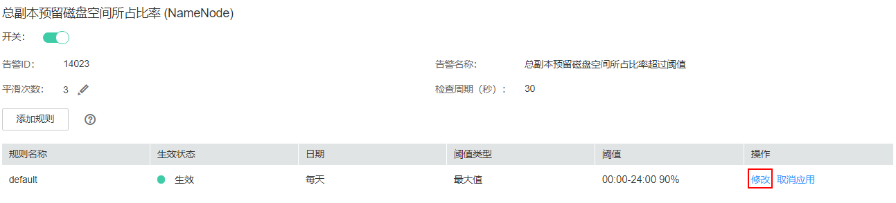

# ALM-14023 总副本预留磁盘空间所占比率超过阈值

## 告警解释

系统每30秒周期性检测总副本预留磁盘空间所占比率（总副本预留磁盘空间/（总副本预留磁盘空间+总剩余的磁盘空间）），并把实际的总副本预留磁盘空间所占比率和阈值（默认为90%）相比较。当检测到总副本预留磁盘空间所占比率连续多次（平滑次数）高于阈值时，产生该告警。

如果平滑次数为1，总副本预留磁盘空间所占比率小于或等于阈值时，告警恢复；如果平滑次数大于1，总副本预留磁盘空间所占比率小于或等于阈值的90%时，告警恢复。

## 告警属性

<table><thead align="left"><tr id="row29552962115124"><th class="cellrowborder" valign="top" width="33.33333333333333%" id="mcps1.1.4.1.1">
告警ID

</th>
<th class="cellrowborder" valign="top" width="33.33333333333333%" id="mcps1.1.4.1.2">
告警级别

</th>
<th class="cellrowborder" valign="top" width="33.33333333333333%" id="mcps1.1.4.1.3">
是否自动清除

</th>
</tr>
</thead>
<tbody><tr id="row16233655115124"><td class="cellrowborder" valign="top" width="33.33333333333333%" headers="mcps1.1.4.1.1 ">
14023

</td>
<td class="cellrowborder" valign="top" width="33.33333333333333%" headers="mcps1.1.4.1.2 ">
次要

</td>
<td class="cellrowborder" valign="top" width="33.33333333333333%" headers="mcps1.1.4.1.3 ">
是

</td>
</tr>
</tbody>
</table>

## 告警参数

<table><thead align="left"><tr id="row51138187115124"><th class="cellrowborder" valign="top" width="50%" id="mcps1.1.3.1.1">
参数名称

</th>
<th class="cellrowborder" valign="top" width="50%" id="mcps1.1.3.1.2">
参数含义

</th>
</tr>
</thead>
<tbody><tr id="row119603492614"><td class="cellrowborder" valign="top" width="50%" headers="mcps1.1.3.1.1 ">
来源

</td>
<td class="cellrowborder" valign="top" width="50%" headers="mcps1.1.3.1.2 ">
产生告警的集群名称。

</td>
</tr>
<tr id="row53911016115124"><td class="cellrowborder" valign="top" width="50%" headers="mcps1.1.3.1.1 ">
服务名

</td>
<td class="cellrowborder" valign="top" width="50%" headers="mcps1.1.3.1.2 ">
产生告警的服务名称。

</td>
</tr>
<tr id="row15568399115124"><td class="cellrowborder" valign="top" width="50%" headers="mcps1.1.3.1.1 ">
角色名

</td>
<td class="cellrowborder" valign="top" width="50%" headers="mcps1.1.3.1.2 ">
产生告警的角色名称。

</td>
</tr>
<tr id="row111414134249"><td class="cellrowborder" valign="top" width="50%" headers="mcps1.1.3.1.1 ">
NameService名

</td>
<td class="cellrowborder" valign="top" width="50%" headers="mcps1.1.3.1.2 ">
产生告警的NameService名称。

</td>
</tr>
<tr id="row19403708115124"><td class="cellrowborder" valign="top" width="50%" headers="mcps1.1.3.1.1 ">
Trigger condition

</td>
<td class="cellrowborder" valign="top" width="50%" headers="mcps1.1.3.1.2 ">
系统当前指标取值满足自定义的告警设置条件。

</td>
</tr>
</tbody>
</table>

## 对系统的影响

HDFS集群磁盘容量不足，会影响到HDFS的数据写入。如果DataNode的剩余空间都已经给副本预留，则写入HDFS数据失败。

## 可能原因

-   告警阈值配置不合理。
-   HDFS集群配置的磁盘空间不足。
-   HDFS的业务访问量太大，超过了已有DataNode的负载能力。

## 处理步骤

**查看阈值设置是否合理**

1.  在FusiongInsight Manager首页，选择“运维 \> 告警 \> 阈值设置 \>  _待操作集群的名称_  \> HDFS \> 磁盘 \> 总副本预留磁盘空间所占比率”，查看该告警阈值设置是否合理（默认90%为合理值，用户可以根据自己的实际需求调节）。
    -   是，执行[4](#li1876823210577)。
    -   否，执行[2](#li6170538620336)。

2.  根据实际服务的使用情况，在“运维 \> 告警 \> 阈值设置 \>  _待操作集群的名称_  \> HDFS \> 磁盘 \> 总副本预留磁盘空间所单击率”页面单击“修改”更改阈值。

    **图 1**  修改阈值  
    

3.  等待5分钟，检查该告警是否恢复。
    -   是，处理完毕。
    -   否，执行[4](#li1876823210577)。

**查看是否有磁盘空间不足告警**

1.  在FusionInsight Manager首页，选择“运维 \> 告警 \> 告警”查看是否存在告警“ALM-14001 HDFS磁盘空间使用率超过阈值”或“ALM-14002 DataNode磁盘空间使用率超过阈值”。
    -   是，执行[5](#li57233187105945)。
    -   否，执行[7](#li58352387201654)。

2.  参考“ALM-14001 HDFS磁盘空间使用率超过阈值”或“ALM-14002 DataNode磁盘空间使用率超过阈值”进行处理，查看对应告警是否清除。
    -   是，[6](#li37685008201452)。
    -   否，[7](#li58352387201654)。

3.  等待5分钟，检查该告警是否恢复。
    -   是，处理完毕。
    -   否，执行[7](#li58352387201654)。

**对DataNode进行扩容**

1.  对DataNode进行扩容。
2.  等待5分钟，检查该告警是否恢复。
    -   是，处理完毕。
    -   否，执行[9](#li4839046320190)。

**收集故障信息**

1.  在FusionInsight Manager首页，选择“运维 \> 日志 \> 下载”。
2.  在“服务”中勾选待操作集群的“HDFS“。
3.  单击右上角的设置日志收集的“开始时间”和“结束时间”分别为告警产生时间的前后20分钟，单击“下载”。
4.  请联系运维人员，并发送已收集的故障日志信息。

## 告警清除

此告警修复后，系统会自动清除此告警，无需手工清除。

## 参考信息

无。

