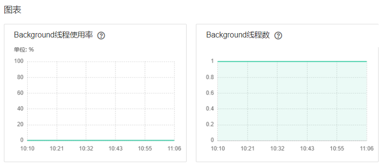

# ALM-16003 Background线程使用率超过阈值

## 告警解释

系统每30秒周期性检测Background线程使用率情况，默认阈值为90%。如果Hive使用的background线程池使用率超过阈值，则发出告警。

> **说明：** 
>MRS 3.X支持Hive多实例，若集群启用了多实例功能且安装了多个Hive服务，请根据“定位信息”的“服务名”值来确定具体产生告警的Hive服务。例如Hive1服务不可用，则“定位信息”中显示服务名=Hive1，处理步骤中的操作对象也应由Hive调整为Hive1。

## 告警属性

<table><thead align="left"><tr id="row13556155"><th class="cellrowborder" valign="top" width="33.33333333333333%" id="mcps1.1.4.1.1">
告警ID

</th>
<th class="cellrowborder" valign="top" width="33.33333333333333%" id="mcps1.1.4.1.2">
告警级别

</th>
<th class="cellrowborder" valign="top" width="33.33333333333333%" id="mcps1.1.4.1.3">
是否自动清除

</th>
</tr>
</thead>
<tbody><tr id="row25078593"><td class="cellrowborder" valign="top" width="33.33333333333333%" headers="mcps1.1.4.1.1 ">
16003

</td>
<td class="cellrowborder" valign="top" width="33.33333333333333%" headers="mcps1.1.4.1.2 ">
重要

</td>
<td class="cellrowborder" valign="top" width="33.33333333333333%" headers="mcps1.1.4.1.3 ">
是

</td>
</tr>
</tbody>
</table>

## 告警参数

<table><thead align="left"><tr id="row6362194"><th class="cellrowborder" valign="top" width="50%" id="mcps1.1.3.1.1">
参数名称

</th>
<th class="cellrowborder" valign="top" width="50%" id="mcps1.1.3.1.2">
参数含义

</th>
</tr>
</thead>
<tbody><tr id="row6577112020256"><td class="cellrowborder" valign="top" width="50%" headers="mcps1.1.3.1.1 ">
来源

</td>
<td class="cellrowborder" valign="top" width="50%" headers="mcps1.1.3.1.2 ">
产生告警的集群名称。

</td>
</tr>
<tr id="row52122619"><td class="cellrowborder" valign="top" width="50%" headers="mcps1.1.3.1.1 ">
服务名

</td>
<td class="cellrowborder" valign="top" width="50%" headers="mcps1.1.3.1.2 ">
产生告警的服务名称。

</td>
</tr>
<tr id="row41825285"><td class="cellrowborder" valign="top" width="50%" headers="mcps1.1.3.1.1 ">
角色名

</td>
<td class="cellrowborder" valign="top" width="50%" headers="mcps1.1.3.1.2 ">
产生告警的角色名称。

</td>
</tr>
<tr id="row891897"><td class="cellrowborder" valign="top" width="50%" headers="mcps1.1.3.1.1 ">
主机名

</td>
<td class="cellrowborder" valign="top" width="50%" headers="mcps1.1.3.1.2 ">
产生告警的主机名。

</td>
</tr>
<tr id="row1025202411304"><td class="cellrowborder" valign="top" width="50%" headers="mcps1.1.3.1.1 ">
Trigger condition

</td>
<td class="cellrowborder" valign="top" width="50%" headers="mcps1.1.3.1.2 ">
系统当前指标取值满足自定义的告警设置条件。

</td>
</tr>
</tbody>
</table>

## 对系统的影响

后台Background线程数过多，导致新提交的任务无法及时运行。

## 可能原因

Hive后台的background线程池使用率过大。

-   HiveServer后台的background线程池执行的任务过多。
-   HiveServer后台的background线程池的容量过小。

## 处理步骤

**检查HiveServer background线程池执行任务数量**

1.  在FusionInsight Manager首页，选择“集群 \>  _待操作集群的名称_  \> 服务 \> Hive \>  _具体的HiveServer__实例_”，找到“Background线程数”与“Background线程使用率”监控信息。

    **图 1**  Background监控信息  
    

2.  在Background线程数监控中，线程数目最近半小时时间内是否有异常偏高（默认队列数值为100，偏高数值\>=90）。
    -   是，执行[3](#li7203188143816)。
    -   否，执行[5](#li1418798143810)。

3.  调整提交到background线程池的任务数（比如，取消一些后台性能低，耗时长的任务）。
4.  “Background线程数”和“Background线程数使用率”是否下降。
    -   是，执行[7](#li73422961119)。
    -   否，执行[5](#li1418798143810)。

****检查HiveServer background线程池容量**。**

1.  在FusionInsight Manager首页，选择“集群 \>  _待操作集群的名称_  \> 服务 \> Hive \>  _具体的HiveServer__实例_”，找到“Background线程数”与“Background线程使用率”监控信息。

    **图 2**  Background监控信息  
    

2.  查看“$\{BIGDATA\_HOME\}/FusionInsight\_HD\_8.1.0.1/1\_23\_HiveServer/etc/hive-site.xml”文件中“hive.server2.async.exec.threads”数量，适当增大该数值（如：增大原数值的20%）。
3.  保存更新配置。
4.  查看本告警是否恢复。
    -   是，操作结束。
    -   否，执行[9](#li76571924143819)。

**收集故障信息。**

1.  在FusionInsight Manager首页，选择“运维 \> 日志 \> 下载”。
2.  在“服务”中勾选待操作集群的“Hive”。
3.  单击右上角的设置日志收集的“开始时间”和“结束时间”，分别为告警产生时间的前后10分钟，单击“下载”。
4.  请联系运维人员，并发送已收集的故障日志信息。

## 告警清除

此告警修复后，系统会自动清除此告警，无需手工清除。

## 参考信息

无。

