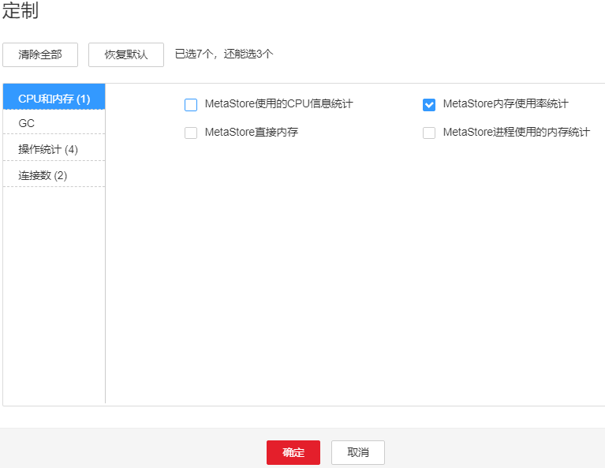

# ALM-16005 Hive服务进程堆内存使用超出阈值

## 告警解释

系统每30秒周期性检测Hive堆内存使用率，并把实际的Hive堆内存使用率和阈值相比较。当Hive堆内存使用率超出阈值（默认为最大堆内存的95%）时产生该告警。

用户可通过“运维 \>告警 \> 阈值设置 \>  _待操作集群的名称_  \> Hive”修改阈值。

当Hive堆内存使用率小于或等于阈值时，告警恢复。

## 告警属性

<table><thead align="left"><tr id="row62153267"><th class="cellrowborder" valign="top" width="33.33333333333333%" id="mcps1.1.4.1.1">
告警ID

</th>
<th class="cellrowborder" valign="top" width="33.33333333333333%" id="mcps1.1.4.1.2">
告警级别

</th>
<th class="cellrowborder" valign="top" width="33.33333333333333%" id="mcps1.1.4.1.3">
是否自动清除

</th>
</tr>
</thead>
<tbody><tr id="row33640379"><td class="cellrowborder" valign="top" width="33.33333333333333%" headers="mcps1.1.4.1.1 ">
16005

</td>
<td class="cellrowborder" valign="top" width="33.33333333333333%" headers="mcps1.1.4.1.2 ">
重要

</td>
<td class="cellrowborder" valign="top" width="33.33333333333333%" headers="mcps1.1.4.1.3 ">
是

</td>
</tr>
</tbody>
</table>

## 告警参数

<table><thead align="left"><tr id="row21786980"><th class="cellrowborder" valign="top" width="50%" id="mcps1.1.3.1.1">
参数名称

</th>
<th class="cellrowborder" valign="top" width="50%" id="mcps1.1.3.1.2">
参数含义

</th>
</tr>
</thead>
<tbody><tr id="row1641869182520"><td class="cellrowborder" valign="top" width="50%" headers="mcps1.1.3.1.1 ">
来源

</td>
<td class="cellrowborder" valign="top" width="50%" headers="mcps1.1.3.1.2 ">
产生告警的集群名称。

</td>
</tr>
<tr id="row922958"><td class="cellrowborder" valign="top" width="50%" headers="mcps1.1.3.1.1 ">
服务名

</td>
<td class="cellrowborder" valign="top" width="50%" headers="mcps1.1.3.1.2 ">
产生告警的服务名称。

</td>
</tr>
<tr id="row7390085"><td class="cellrowborder" valign="top" width="50%" headers="mcps1.1.3.1.1 ">
角色名

</td>
<td class="cellrowborder" valign="top" width="50%" headers="mcps1.1.3.1.2 ">
产生告警的角色名称。

</td>
</tr>
<tr id="row35325999"><td class="cellrowborder" valign="top" width="50%" headers="mcps1.1.3.1.1 ">
主机名

</td>
<td class="cellrowborder" valign="top" width="50%" headers="mcps1.1.3.1.2 ">
产生告警的主机名。

</td>
</tr>
<tr id="row20123033"><td class="cellrowborder" valign="top" width="50%" headers="mcps1.1.3.1.1 ">
Trigger Condition

</td>
<td class="cellrowborder" valign="top" width="50%" headers="mcps1.1.3.1.2 ">
系统当前指标取值满足自定义的告警设置条件。

</td>
</tr>
</tbody>
</table>

## 对系统的影响

Hive堆内存使用率过高，会影响Hive任务运行的性能，甚至造成内存溢出导致Hive服务不可用。

## 可能原因

该节点Hive实例堆内存使用量过大，或分配的堆内存不合理，导致使用率超过阈值。

## 处理步骤

**检查堆内存使用率。**

1.  在FusionInsight Manager首页，选择“运维 \> 告警 \> 告警”，选中“告警ID”为“16005”的告警，查看“定位信息”中的角色名并确定实例的IP地址。
    -   告警上报的角色是HiveServer，执行[2](#li30678316162827)。
    -   告警上报的角色是MetaStore，执行[3](#li19469054162827)。

2.  在FusionInsight Manager首页，选择“集群 \>  _待操作集群的名称_  \> 服务 \> Hive \> 实例”，单击告警上报的HiveServer，进入实例“概览”页面，单击图表区域右上角的下拉菜单，选择“定制 \> CPU和内存”，勾选“HiveServer内存使用率统计”，单击“确定”，查看HiveServer进程使用的堆内存是否已达到HiveServer进程设定的最大堆内存的阈值（默认95%）。

    -   是，执行[4](#li41003766162827)。
    -   否，执行[7](#li62159379162827)。

    **图 1**  勾选HiveServer内存使用率统计  
    

3.  在FusionInsight Manager首页，选择“集群 \>  _待操作集群的名称_  \> 服务 \> Hive \> 实例”，单击告警上报的MetaStore，进入实例“概览”页面，单击图表区域右上角的下拉菜单，选择“定制 \> CPU和内存”，勾选“MetaStore内存使用率统计”，单击“确定”，查看MetaStore进程使用的堆内存是否已达到MetaStore进程设定的最大堆内存的阈值（默认95%）。

    -   是，执行[4](#li41003766162827)。
    -   否，执行[7](#li62159379162827)。

    **图 2**  勾选MetaStore内存使用率统计  
    

4.  在FusionInsight Manager首页，选择“集群 \>  _待操作集群的名称_  \> 服务 \> Hive \> 配置”，选择“全部配置”，选择“HiveServer/MetaStore \> JVM”，将“HIVE\_GC\_OPTS/METASTORE\_GC\_OPTS”参数中“-Xmx”的值根据如下建议进行调整，并单击“保存”。

    > **说明：** 
    >1.  HiveServer的GC参数配置建议
    >    -   当HiveServer进程使用的堆内存已达到HiveServer进程设定的堆内存的阈值时，将“-Xmx”值调整为默认值的2倍，比如：“-Xmx”默认设置为2G时，调整“-Xmx”的值为4G。在FusionInsight Manager首页，选择“运维 \> 告警 \> 阈值设置 \>_ 待操作集群名称_  \> Hive \> CPU和内存 \> HiveServer堆内存使用率统计 \(HiveServer\)”，可查看“阈值”。
    >    -   建议同时调节“-Xms”的值，使“-Xms”和“-Xmx”比值为1:2，这样可以避免JVM动态调整堆内存大小时影响性能。
    >2.  MetaServer的GC参数配置建议
    >    -   当MetaStore进程使用的堆内存已达到MetaStore进程设定的堆内存的阈值时，将“-Xmx”值调整为默认值的2倍，比如：“-Xmx”默认设置为2G时，调整“-Xmx”的值为4G。在FusionInsight Manager首页，选择“运维 \> 告警 \> 阈值设置 \>_ 待操作集群名称_  \> Hive \> CPU和内存 \> MetaStore堆内存使用率统计 \(MetaStore\)”，可查看“阈值”。
    >    -   建议同时调节“-Xms”的值，使“-Xms”和“-Xmx”比值为1:2，这样可以避免JVM动态调整堆内存大小时影响性能。

5.  选择“更多 \> 重启服务”重启服务。
6.  观察界面告警是否清除。
    -   是，处理完毕。
    -   否，执行[7](#li62159379162827)。

**收集故障信息。**

1.  在FusionInsight Manager首页，选择“运维 \> 日志 \> 下载”。
2.  在“服务”中勾选待操作集群的“Hive”。
3.  单击右上角的设置日志收集的“开始时间”和“结束时间”，分别为告警产生时间的前后10分钟，单击“下载”。
4.  请联系运维人员，并发送已收集的故障日志信息。

## 告警清除

此告警修复后，系统会自动清除此告警，无需手工清除。

## 参考信息

无。

