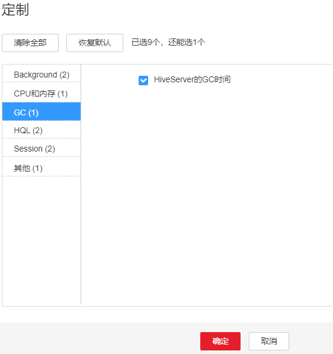
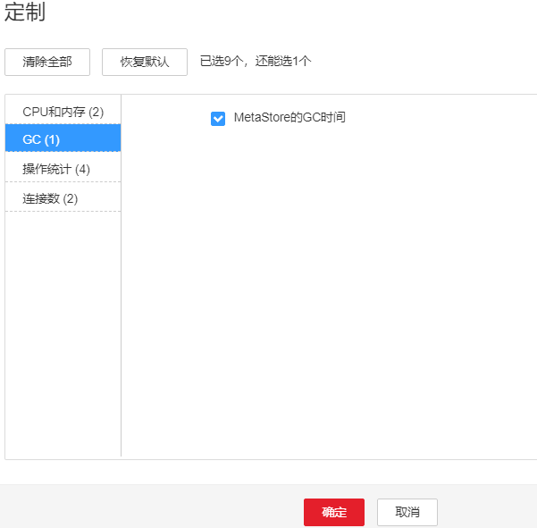

# ALM-16007 Hive GC 时间超出阈值

## 告警解释

系统每60秒周期性检测Hive服务的GC时间，当检测到Hive服务的GC时间超出阈值\(连续3次检测超过12秒\)时产生该告警。用户可通过“运维 \> 告警 \> 阈值设置 \>  _待操作集群的名称_  \> Hive”修改阈值。当Hive GC时间小于或等于阈值时，告警恢复。

## 告警属性

<table><thead align="left"><tr id="row59129055"><th class="cellrowborder" valign="top" width="33.33333333333333%" id="mcps1.1.4.1.1">
告警ID

</th>
<th class="cellrowborder" valign="top" width="33.33333333333333%" id="mcps1.1.4.1.2">
告警级别

</th>
<th class="cellrowborder" valign="top" width="33.33333333333333%" id="mcps1.1.4.1.3">
是否自动清除

</th>
</tr>
</thead>
<tbody><tr id="row37746813"><td class="cellrowborder" valign="top" width="33.33333333333333%" headers="mcps1.1.4.1.1 ">
16007

</td>
<td class="cellrowborder" valign="top" width="33.33333333333333%" headers="mcps1.1.4.1.2 ">
重要

</td>
<td class="cellrowborder" valign="top" width="33.33333333333333%" headers="mcps1.1.4.1.3 ">
是

</td>
</tr>
</tbody>
</table>

## 告警参数

<table><thead align="left"><tr id="row28890097"><th class="cellrowborder" valign="top" width="50%" id="mcps1.1.3.1.1">
参数名称

</th>
<th class="cellrowborder" valign="top" width="50%" id="mcps1.1.3.1.2">
参数含义

</th>
</tr>
</thead>
<tbody><tr id="row18994184913243"><td class="cellrowborder" valign="top" width="50%" headers="mcps1.1.3.1.1 ">
来源

</td>
<td class="cellrowborder" valign="top" width="50%" headers="mcps1.1.3.1.2 ">
产生告警的集群名称。

</td>
</tr>
<tr id="row14907948"><td class="cellrowborder" valign="top" width="50%" headers="mcps1.1.3.1.1 ">
服务名

</td>
<td class="cellrowborder" valign="top" width="50%" headers="mcps1.1.3.1.2 ">
产生告警的服务名称。

</td>
</tr>
<tr id="row32461705"><td class="cellrowborder" valign="top" width="50%" headers="mcps1.1.3.1.1 ">
角色名

</td>
<td class="cellrowborder" valign="top" width="50%" headers="mcps1.1.3.1.2 ">
产生告警的角色名称。

</td>
</tr>
<tr id="row779592"><td class="cellrowborder" valign="top" width="50%" headers="mcps1.1.3.1.1 ">
主机名

</td>
<td class="cellrowborder" valign="top" width="50%" headers="mcps1.1.3.1.2 ">
产生告警的主机名。

</td>
</tr>
<tr id="row1016518552460"><td class="cellrowborder" valign="top" width="50%" headers="mcps1.1.3.1.1 ">
Trigger condition

</td>
<td class="cellrowborder" valign="top" width="50%" headers="mcps1.1.3.1.2 ">
系统当前指标取值满足自定义的告警设置条件。

</td>
</tr>
</tbody>
</table>

## 对系统的影响

GC时间超出阈值，会影响到Hive数据的读写。

## 可能原因

该节点Hive实例内存使用率过大，或配置的堆内存不合理，导致进程GC频繁。

## 处理步骤

**检查GC时间**

1.  在FusionInsight Manager首页，选择“运维 \> 告警 \> 告警”，选中“告警ID”为“16007”的告警，查看“定位信息”中的角色名并确定实例的IP地址。
    -   告警上报的角色是HiveServer，执行[2](#li53865803163548)。
    -   告警上报的角色是MetaStore，执行[3](#li21053882163548)。

2.  在FusionInsight Manager首页，选择“集群 \>  _待操作集群的名称_  \> 服务 \> Hive \> 实例”，单击告警上报的HiveServer，进入实例“概览”页面，单击图表区域右上角的下拉菜单，选择“定制 \> GC”，勾选“HiveServer的GC时间” ，单击“确定”，查看GC时间是否大于12秒。

    -   是，执行[4](#li55267213163548)。
    -   否，执行[7](#li24184344163548)。

    **图 1**  定制HiveServer的GC时间  
    

3.  在FusionInsight Manager首页，选择“集群 \>  _待操作集群的名称_  \> 服务 \> Hive \> 实例”，单击告警上报的MetaStore，进入实例“概览”页面，单击图表区域右上角的下拉菜单，选择“定制 \> GC”，勾选“MetaStore的GC时间” ，单击“确定”，查看GC时间是否大于12秒。

    -   是，执行[4](#li55267213163548)。
    -   否，执行[7](#li24184344163548)。

    **图 2**  定制MetaStore的GC时间  
    

**查看JVM的当前配置**

1.  在FusionInsight Manager首页，选择“集群 \>  _待操作集群的名称_  \> 服务 \> Hive \> 配置”，选择“全部配置”， 选择“HiveServer/MetaStore \> JVM”，将“HIVE\_GC\_OPTS/METASTORE\_GC\_OPTS”参数中“-Xmx”的值根据如下建议进行调整，并单击“保存”。

    > **说明：** 
    >1.  HiveServer的GC参数配置建议
    >    -   当Hive GC时间超出阈值时，将“-Xmx”值调整为默认值的2倍，比如：“-Xmx”默认设置为2G时，调整“-Xmx”的值为4G。
    >    -   建议同时调节“-Xms”的值，使“-Xms”和“-Xmx”比值为1:2，这样可以避免JVM动态调整堆内存大小时影响性能。
    >2.  MetaServer的GC参数配置建议
    >    -   当Meta GC时间超出阈值时，将“-Xmx”值调整为默认值的2倍，比如：“-Xmx”默认设置为2G时，调整“-Xmx”的值为4G。
    >    -   建议同时调节“-Xms”的值，使“-Xms”和“-Xmx”比值为1:2，这样可以避免JVM动态调整堆内存大小时影响性能。

2.  选择“更多 \> 重启服务”重启服务。
3.  观察界面告警是否清除。
    -   是，处理完毕。
    -   否，执行[7](#li24184344163548)。

**收集故障信息**

1.  在主备集群的FusionInsight Manager首页，选择“运维 \> 日志 \> 下载”。
2.  在“服务”中勾选待操作集群的“Hive”。
3.  单击右上角的设置日志收集的“开始时间”和“结束时间”分别为告警产生时间的前后10分钟，单击“下载”。
4.  请联系运维人员，并发送已收集的故障日志信息。

## 告警清除

此告警修复后，系统会自动清除此告警，无需手工清除。

## 参考信息

无

