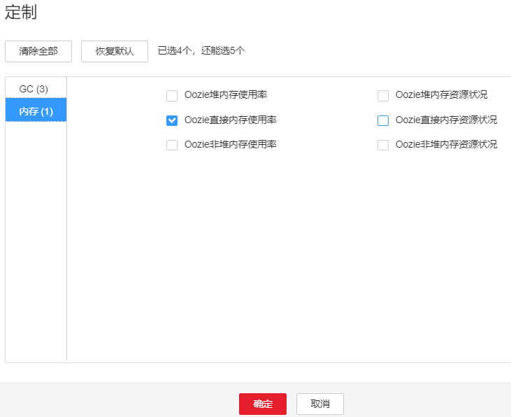

# ALM-17006 Oozie直接内存使用率超过阈值

## 告警解释

系统每30秒周期性检测Oozie服务直接内存使用状态，当检测到Oozie实例直接内存使用率超出阈值（最大内存的80%）时，产生该告警。当Oozie直接内存使用率小于或等于阈值时，告警恢复。

## 告警属性

<table><thead align="left"><tr id="row23830225"><th class="cellrowborder" valign="top" width="33.33333333333333%" id="mcps1.1.4.1.1">
告警ID

</th>
<th class="cellrowborder" valign="top" width="33.33333333333333%" id="mcps1.1.4.1.2">
告警级别

</th>
<th class="cellrowborder" valign="top" width="33.33333333333333%" id="mcps1.1.4.1.3">
是否自动清除

</th>
</tr>
</thead>
<tbody><tr id="row44876830"><td class="cellrowborder" valign="top" width="33.33333333333333%" headers="mcps1.1.4.1.1 ">
17006

</td>
<td class="cellrowborder" valign="top" width="33.33333333333333%" headers="mcps1.1.4.1.2 ">
重要

</td>
<td class="cellrowborder" valign="top" width="33.33333333333333%" headers="mcps1.1.4.1.3 ">
是

</td>
</tr>
</tbody>
</table>

## 告警参数

<table><thead align="left"><tr id="row59299451"><th class="cellrowborder" valign="top" width="50%" id="mcps1.1.3.1.1">
参数名称

</th>
<th class="cellrowborder" valign="top" width="50%" id="mcps1.1.3.1.2">
参数含义

</th>
</tr>
</thead>
<tbody><tr id="row92251033132112"><td class="cellrowborder" valign="top" width="50%" headers="mcps1.1.3.1.1 ">
来源

</td>
<td class="cellrowborder" valign="top" width="50%" headers="mcps1.1.3.1.2 ">
产生告警的集群名称。

</td>
</tr>
<tr id="row38855258"><td class="cellrowborder" valign="top" width="50%" headers="mcps1.1.3.1.1 ">
服务名

</td>
<td class="cellrowborder" valign="top" width="50%" headers="mcps1.1.3.1.2 ">
产生告警的服务名称。

</td>
</tr>
<tr id="row46299319"><td class="cellrowborder" valign="top" width="50%" headers="mcps1.1.3.1.1 ">
角色名

</td>
<td class="cellrowborder" valign="top" width="50%" headers="mcps1.1.3.1.2 ">
产生告警的角色名称。

</td>
</tr>
<tr id="row47624865"><td class="cellrowborder" valign="top" width="50%" headers="mcps1.1.3.1.1 ">
主机名

</td>
<td class="cellrowborder" valign="top" width="50%" headers="mcps1.1.3.1.2 ">
产生告警的主机名。

</td>
</tr>
<tr id="row3721419"><td class="cellrowborder" valign="top" width="50%" headers="mcps1.1.3.1.1 ">
Trigger Condition

</td>
<td class="cellrowborder" valign="top" width="50%" headers="mcps1.1.3.1.2 ">
系统当前指标取值满足自定义的告警设置条件。

</td>
</tr>
</tbody>
</table>

## 对系统的影响

直接内存溢出可能导致服务崩溃。

## 可能原因

该节点Oozie实例直接内存使用率过大，或配置的直接内存不合理，导致使用率超过阈值。

## 处理步骤

**检查直接内存使用率。**

1.  在FusionInsight Manager首页，选择“运维 \> 告警 \> 告警 \> Oozie直接内存使用率超过阈值 \> 定位信息”检查该告警的“定位信息”。查看告警上报的实例主机名。
2.  在FusionInsight Manager首页，选择“集群 \>  _待操作集群的名称_  \> 服务 \> Oozie \> 实例”，选择上报告警实例主机名对应的角色，单击图表区域右上角的下拉菜单，选择“定制 \> 内存”中的“Oozie直接内存使用率”，单击“确定”。

    **图 1**  定制Oozie直接内存使用率  
    

3.  查看Oozie使用的直接内存是否已达到Oozie设定的阈值（默认值为最大直接内存的80%）。
    -   是，执行[4](#zh-cn_topic_0066982698_li79703172532)。
    -   否，执行[6](#d0e31949)。

4.  在FusionInsight Manager首页，选择“集群 \>  _待操作集群的名称_  \> 服务\> Oozie \> 配置”，选择“全部配置”，在搜索栏里搜索“GC\_OPTS”参数。将“-XX:MaxDirectMemorySize”的值根据实际情况调大，并单击“保存”，单击“确定”。

    > **说明：** 
    >Oozie的GC参数配置建议：
    >建议将“-XX:MaxDirectMemorySize”值设置为“-Xmx”值的1/4，比如：当“-Xmx”设置为4G时，“-XX:MaxDirectMemorySize”设置为1024M，“-Xmx”设置为2G时，“-XX:MaxDirectMemorySize”设置为512M。并且建议“-XX:MaxDirectMemorySize”值不小于512M。

5.  重启受影响的服务或实例，观察界面告警是否清除。
    -   是，处理完毕。
    -   否，执行[6](#d0e31949)。

**收集故障信息。**

1.  在FusionInsight Manager界面，选择“运维 \> 日志 \> 下载”。
2.  在“服务”框中勾选待操作集群的“Oozie”。
3.  单击右上角的设置日志收集的“开始时间”和“结束时间”分别为告警产生时间的前后10分钟，单击“下载”。
4.  请联系运维人员，并发送已收集的故障日志信息。

## 告警清除

此告警修复后，系统会自动清除此告警，无需手工清除。

## 参考信息

无。

