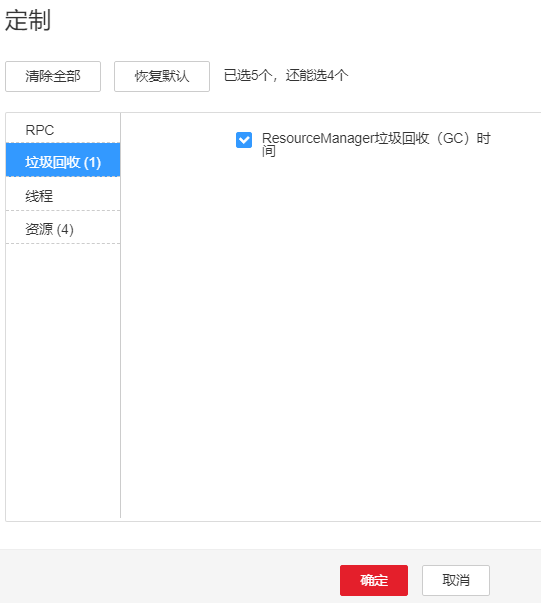

# ALM-18010 ResourceManager进程垃圾回收（GC）时间超过阈值

## 告警解释

系统每60秒周期性检测ResourceManager进程的垃圾回收（GC）占用时间，当检测到ResourceManager进程的垃圾回收（GC）时间超出阈值（默认12秒）时，产生该告警。

垃圾回收（GC）时间小于阈值时，告警恢复。

## 告警属性

<table><thead align="left"><tr id="row20504385"><th class="cellrowborder" valign="top" width="33.33333333333333%" id="mcps1.1.4.1.1">
告警ID

</th>
<th class="cellrowborder" valign="top" width="33.33333333333333%" id="mcps1.1.4.1.2">
告警级别

</th>
<th class="cellrowborder" valign="top" width="33.33333333333333%" id="mcps1.1.4.1.3">
是否自动清除

</th>
</tr>
</thead>
<tbody><tr id="row31321393"><td class="cellrowborder" valign="top" width="33.33333333333333%" headers="mcps1.1.4.1.1 ">
18010

</td>
<td class="cellrowborder" valign="top" width="33.33333333333333%" headers="mcps1.1.4.1.2 ">
重要

</td>
<td class="cellrowborder" valign="top" width="33.33333333333333%" headers="mcps1.1.4.1.3 ">
是

</td>
</tr>
</tbody>
</table>

## 告警参数

<table><thead align="left"><tr id="row42048455"><th class="cellrowborder" valign="top" width="50%" id="mcps1.1.3.1.1">
参数名称

</th>
<th class="cellrowborder" valign="top" width="50%" id="mcps1.1.3.1.2">
参数含义

</th>
</tr>
</thead>
<tbody><tr id="row5378155881910"><td class="cellrowborder" valign="top" width="50%" headers="mcps1.1.3.1.1 ">
来源

</td>
<td class="cellrowborder" valign="top" width="50%" headers="mcps1.1.3.1.2 ">
产生告警的集群名称。

</td>
</tr>
<tr id="row28078335"><td class="cellrowborder" valign="top" width="50%" headers="mcps1.1.3.1.1 ">
服务名

</td>
<td class="cellrowborder" valign="top" width="50%" headers="mcps1.1.3.1.2 ">
产生告警的服务名称。

</td>
</tr>
<tr id="row6057523"><td class="cellrowborder" valign="top" width="50%" headers="mcps1.1.3.1.1 ">
角色名

</td>
<td class="cellrowborder" valign="top" width="50%" headers="mcps1.1.3.1.2 ">
产生告警的角色名称。

</td>
</tr>
<tr id="row468450"><td class="cellrowborder" valign="top" width="50%" headers="mcps1.1.3.1.1 ">
主机名

</td>
<td class="cellrowborder" valign="top" width="50%" headers="mcps1.1.3.1.2 ">
产生告警的主机名。

</td>
</tr>
<tr id="row12687257"><td class="cellrowborder" valign="top" width="50%" headers="mcps1.1.3.1.1 ">
Trigger Condition

</td>
<td class="cellrowborder" valign="top" width="50%" headers="mcps1.1.3.1.2 ">
系统当前指标取值满足自定义的告警设置条件。

</td>
</tr>
</tbody>
</table>

## 对系统的影响

ResourceManager进程的垃圾回收时间过长，可能影响该ResourceManager进程正常提供服务。

## 可能原因

该节点ResourceManager实例堆内存使用率过大，或配置的堆内存不合理，导致进程GC频繁。

## 处理步骤

**检查GC时间。**

1.  在FusionInsight Manager首页，选择“运维 \> 告警 \> 告警 \> ALM-18010 ResourceManager进程垃圾回收（GC）时间超过阈值 \> 定位信息”。查看告警上报的实例的IP地址。
2.  在FusionInsight Manager首页，选择“集群 \>  _待操作集群的名称_  \> 服务 \> Yarn \> 实例 \> ResourceManager（对应上报告警实例IP地址）”，单击图表区域右上角的下拉菜单，选择“定制 \> 垃圾回收”，勾选“ResourceManager垃圾回收（GC）时间”。查看ResourceManager每分钟的垃圾回收时间统计情况。

    **图 1**  定制ResourceManager垃圾回收（GC）时间  
    

3.  查看ResourceManager每分钟的垃圾回收时间统计值是否大于告警阈值（默认12秒）。
    -   是，执行[4](#li4033106183517)。
    -   否，执行[7](#li2203726083517)。

4.  在FusionInsight Manager首页，选择“集群 \>  _待操作集群的名称_  \> 服务 \> Yarn \> 配置 \> 全部配置 \> ResourceManager \> 系统”。将“GC\_OPTS”参数根据实际情况调大。

    > **说明：** 
    >集群中的NodeManager实例数量和ResourceManager内存大小的对应关系参考如下：
    >-   集群中的NodeManager实例数据达到100，ResourceManager实例的JVM参数建议配置为：-Xms4G -Xmx4G -XX:NewSize=512M -XX:MaxNewSize=1G
    >-   集群中的NodeManager实例数据达到200，ResourceManager实例的JVM参数建议配置为：-Xms6G -Xmx6G -XX:NewSize=512M -XX:MaxNewSize=1G
    >-   集群中的NodeManager实例数据达到500，ResourceManager实例的JVM参数建议配置为：-Xms10G -Xmx10G -XX:NewSize=1G -XX:MaxNewSize=2G
    >-   集群中的NodeManager实例数据达到1000，ResourceManager实例的JVM参数建议配置为：-Xms20G -Xmx20G -XX:NewSize=1G -XX:MaxNewSize=2G
    >-   集群中的NodeManager实例数据达到2000，ResourceManager实例的JVM参数建议配置为：-Xms40G -Xmx40G -XX:NewSize=2G -XX:MaxNewSize=4G
    >-   集群中的NodeManager实例数据达到3000，ResourceManager实例的JVM参数建议配置为：-Xms60G -Xmx60G -XX:NewSize=2G -XX:MaxNewSize=4G
    >-   集群中的NodeManager实例数据达到4000，ResourceManager实例的JVM参数建议配置为：-Xms80G -Xmx80G -XX:NewSize=2G -XX:MaxNewSize=4G
    >-   集群中的NodeManager实例数据达到5000，ResourceManager实例的JVM参数建议配置为：-Xms100G -Xmx100G -XX:NewSize=3G -XX:MaxNewSize=6G

5.  保存配置，并重启该ResourceManager实例。
6.  观察界面告警是否清除。
    -   是，处理完毕。
    -   否，执行[7](#li2203726083517)。

**收集故障信息。**

1.  在FusionInsight Manager界面，选择“运维 \> 日志 \> 下载”。
2.  在“服务”中勾选待操作集群的“ResourceManager”。
3.  单击右上角的设置日志收集的“开始时间”和“结束时间”分别为告警产生时间的前后10分钟，单击“下载”。
4.  请联系运维人员，并发送已收集的故障日志信息。

## 告警清除

此告警修复后，系统会自动清除此告警，无需手工清除。

## 参考信息

无。

