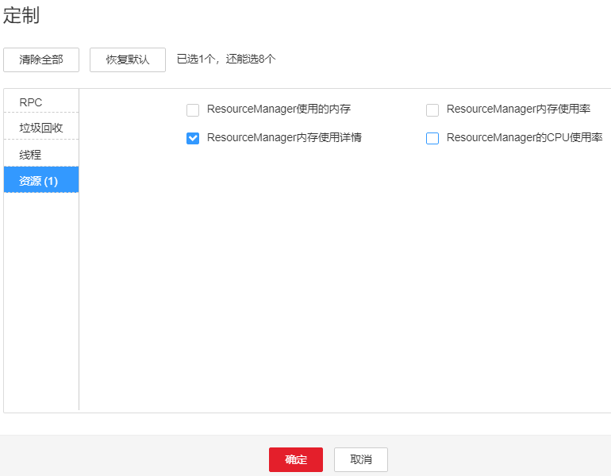

# ALM-18013 ResourceManager直接内存使用率超过阈值

## 告警解释

系统每30秒周期性检测ResourceManager服务直接内存使用状态，当检测到ResourceManager实例直接内存使用率超出阈值（最大内存的90%）时，产生该告警。

直接内存使用率小于阈值时，告警恢复。

## 告警属性

<table><thead align="left"><tr id="row33796185"><th class="cellrowborder" valign="top" width="33.33333333333333%" id="mcps1.1.4.1.1">
告警ID

</th>
<th class="cellrowborder" valign="top" width="33.33333333333333%" id="mcps1.1.4.1.2">
告警级别

</th>
<th class="cellrowborder" valign="top" width="33.33333333333333%" id="mcps1.1.4.1.3">
是否自动清除

</th>
</tr>
</thead>
<tbody><tr id="row2494817"><td class="cellrowborder" valign="top" width="33.33333333333333%" headers="mcps1.1.4.1.1 ">
18013

</td>
<td class="cellrowborder" valign="top" width="33.33333333333333%" headers="mcps1.1.4.1.2 ">
重要

</td>
<td class="cellrowborder" valign="top" width="33.33333333333333%" headers="mcps1.1.4.1.3 ">
是

</td>
</tr>
</tbody>
</table>

## 告警参数

<table><thead align="left"><tr id="row35523450"><th class="cellrowborder" valign="top" width="50%" id="mcps1.1.3.1.1">
参数名称

</th>
<th class="cellrowborder" valign="top" width="50%" id="mcps1.1.3.1.2">
参数含义

</th>
</tr>
</thead>
<tbody><tr id="row13219124010196"><td class="cellrowborder" valign="top" width="50%" headers="mcps1.1.3.1.1 ">
来源

</td>
<td class="cellrowborder" valign="top" width="50%" headers="mcps1.1.3.1.2 ">
产生告警的集群名称。

</td>
</tr>
<tr id="row22050308"><td class="cellrowborder" valign="top" width="50%" headers="mcps1.1.3.1.1 ">
服务名

</td>
<td class="cellrowborder" valign="top" width="50%" headers="mcps1.1.3.1.2 ">
产生告警的服务名称。

</td>
</tr>
<tr id="row2498475"><td class="cellrowborder" valign="top" width="50%" headers="mcps1.1.3.1.1 ">
角色名

</td>
<td class="cellrowborder" valign="top" width="50%" headers="mcps1.1.3.1.2 ">
产生告警的角色名称。

</td>
</tr>
<tr id="row27197765"><td class="cellrowborder" valign="top" width="50%" headers="mcps1.1.3.1.1 ">
主机名

</td>
<td class="cellrowborder" valign="top" width="50%" headers="mcps1.1.3.1.2 ">
产生告警的主机名。

</td>
</tr>
<tr id="row18628895"><td class="cellrowborder" valign="top" width="50%" headers="mcps1.1.3.1.1 ">
Trigger Condition

</td>
<td class="cellrowborder" valign="top" width="50%" headers="mcps1.1.3.1.2 ">
系统当前指标取值满足自定义的告警设置条件。

</td>
</tr>
</tbody>
</table>

## 对系统的影响

ResourceManager可用直接内存不足，可能会造成内存溢出导致服务崩溃。

## 可能原因

该节点ResourceManager实例直接内存使用率过大，或配置的直接内存不合理，导致使用率超过阈值。

## 处理步骤

**检查直接内存使用率。**

1.  在FusionInsight Manager首页，选择“运维 \> 告警 \> 告警 \> ALM-18013 ResourceManager直接内存使用率超过阈值 \> 定位信息”。查看告警上报的实例的IP地址。
2.  在FusionInsight Manager首页，选择“集群 \>  _待操作集群的名称_  \> 服务 \> Yarn \> 实例 \> ResourceManager（对应上报告警实例IP地址）”，单击图表区域右上角的下拉菜单，选择“定制 \> 资源”，勾选“ResourceManager内存使用详情”。查看直接内存使用情况。

    **图 1**  定制ResourceManager内存使用详情  
    

3.  查看ResourceManager使用的直接内存是否已达到ResourceManager设定的最大直接内存的90%\(默认阈值\)。
    -   是，执行[4](#li3112690684330)。
    -   否，执行[9](#li4344814084330)。

4.  在FusionInsight Manager首页，选择“集群 \>  _待操作集群的名称_  \> 服务 \> Yarn \> 配置 \> 全部配置 \> ResourceManager \> 系统”。查看“GC\_OPTS”参数中是否存在“-XX:MaxDirectMemorySize”。
    -   是，执行[5](#li48911622152)。
    -   否，执行[7](#li881319113122)。

5.  在“GC\_OPTS”中把参数“-XX:MaxDirectMemorySize”删除。
6.  保存配置，并重启ResourceManager实例。
7.  查看告警信息，是否存在告警“ALM-18008 ResourceManager堆内存使用率超过阈值”。
    -   是，查看“ALM-18008 ResourceManager堆内存使用率超过阈值”进行处理。
    -   否，执行[8](#li2719719284330)。

8.  观察界面告警是否清除。
    -   是，处理完毕。
    -   否，执行[9](#li4344814084330)。

**收集故障信息。**

1.  在FusionInsight Manager界面，选择“运维 \> 日志 \> 下载”。
2.  在“服务”中勾选待操作集群的“ResourceManager”。
3.  单击右上角的设置日志收集的“开始时间”和“结束时间”分别为告警产生时间的前后10分钟，单击“下载”。
4.  请联系运维人员，并发送已收集的故障日志信息。

## 告警清除

此告警修复后，系统会自动清除此告警，无需手工清除。

## 参考信息

无。

