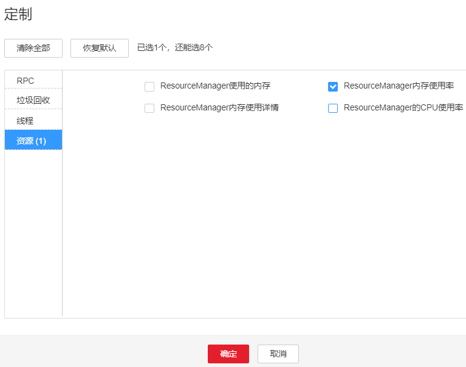

# ALM-18016 ResourceManager非堆内存使用率超过阈值

## 告警解释

系统每30秒周期性检测Yarn ResourceManager非堆内存使用率，并把实际的Yarn ResourceManager非堆内存使用率和阈值相比较。当Yarn ResourceManager非堆内存使用率超出阈值（默认为最大非堆内存的90%）时产生该告警。

用户可通过“运维 \> 告警 \> 阈值设置 \>  _待操作集群的名称_  \> Yarn”修改阈值。

当Yarn ResourceManager非堆内存使用率小于或等于阈值时，告警恢复。

## 告警属性

<table><thead align="left"><tr id="row17694464"><th class="cellrowborder" valign="top" width="33.33333333333333%" id="mcps1.1.4.1.1">
告警ID

</th>
<th class="cellrowborder" valign="top" width="33.33333333333333%" id="mcps1.1.4.1.2">
告警级别

</th>
<th class="cellrowborder" valign="top" width="33.33333333333333%" id="mcps1.1.4.1.3">
是否自动清除

</th>
</tr>
</thead>
<tbody><tr id="row30182949"><td class="cellrowborder" valign="top" width="33.33333333333333%" headers="mcps1.1.4.1.1 ">
18016

</td>
<td class="cellrowborder" valign="top" width="33.33333333333333%" headers="mcps1.1.4.1.2 ">
重要

</td>
<td class="cellrowborder" valign="top" width="33.33333333333333%" headers="mcps1.1.4.1.3 ">
是

</td>
</tr>
</tbody>
</table>

## 告警参数

<table><thead align="left"><tr id="row56549341"><th class="cellrowborder" valign="top" width="50%" id="mcps1.1.3.1.1">
参数名称

</th>
<th class="cellrowborder" valign="top" width="50%" id="mcps1.1.3.1.2">
参数含义

</th>
</tr>
</thead>
<tbody><tr id="row197111614191918"><td class="cellrowborder" valign="top" width="50%" headers="mcps1.1.3.1.1 ">
来源

</td>
<td class="cellrowborder" valign="top" width="50%" headers="mcps1.1.3.1.2 ">
产生告警的集群名称。

</td>
</tr>
<tr id="row14420510"><td class="cellrowborder" valign="top" width="50%" headers="mcps1.1.3.1.1 ">
服务名

</td>
<td class="cellrowborder" valign="top" width="50%" headers="mcps1.1.3.1.2 ">
产生告警的服务名称。

</td>
</tr>
<tr id="row39433286"><td class="cellrowborder" valign="top" width="50%" headers="mcps1.1.3.1.1 ">
角色名

</td>
<td class="cellrowborder" valign="top" width="50%" headers="mcps1.1.3.1.2 ">
产生告警的角色名称。

</td>
</tr>
<tr id="row19882291"><td class="cellrowborder" valign="top" width="50%" headers="mcps1.1.3.1.1 ">
主机名

</td>
<td class="cellrowborder" valign="top" width="50%" headers="mcps1.1.3.1.2 ">
产生告警的主机名。

</td>
</tr>
<tr id="row26941016"><td class="cellrowborder" valign="top" width="50%" headers="mcps1.1.3.1.1 ">
Trigger Condition

</td>
<td class="cellrowborder" valign="top" width="50%" headers="mcps1.1.3.1.2 ">
系统当前指标取值满足自定义的告警设置条件。

</td>
</tr>
</tbody>
</table>

## 对系统的影响

Yarn ResourceManager非堆内存使用率过高，会影响Yarn任务提交和运行的性能，甚至造成内存溢出导致Yarn服务不可用。

## 可能原因

该节点Yarn ResourceManager实例非堆内存使用量过大，或分配的非堆内存不合理，导致使用量超过阈值。

## 处理步骤

**检查非堆内存使用量。**

1.  在FusionInsight Manager界面，选择“运维 \> 告警 \> 告警 \> ALM-18016 Yarn ResourceManager非堆内存使用率超过阈值 \> 定位信息”。查看告警上报的实例的主机名。
2.  在FusionInsight Manager界面，选择“集群 \>  _待操作集群的名称_  \> 服务 \> Yarn \> 实例 \> ResourceManager（对应上报告警实例主机名）”，单击图表区域右上角的下拉菜单，选择“定制 \> 资源”，勾选“ResourceManager内存使用率”。查看非堆内存使用情况。

    **图 1**  定制ResourceManager内存使用率  
    

3.  查看ResourceManager使用的非堆内存是否已达到ResourceManager设定的最大非堆内存的90%。
    -   是，执行[4](#li4804656085044)。
    -   否，执行[6](#li3192337385044)。

4.  在FusionInsight Manager界面，选择“集群 \>  _待操作集群的名称_  \> 服务 \> Yarn \> 配置 \> 全部配置 \> ResourceManager \> 系统”。对ResourceManager 的内存参数“GC\_OPTS”进行调整。保存配置，并重启ResourceManager实例。

    > **说明：** 
    >集群中的NodeManager实例数量和ResourceManager内存大小的对应关系参考如下：
    >-   集群中的NodeManager实例数据达到100，ResourceManager实例的JVM参数建议配置为：-Xms4G -Xmx4G -XX:NewSize=512M -XX:MaxNewSize=1G
    >-   集群中的NodeManager实例数据达到200，ResourceManager实例的JVM参数建议配置为：-Xms6G -Xmx6G -XX:NewSize=512M -XX:MaxNewSize=1G
    >-   集群中的NodeManager实例数据达到500，ResourceManager实例的JVM参数建议配置为：-Xms10G -Xmx10G -XX:NewSize=1G -XX:MaxNewSize=2G
    >-   集群中的NodeManager实例数据达到1000，ResourceManager实例的JVM参数建议配置为：-Xms20G -Xmx20G -XX:NewSize=1G -XX:MaxNewSize=2G
    >-   集群中的NodeManager实例数据达到2000，ResourceManager实例的JVM参数建议配置为：-Xms40G -Xmx40G -XX:NewSize=2G -XX:MaxNewSize=4G
    >-   集群中的NodeManager实例数据达到3000，ResourceManager实例的JVM参数建议配置为：-Xms60G -Xmx60G -XX:NewSize=2G -XX:MaxNewSize=4G
    >-   集群中的NodeManager实例数据达到4000，ResourceManager实例的JVM参数建议配置为：-Xms80G -Xmx80G -XX:NewSize=2G -XX:MaxNewSize=4G
    >-   集群中的NodeManager实例数据达到5000，ResourceManager实例的JVM参数建议配置为：-Xms100G -Xmx100G -XX:NewSize=3G -XX:MaxNewSize=6G

5.  观察界面告警是否清除。
    -   是，处理完毕。
    -   否，执行[6](#li3192337385044)。

**收集故障信息。**

1.  在FusionInsight Manager界面，选择“运维 \> 日志 \> 下载”。
2.  在“服务”中勾选待操作集群的如下节点信息。
    -   NodeAgent
    -   Yarn

3.  单击右上角的设置日志收集的“开始时间”和“结束时间”分别为告警产生时间的前后10分钟，单击“下载”。
4.  请联系运维人员，并发送已收集的故障日志信息。

## 告警清除

此告警修复后，系统会自动清除此告警，无需手工清除。

## 参考信息

无。

