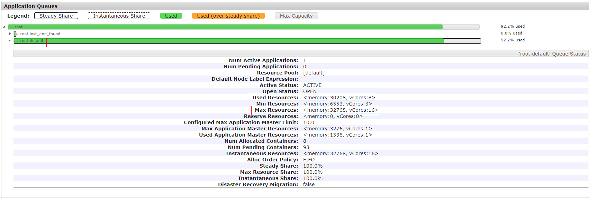
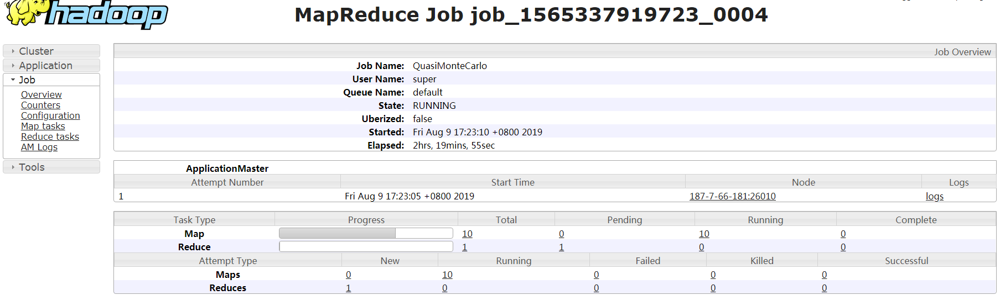

# ALM-18020 Yarn任务执行超时

## 告警解释

系统每15分钟周期性检测提交到Yarn上的Mapreduce和Spark应用任务（JDBC常驻任务除外），当检测到任务执行时间超过用户指定的超时时间时，产生该告警，但任务仍继续正常执行。其中，Mapreduce的客户端超时参数为“mapreduce.application.timeout.alarm”，Spark的客户端超时参数为“spark.application.timeout.alarm”（单位：毫秒）。

当该任务结束或者任务被终止后，该告警会自动清除。

## 告警属性

<table><thead align="left"><tr id="row37502219"><th class="cellrowborder" valign="top" width="33.33333333333333%" id="mcps1.1.4.1.1">
告警ID

</th>
<th class="cellrowborder" valign="top" width="33.33333333333333%" id="mcps1.1.4.1.2">
告警级别

</th>
<th class="cellrowborder" valign="top" width="33.33333333333333%" id="mcps1.1.4.1.3">
是否自动清除

</th>
</tr>
</thead>
<tbody><tr id="row26774487"><td class="cellrowborder" valign="top" width="33.33333333333333%" headers="mcps1.1.4.1.1 ">
18020

</td>
<td class="cellrowborder" valign="top" width="33.33333333333333%" headers="mcps1.1.4.1.2 ">
次要

</td>
<td class="cellrowborder" valign="top" width="33.33333333333333%" headers="mcps1.1.4.1.3 ">
是

</td>
</tr>
</tbody>
</table>

## 告警参数

<table><thead align="left"><tr id="row49074905"><th class="cellrowborder" valign="top" width="50%" id="mcps1.1.3.1.1">
参数名称

</th>
<th class="cellrowborder" valign="top" width="50%" id="mcps1.1.3.1.2">
参数含义

</th>
</tr>
</thead>
<tbody><tr id="row4896154413186"><td class="cellrowborder" valign="top" width="50%" headers="mcps1.1.3.1.1 ">
来源

</td>
<td class="cellrowborder" valign="top" width="50%" headers="mcps1.1.3.1.2 ">
产生告警的集群名称。

</td>
</tr>
<tr id="row33007158"><td class="cellrowborder" valign="top" width="50%" headers="mcps1.1.3.1.1 ">
服务名

</td>
<td class="cellrowborder" valign="top" width="50%" headers="mcps1.1.3.1.2 ">
产生告警的服务名称。

</td>
</tr>
<tr id="row64074093"><td class="cellrowborder" valign="top" width="50%" headers="mcps1.1.3.1.1 ">
角色名

</td>
<td class="cellrowborder" valign="top" width="50%" headers="mcps1.1.3.1.2 ">
产生告警的角色名称。

</td>
</tr>
<tr id="row47631980"><td class="cellrowborder" valign="top" width="50%" headers="mcps1.1.3.1.1 ">
应用名

</td>
<td class="cellrowborder" valign="top" width="50%" headers="mcps1.1.3.1.2 ">
产生告警的应用名。

</td>
</tr>
<tr id="row753711307398"><td class="cellrowborder" valign="top" width="50%" headers="mcps1.1.3.1.1 ">
Trigger Condition

</td>
<td class="cellrowborder" valign="top" width="50%" headers="mcps1.1.3.1.2 ">
系统当前指标取值满足自定义的告警设置条件。

</td>
</tr>
</tbody>
</table>

## 对系统的影响

任务执行超时后的运行时间内，该告警一直存在，但任务仍继续正常执行，没有任何影响。

## 可能原因

-   指定的超时时间少于所需执行时间。
-   任务运行的队列资源不足。
-   任务数据倾斜，导致一些任务处理的数据量大，执行时间长。

## 处理步骤

**检查超时时间是否正确设置。**

1.  在FusionInsight Manager首页，选择“运维 \> 告警 \> 告警”，弹出告警页面。
2.  在告警页面，选中“告警ID”为“18020”的告警，在该页面的告警详情里查看“定位信息”，查看超时任务的名称和超时时间。
3.  根据任务名称和超时时间，选择“集群 \>  _待操作集群的名称_  \> 服务 \> Yarn \> ResourceManager\(主\)”，登录Yarn的原生页面。在原生页面找到该任务，查看该任务的“StartTime”，根据系统当前时间计算任务已执行的时间。查看已执行的时间是否大于超时时间。
    -   是，执行[5](#li9996125375313)。
    -   否，执行[10](#li6394993485922)。

4.  请根据业务合理评估任务的预期执行时间，并与任务的超时时间对比。若超时时间设置过小，请设置客户端的超时时间（“mapreduce.application.timeout.alarm”或“spark.application.timeout.alarm”）为任务的预期执行时间。重新运行任务后，查看是否不再上报告警。
    -   是，处理完毕。
    -   否，执行[5](#li9996125375313)。

**检查队列资源是否不足。**

1.  在原生页面找到该任务，查看该任务的“Queue”中的队列名。单击原生页面左侧“Scheduler”,在“Applications Queues”页框中查找对应的队列名，并下拉展开队列的详细信息，如图所示：

    

2.  查看队列详情中“Used Resources”是否近似等于“Max Resources”，即任务提交的队列中资源已经使用完毕，若队列资源不足，请在FusionInsight Manager的“租户资源 \> 动态资源计划 \> 资源分布策略”中调大队列的“最大资源”。重新运行任务后，查看是否不再上报告警。
    -   是，处理完毕。
    -   否，执行[7](#li5526143185420)。

**检查任务是否发生数据倾斜。**

1.  在Yarn的原生页面，选择“_任务ID_（如application\_1565337919723\_0002） \> Tracking URL:ApplicationMaster \> job\_1565337919723\_0002”，进入如下页面：

    

2.  选择左侧“Job \> Map tasks”或者“Job \> Reduce tasks”，查看每个Map或者每个Reduce任务的执行时间是否相差很大，如果相差很大，说明任务数据发生了倾斜，需要对任务数据进行均衡。
3.  按照如上原因进行处理后，重新执行任务，观察本告警是否还出现。
    -   是，执行[10](#li6394993485922)。
    -   否，处理完毕。

**收集故障信息**

1.  在FusionInsight Manager界面，选择“运维 \> 日志 \> 下载”。
2.  在“服务”中勾选待操作集群的“Yarn”。
3.  单击右上角的设置日志收集的“开始时间”和“结束时间”分别为告警产生时间的前后10分钟，单击“下载”。
4.  请联系运维人员，并发送已收集的故障日志信息。

## 告警清除

此告警修复后，系统会自动清除此告警，无需手工清除。

## 参考信息

无。

