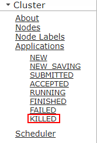

# ALM-18025 Yarn被终止的任务数超过阈值

## 告警解释

告警模块按60秒周期检测Yarn root队列上被终止的应用的数量，当root队列上该监控周期内新增的被终止的应用的数量超过50，且连续发生3次以上时，触发该告警。

## 告警属性

<table><thead align="left"><tr id="row10829199161819"><th class="cellrowborder" valign="top" width="33.33333333333333%" id="mcps1.1.4.1.1">
告警ID

</th>
<th class="cellrowborder" valign="top" width="33.33333333333333%" id="mcps1.1.4.1.2">
告警级别

</th>
<th class="cellrowborder" valign="top" width="33.33333333333333%" id="mcps1.1.4.1.3">
是否自动清除

</th>
</tr>
</thead>
<tbody><tr id="row11834698184"><td class="cellrowborder" valign="top" width="33.33333333333333%" headers="mcps1.1.4.1.1 ">
18025

</td>
<td class="cellrowborder" valign="top" width="33.33333333333333%" headers="mcps1.1.4.1.2 ">
重要

</td>
<td class="cellrowborder" valign="top" width="33.33333333333333%" headers="mcps1.1.4.1.3 ">
是

</td>
</tr>
</tbody>
</table>

## 告警参数

<table><thead align="left"><tr id="row2451192861813"><th class="cellrowborder" valign="top" width="50%" id="mcps1.1.3.1.1">
参数名称

</th>
<th class="cellrowborder" valign="top" width="50%" id="mcps1.1.3.1.2">
参数含义

</th>
</tr>
</thead>
<tbody><tr id="row077613291817"><td class="cellrowborder" valign="top" width="50%" headers="mcps1.1.3.1.1 ">
来源

</td>
<td class="cellrowborder" valign="top" width="50%" headers="mcps1.1.3.1.2 ">
产生告警的集群名称。

</td>
</tr>
<tr id="row8457102815185"><td class="cellrowborder" valign="top" width="50%" headers="mcps1.1.3.1.1 ">
服务名

</td>
<td class="cellrowborder" valign="top" width="50%" headers="mcps1.1.3.1.2 ">
产生告警的服务名称。

</td>
</tr>
<tr id="row846182891817"><td class="cellrowborder" valign="top" width="50%" headers="mcps1.1.3.1.1 ">
角色名

</td>
<td class="cellrowborder" valign="top" width="50%" headers="mcps1.1.3.1.2 ">
产生告警的角色名称。

</td>
</tr>
<tr id="row1863012571189"><td class="cellrowborder" valign="top" width="50%" headers="mcps1.1.3.1.1 ">
主机名

</td>
<td class="cellrowborder" valign="top" width="50%" headers="mcps1.1.3.1.2 ">
产生告警的主机名。

</td>
</tr>
<tr id="row76301557131813"><td class="cellrowborder" valign="top" width="50%" headers="mcps1.1.3.1.1 ">
Trigger Condition

</td>
<td class="cellrowborder" valign="top" width="50%" headers="mcps1.1.3.1.2 ">
系统当前指标取值满足自定义的告警设置条件。

</td>
</tr>
</tbody>
</table>

## 对系统的影响

大量应用任务被强制终止。

## 可能原因

-   人为强制终止大量任务。
-   系统出于某种错误终止任务。

## 处理步骤

**检查告警详情。**

1.  在FusionInsight Manager界面，选择“运维 \> 告警 \> 告警”，打开告警页面。
2.  查看“Yarn被终止的任务数超过阈值”告警详情中的“附加信息”，确认监控阈值是否设置过小。
    -   是，执行[3](#li88991487294)。
    -   否，执行[4](#li195342313207)。

3.  选择“运维 \> 告警 \> 阈值设置 \>  _待操作集群的名称_  \> Yarn \> 其它 \> root队列下被杀死的任务数”，修改该监控的阈值。执行[6](#li64965179612)。
4.  选择“集群 \>  _待操作集群的名称_  \> 服务 \> Yarn \> ResourceManager\(主\)”，进入ResourceManager的WebUI页面。
5.  单击“Applications”下的“KILLED”，单击最上面的任务。查看“Diagnostics”对应的描述信息，根据定位的任务被终止的详情（例如：被某用户终止）处理相关问题。

    **图 1**  单击“KILLED”  
    

6.  等待3分钟，查看该告警是否消除。
    -   是，处理完毕。
    -   否，执行[7](#li76841314475)。

**收集故障信息。**

1.  在FusionInsight Manager界面，选择“运维 \> 日志 \> 下载”。
2.  在“服务”中勾选待操作集群的“Yarn”。
3.  单击右上角的设置日志收集的“开始时间”和“结束时间”分别为告警产生时间的前后10分钟，单击“下载”。
4.  请联系运维人员，并发送已收集的故障日志信息。

## 告警清除

此告警修复后，系统会自动清除此告警，无需手工清除。

## 参考信息

无。

