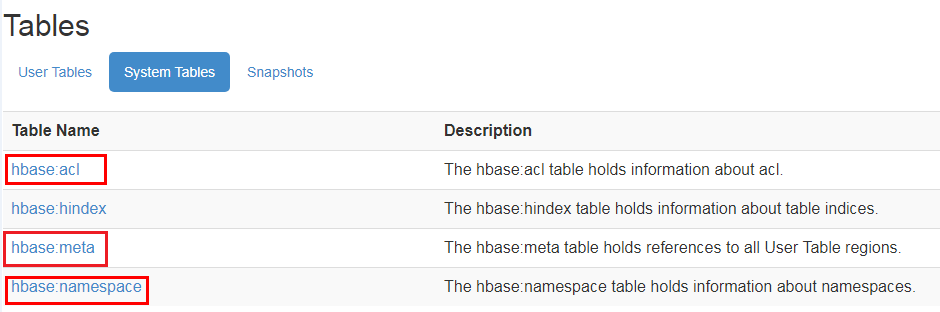
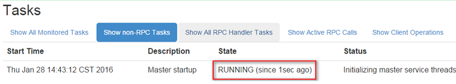
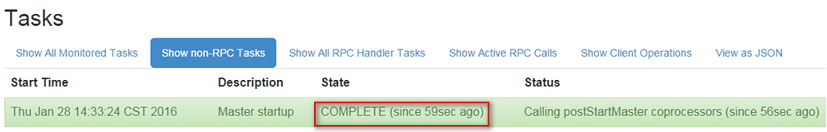
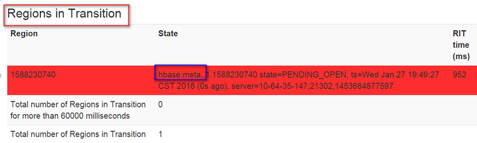

# ALM-19000 HBase服务不可用

## 告警解释

告警模块按120秒周期检测HBase服务状态。当HBase服务不可用时产生该告警。

HBase服务恢复时，告警清除。

> **说明：** 
>若集群启用了多实例功能且安装了多个HBase服务，请根据“定位信息”的“服务名”值来确定具体产生告警的HBase服务。例如HBase1服务不可用，则“定位信息”中显示服务名=HBase1，处理步骤中的操作对象也应由HBase调整为HBase1。

## 告警属性

<table><thead align="left"><tr id="row37452510"><th class="cellrowborder" valign="top" width="33.33333333333333%" id="mcps1.1.4.1.1">
告警ID

</th>
<th class="cellrowborder" valign="top" width="33.33333333333333%" id="mcps1.1.4.1.2">
告警级别

</th>
<th class="cellrowborder" valign="top" width="33.33333333333333%" id="mcps1.1.4.1.3">
是否自动清除

</th>
</tr>
</thead>
<tbody><tr id="row55266038"><td class="cellrowborder" valign="top" width="33.33333333333333%" headers="mcps1.1.4.1.1 ">
19000

</td>
<td class="cellrowborder" valign="top" width="33.33333333333333%" headers="mcps1.1.4.1.2 ">
紧急

</td>
<td class="cellrowborder" valign="top" width="33.33333333333333%" headers="mcps1.1.4.1.3 ">
是

</td>
</tr>
</tbody>
</table>

## 告警参数

<table><thead align="left"><tr id="row45935908"><th class="cellrowborder" valign="top" width="50%" id="mcps1.1.3.1.1">
参数名称

</th>
<th class="cellrowborder" valign="top" width="50%" id="mcps1.1.3.1.2">
参数含义

</th>
</tr>
</thead>
<tbody><tr id="row18190122316182"><td class="cellrowborder" valign="top" width="50%" headers="mcps1.1.3.1.1 ">
来源

</td>
<td class="cellrowborder" valign="top" width="50%" headers="mcps1.1.3.1.2 ">
产生告警的集群名称。

</td>
</tr>
<tr id="row33701210"><td class="cellrowborder" valign="top" width="50%" headers="mcps1.1.3.1.1 ">
服务名

</td>
<td class="cellrowborder" valign="top" width="50%" headers="mcps1.1.3.1.2 ">
产生告警的服务名称。

</td>
</tr>
<tr id="row43619052"><td class="cellrowborder" valign="top" width="50%" headers="mcps1.1.3.1.1 ">
角色名

</td>
<td class="cellrowborder" valign="top" width="50%" headers="mcps1.1.3.1.2 ">
产生告警的角色名称。

</td>
</tr>
<tr id="row23256701"><td class="cellrowborder" valign="top" width="50%" headers="mcps1.1.3.1.1 ">
主机名

</td>
<td class="cellrowborder" valign="top" width="50%" headers="mcps1.1.3.1.2 ">
产生告警的主机名。

</td>
</tr>
</tbody>
</table>

## 对系统的影响

无法进行数据读写和创建表等操作。

## 可能原因

-   ZooKeeper服务异常。
-   HDFS服务异常。
-   HBase服务异常。
-   网络异常。

## 处理步骤

**检查ZooKeeper服务状态。**

1.  在FusionInsight Manager的服务列表中，查看ZooKeeper运行状态是否为“良好”。
    -   是，执行[5](#li620900869259)。
    -   否，执行[2](#li257033669259)。

2.  在告警列表中，查看是否有“ALM-13000 ZooKeeper服务不可用”告警产生。
    -   是，执行[3](#li15979369259)。
    -   否，执行[5](#li620900869259)。

3.  参考“ALM-13000 ZooKeeper服务不可用”的处理步骤处理该故障。
4.  等待几分钟后检查本告警是否恢复。
    -   是，处理完毕。
    -   否，执行[5](#li620900869259)。

**检查HDFS服务状态。**

1.  在告警列表中，查看是否有“ALM-14000 HDFS服务不可用”告警产生。
    -   是，执行[6](#li632410929259)。
    -   否，执行[8](#li660818889259)。

2.  参考“ALM-14000 HDFS服务不可用”的处理步骤处理该故障。
3.  等待几分钟后检查本告警是否恢复。
    -   是，处理完毕。
    -   否，执行[8](#li660818889259)。

4.  在FusionInsight Manager，选择“集群 \>  _待操作集群的名称_  \> 服务 \> HDFS”，查看HDFS“安全模式”是否为“ON”。
    -   是，执行[9](#li193225719259)。
    -   否，执行[12](#li513508519259)。

5.  以**root**用户登录HDFS客户端，用户密码为安装前用户自定义，请咨询系统管理员。执行**cd**命令进入客户端安装目录，然后执行**source bigdata\_env**。

    如果集群采用安全版本，要进行安全认证。预先向管理员获取hdfs用户的密码，执行**kinit hdfs**命令，按提示输入密码。

6.  执行以下命令手动退出安全模式。

    **hdfs dfsadmin -safemode leave**

7.  等待几分钟后检查本告警是否恢复。
    -   是，处理完毕。
    -   否，执行[12](#li513508519259)。

**检查HBase服务状态。**

1.  在FusionInsight Manager，选择“集群 \>  _待操作集群的名称_  \> 服务 \> HBase”。
2.  查看2个HMaster的状态是否为一“主”一“备”。
    -   是，执行[15](#li233523699259)。
    -   否，执行[14](#li547904909259)。

3.  单击“实例”，选择非主状态的HMaster实例，单击“更多 \> 重启实例”重启HMaster，再次查看2个HMaster的状态是否为一“主”一“备”。
    -   是，执行[15](#li233523699259)。
    -   否，执行[21](#li50721779259)。

4.  选择“集群 \>  _待操作集群的名称_  \> 服务 \> HBase \> HMaster\(主\)”，进入HMaster的WebUI页面。

    > **说明：** 
    >**admin**用户默认不具备其他组件的管理权限，如果访问组件原生界面时出现因权限不足而打不开页面或内容显示不全时，可手动创建具备对应组件管理权限的用户进行登录。

5.  查看Region Servers下是否存在至少一个RegionServer。
    -   是，执行[17](#li132400939259)。
    -   否，执行[21](#li50721779259)。

6.  查看“Tables \> System Tables”，如[图1](#fig13618196577)，查看该标签的“Table Name”列下是否存在“hbase:meta”、“hbase:namespace”和“hbase:acl”。
    -   是，执行[18](#li658146339259)。
    -   否，执行[19](#li322889699259)。

        **图 1**  HBase系统表  
        

7.  如[图1](#fig13618196577)，分别单击“hbase:meta”、“hbase:namespace”和“hbase:acl”超链接，查看所有页面是否能正常打开。如果页面能正常打开，说明表都正常。
    -   是，执行[19](#li322889699259)。
    -   否，执行[23](#li99991989259)。

        > **说明：** 
        >由于普通模式下的HBase默认未开启ACL权限控制，只有在手动开启ACL权限控制后才会存在“hbase:acl”表，需要检查该表，否则不需要检查该表。

8.  查看HMaster的启动状态。

    如[图2](#fig605340209259)在“Tasks” 下有“RUNNING”的状态表示HMaster正在启动，“State”列有HMaster处于“RUNNING”状态的时间。如[图3](#fig134506439259)中的“COMPLETE”状态表示HMaster启动完成。

    查看HMaster是否持续了很长一段时间处于“RUNNING”状态。

    **图 2**  HMaster正在启动的状态  
    

    **图 3**  HMaster启动完成的状态  
    

    -   是，执行[20](#li71816449259)。
    -   否，执行[21](#li50721779259)。

9.  查看HMaster页面是否有hbase:meta长时间处于“Region in Transition”的状态。

    **图 4**  Region处于Region in Transition的状态  
    

    -   是，执行[21](#li50721779259)。
    -   否，执行[22](#li11110229259)。

10. 确认在不影响业务的情况下，登录FusionInsight Manager，选择“集群 \>  _待操作集群的名称_  \> 服务 \> HBase \> 更多 \> 重启服务”，输入密码，单击“确定”。
    -   是，执行[22](#li11110229259)。
    -   否，执行[23](#li99991989259)。

11. 等待几分钟后检查本告警是否恢复。
    -   是，处理完毕。
    -   否，执行[23](#li99991989259)。

**检查HMaster和依赖组件之间的网络连接。**

1.  在FusionInsight Manager界面，选择“集群 \>  _待操作集群的名称_  \> 服务 \> HBase”。
2.  单击“实例”，显示HMaster实例列表，记录“HMaster\(主\)”行的“管理IP”。
3.  以**omm**用户通过[24](#li228839209259)获取的IP地址登录主HMaster节点。
4.  执行**ping**命令，查看主HMaster节点和依赖组件所在主机的网络连接是否正常。（依赖组件包括ZooKeeper、HDFS和Yarn等，获取依赖组件所在主机的IP地址的方式和获取主HMaster的IP地址的方式相同。）
    -   是，执行[29](#li240314599259)。
    -   否，执行[27](#li135441579259)。

5.  联系网络管理员恢复网络。
6.  在告警列表中，查看“HBase服务不可用”告警是否清除。
    -   是，处理完毕。
    -   否，执行[29](#li240314599259)。

**收集故障信息。**

1.  在FusionInsight Manager界面，选择“运维 \> 日志 \> 下载”。
2.  在“服务”中勾选待操作集群的如下节点信息。
    -   ZooKeeper
    -   HDFS
    -   HBase

3.  单击右上角的设置日志收集的“开始时间”和“结束时间”分别为告警产生时间的前后10分钟，单击“下载”。
4.  请联系运维人员，并发送已收集的故障日志信息。

## 告警清除

此告警修复后，系统会自动清除此告警，无需手工清除。

## 参考信息

无。

