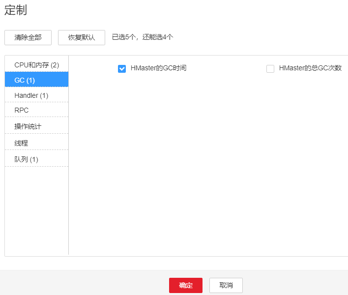
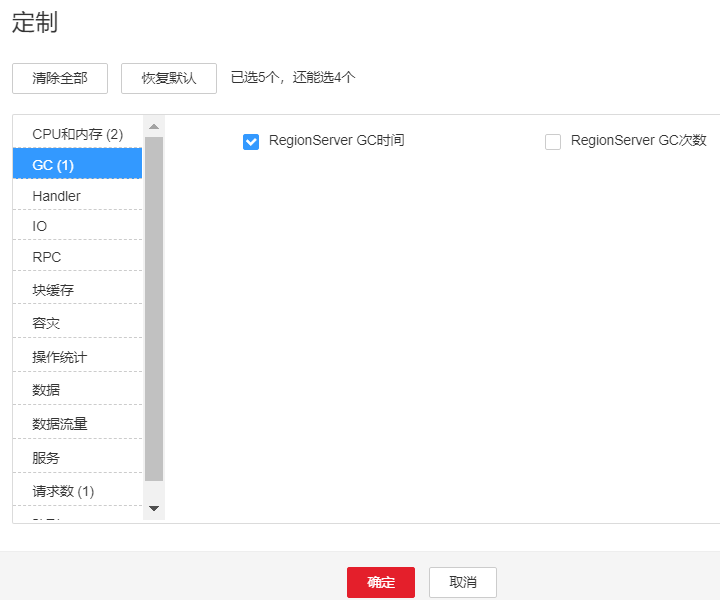

# ALM-19007 HBase GC时间超出阈值

## 告警解释

系统每60秒周期性检测HBase服务的老年代GC时间，当检测到HBase服务的老年代GC时间超出阈值（默认连续3次检测超过5秒）时产生该告警。 在FusionInsight Manager首页，用户可通过选择“运维 \> 告警 \> 阈值设置\> HBase \> GC \> GC中回收old区所花时长”修改阈值。 当HBase服务的老年代GC时间小于或等于阈值时，告警恢复。

> **说明：** 
>若集群启用了多实例功能且安装了多个HBase服务，请根据“定位信息”的“服务名”值来确定具体产生告警的HBase服务。例如HBase1服务不可用，则“定位信息”中显示服务名=HBase1，处理步骤中的操作对象也应由HBase调整为HBase1。

## 告警属性

<table><thead align="left"><tr id="row60491510"><th class="cellrowborder" valign="top" width="33.33333333333333%" id="mcps1.1.4.1.1">
告警ID

</th>
<th class="cellrowborder" valign="top" width="33.33333333333333%" id="mcps1.1.4.1.2">
告警级别

</th>
<th class="cellrowborder" valign="top" width="33.33333333333333%" id="mcps1.1.4.1.3">
是否自动清除

</th>
</tr>
</thead>
<tbody><tr id="row19327501"><td class="cellrowborder" valign="top" width="33.33333333333333%" headers="mcps1.1.4.1.1 ">
19007

</td>
<td class="cellrowborder" valign="top" width="33.33333333333333%" headers="mcps1.1.4.1.2 ">
重要

</td>
<td class="cellrowborder" valign="top" width="33.33333333333333%" headers="mcps1.1.4.1.3 ">
是

</td>
</tr>
</tbody>
</table>

## 告警参数

<table><thead align="left"><tr id="row50302991"><th class="cellrowborder" valign="top" width="50%" id="mcps1.1.3.1.1">
参数名称

</th>
<th class="cellrowborder" valign="top" width="50%" id="mcps1.1.3.1.2">
参数含义

</th>
</tr>
</thead>
<tbody><tr id="row01011058191711"><td class="cellrowborder" valign="top" width="50%" headers="mcps1.1.3.1.1 ">
来源

</td>
<td class="cellrowborder" valign="top" width="50%" headers="mcps1.1.3.1.2 ">
产生告警的集群名称。

</td>
</tr>
<tr id="row54839012"><td class="cellrowborder" valign="top" width="50%" headers="mcps1.1.3.1.1 ">
服务名

</td>
<td class="cellrowborder" valign="top" width="50%" headers="mcps1.1.3.1.2 ">
产生告警的服务名称。

</td>
</tr>
<tr id="row51945345"><td class="cellrowborder" valign="top" width="50%" headers="mcps1.1.3.1.1 ">
角色名

</td>
<td class="cellrowborder" valign="top" width="50%" headers="mcps1.1.3.1.2 ">
产生告警的角色名称。

</td>
</tr>
<tr id="row42945494"><td class="cellrowborder" valign="top" width="50%" headers="mcps1.1.3.1.1 ">
主机名

</td>
<td class="cellrowborder" valign="top" width="50%" headers="mcps1.1.3.1.2 ">
产生告警的主机名。

</td>
</tr>
</tbody>
</table>

## 对系统的影响

老年代GC时间超出阈值，会影响到HBase数据的读写。

## 可能原因

该节点HBase实例内存使用率过大，或配置的堆内存不合理，或HBase存在大量的IO操作，导致进程GC频繁。

## 处理步骤

**检查GC时间**

1.  在FusionInsight Manager首页，选择“运维  \>   告警  \>   告警“，选中“告警ID”为“19007”的告警，查看“定位信息”中的角色名并确定实例的IP地址。
    -   告警上报的角色是HMaster，执行[2](#li158623792852)。
    -   告警上报的角色是RegionServer，执行[3](#li6512621192852)。

2.  在FusionInsight Manager首页，选择“集群 \>  _待操作集群的名称_  \> 服务 \> HBase \> 实例”，单击告警上报的HMaster，进入实例“概览”页面，单击图表区域右上角的下拉菜单，选择“定制 \> GC \> HMaster的GC时间” ，单击“确定”，查看该图表中“GC中回收old区所花时长”监控项的值是否连续3个检测周期大于阈值（默认阈值为5秒）。

    -   是，执行[4](#li4926498792852)。
    -   否，执行[6](#li6512271692852)。

    **图 1**  HMaster的GC时间  
    

3.  在FusionInsight Manager首页，选择“集群 \>  _待操作集群的名称_  \> 服务 \> HBase \> 实例”，单击告警上报的RegionServer，进入实例“概览”页面，单击图表区域右上角的下拉菜单，选择“定制 \> GC \> RegionServer的GC时间” ，单击“确定”，查看该图表中“GC中回收old区所花时长”监控项的值是否连续3个检测周期大于阈值（默认阈值为5秒）。

    -   是，执行[4](#li4926498792852)。
    -   否，执行[6](#li6512271692852)。

    **图 2**  RegionServer的GC时间  
    

**查看JVM的当前配置**

1.  在FusionInsight Manager界面，选择“集群 \>  _待操作集群的名称_  \> 服务 \> HBase \> 配置”，单击“全部配置”。 在搜索框中输入“GC\_OPTS”，确定当前告警角色HMaster\(HBase-\>HMaster\)，RegionServer\(HBase-\>RegionServer\)的“GC\_OPTS”内存参数。将GC\_OPTS参数中的“-Xmx”和“-XX:CMSInitiatingOccupancyFraction”的值参考以下说明进行调整。

    > **说明：** 
    >1.  HMaster的GC参数配置建议：
    >    -   建议“-Xms”和“-Xmx”设置成相同的值，这样可以避免JVM动态调整堆内存大小时影响性能。
    >    -   调整“-XX:NewSize”大小时，建议把其设置成和“-XX:MaxNewSize”相同，均为“-Xmx”大小的1/8。
    >    -   当HBase集群规模越大、Region数量越多时，可以适当调大HMaster的GC\_OPTS参数，配置建议如下：Region总数小于10万个，“-Xmx”设置为4G；超过10万个，“-Xmx”设置为不小于6G；超过10万时，每增加35000个Region，增加2G的“-Xmx”，整体的“-Xmx”的大小不超过32G。
    >2.  RegionServer的GC参数配置建议：
    >    -   建议“-Xms”和“-Xmx”设置成相同的值，这样可以避免JVM动态调整堆内存大小时影响性能。
    >    -   调整“-XX:NewSize”大小的时候，建议把其设置为“-Xmx”大小的1/8。
    >    -   RegionServer需要的内存一般比HMaster要大。在内存充足的情况下，堆内存可以相对设置大一些。
    >    -   根据机器的内存大小设置“-Xmx”大小：机器内存\>200G，“-Xmx”设置为32G；128G<机器内存<200G，“-Xmx”设置为16G；机器内存<128G，“-Xmx”设置为8G。“-Xmx”配置为32G，可支持单RegionServer节点2000个Region，200个热点Region。
    >    -   “XX:CMSInitiatingOccupancyFraction”建议设置为“100 \* \(hfile.block.cache.size+hbase.regionserver.global.memstore.size\)”，最大值不超过85。

2.  观察界面告警是否清除。
    -   是，处理完毕。
    -   否，执行[6](#li6512271692852)。

**收集故障信息**

1.  在主备集群的FusionInsight Manager界面，选择“运维 \> 日志 \> 下载”。
2.  在“服务”中勾选待操作集群的“HBase”。
3.  单击右上角的设置日志收集的“开始时间”和“结束时间”分别为告警产生时间的前后10分钟，单击“下载”。
4.  请联系运维人员，并发送已收集的故障日志信息。

## 告警清除

此告警修复后，系统会自动清除此告警，无需手工清除。

## 参考信息

无

