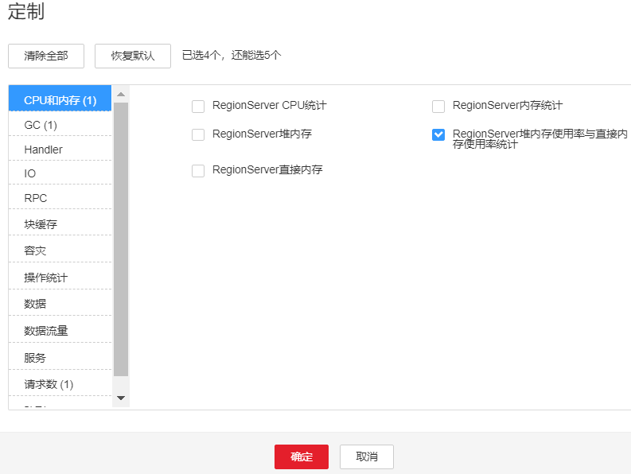

# ALM-19009 HBase服务进程直接内存使用率超出阈值

## 告警解释

系统每30秒周期性检测HBase服务直接内存使用状态，当检测到HBase服务直接内存使用率超出阈值（最大内存的90%）时产生该告警。

直接内存使用率小于阈值时，告警恢复。

> **说明：** 
>若集群启用了多实例功能且安装了多个HBase服务，请根据“定位信息”的“服务名”值来确定具体产生告警的HBase服务。例如HBase1服务不可用，则“定位信息”中显示服务名=HBase1，处理步骤中的操作对象也应由HBase调整为HBase1。

## 告警属性

<table><thead align="left"><tr id="row57848198"><th class="cellrowborder" valign="top" width="33.33333333333333%" id="mcps1.1.4.1.1">
告警ID

</th>
<th class="cellrowborder" valign="top" width="33.33333333333333%" id="mcps1.1.4.1.2">
告警级别

</th>
<th class="cellrowborder" valign="top" width="33.33333333333333%" id="mcps1.1.4.1.3">
是否自动清除

</th>
</tr>
</thead>
<tbody><tr id="row64359861"><td class="cellrowborder" valign="top" width="33.33333333333333%" headers="mcps1.1.4.1.1 ">
19009

</td>
<td class="cellrowborder" valign="top" width="33.33333333333333%" headers="mcps1.1.4.1.2 ">
重要

</td>
<td class="cellrowborder" valign="top" width="33.33333333333333%" headers="mcps1.1.4.1.3 ">
是

</td>
</tr>
</tbody>
</table>

## 告警参数

<table><thead align="left"><tr id="row461818"><th class="cellrowborder" valign="top" width="50%" id="mcps1.1.3.1.1">
参数名称

</th>
<th class="cellrowborder" valign="top" width="50%" id="mcps1.1.3.1.2">
参数含义

</th>
</tr>
</thead>
<tbody><tr id="row1975212412175"><td class="cellrowborder" valign="top" width="50%" headers="mcps1.1.3.1.1 ">
来源

</td>
<td class="cellrowborder" valign="top" width="50%" headers="mcps1.1.3.1.2 ">
产生告警的集群名称。

</td>
</tr>
<tr id="row12137633"><td class="cellrowborder" valign="top" width="50%" headers="mcps1.1.3.1.1 ">
服务名

</td>
<td class="cellrowborder" valign="top" width="50%" headers="mcps1.1.3.1.2 ">
产生告警的服务名称。

</td>
</tr>
<tr id="row59556464"><td class="cellrowborder" valign="top" width="50%" headers="mcps1.1.3.1.1 ">
角色名

</td>
<td class="cellrowborder" valign="top" width="50%" headers="mcps1.1.3.1.2 ">
产生告警的角色名称。

</td>
</tr>
<tr id="row43900785"><td class="cellrowborder" valign="top" width="50%" headers="mcps1.1.3.1.1 ">
主机名

</td>
<td class="cellrowborder" valign="top" width="50%" headers="mcps1.1.3.1.2 ">
产生告警的主机名。

</td>
</tr>
</tbody>
</table>

## 对系统的影响

HBase可用的直接内存不足，可能会造成内存溢出导致服务崩溃。

## 可能原因

该节点HBase服务直接内存使用率过大，或配置的直接内存不合理，导致使用率超过阈值。

## 处理步骤

**检查直接内存使用率**

1.  在FusionInsight Manager首页，选择“运维 \> 告警 \> 告警”，选中“告警ID”为“19009”的告警，查看“定位信息”中的角色名以及确认主机名所在的IP地址。
    -   告警上报的角色是HMaster，执行[2](#li3900231593624)。
    -   告警上报的角色是RegionServer，执行[3](#li5178258893624)。

2.  在FusionInsight Manager首页，选择“集群 \>  _待操作集群的名称_  \> 服务 \> HBase \> 实例”，单击告警上报的HMaster，进入实例“概览”页面，单击图表区域右上角的下拉菜单，选择“定制 \> CPU和内存 \> HMaster堆内存使用率与直接内存使用率统计” ，单击“确定”，查看HBase服务进程使用的直接内存是否已达到HBase服务进程设定的最大直接内存的90%。

    -   是，执行[4](#li6339011093624)。
    -   否，执行[8](#li5351076393624)。

    **图 1**  HMaster堆内存使用率与直接内存使用率统计  
    

3.  在FusionInsight Manager首页，选择“集群 \>  _待操作集群的名称_  \> 服务 \> HBase \> 实例”，单击告警上报的RegionServer，进入实例“概览”页面，单击图表区域右上角的下拉菜单，选择“定制 \> CPU和内存 \> RegionServer堆内存使用率与直接内存使用率统计” ，单击“确定”，查看HBase服务进程使用的直接内存是否已达到HBase服务进程设定的最大直接内存的90%。

    -   是，执行[4](#li6339011093624)。
    -   否，执行[8](#li5351076393624)。

    **图 2**  RegionServer堆内存使用率与直接内存使用率统计  
    

4.  在FusionInsight Manager首页，选择“集群 \>  _待操作集群的名称_  \> 服务 \> HBase \> 配置”，单击“全部配置”， 选择“HMaster/RegionServer \> 系统”，查看“GC\_OPTS”参数中是否存在“XX:MaxDirectMemorySize”。
    -   是，执行[5](#li185719813288)。
    -   否，执行[6](#li108152512315)。

5.  在FusionInsight Manager首页，选择“集群 \>  _待操作集群的名称_  \> 服务 \> HBase \> 配置”，单击“全部配置”， 选择“HMaster/RegionServer \> 系统”，在“GC\_OPTS”中把参数“XX:MaxDirectMemorySize”删除。
6.  查看告警信息，是否产生“ALM-19008 HBase服务进程堆内存使用率超出阈值”告警。
    -   是，参考“ALM-19008 HBase服务进程堆内存使用率超出阈值”处理告警。
    -   否，执行[8](#li5351076393624)。

7.  观察界面告警是否清除。
    -   是，处理完毕。
    -   否，执行[8](#li5351076393624)。

**收集故障信息**

1.  在FusionInsight Manager界面，选择“运维 \> 日志 \> 下载”。
2.  在“服务”中勾选待操作集群的“HBase”。
3.  单击右上角的设置日志收集的“开始时间”和“结束时间”分别为告警产生时间的前后10分钟，单击“下载”。
4.  请联系运维人员，并发送已收集的故障日志信息。

## 告警清除

此告警修复后，系统会自动清除此告警，无需手工清除。

## 参考信息

无。

