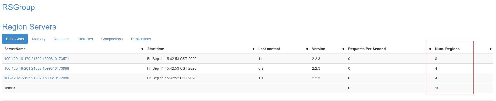
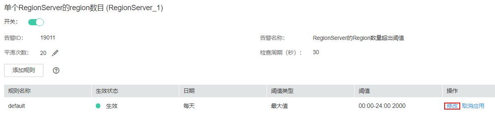

# ALM-19011 RegionServer的Region数量超出阈值

## 告警解释

系统每30秒周期性检测每个HBase服务实例中每个RegionServer的Region数。该指标可以在HBase服务监控界面和RegionServer角色监控界面查看，当检测到某个RegionServer上的Region数超出阈值（默认连续20次超过默认阈值2000）时产生该告警。用户可通过“运维 \> 告警 \> 阈值设置\> 服务 \> HBase”修改阈值。当Region数小于或等于阈值时，告警消除。

> **说明：** 
>若集群启用了多实例功能且安装了多个HBase服务，请根据“定位信息”的“服务名”值来确定具体产生告警的HBase服务。例如HBase1服务不可用，则“定位信息”中显示服务名=HBase1，处理步骤中的操作对象也应由HBase调整为HBase1。

## 告警属性

<table><thead align="left"><tr id="row1431461419318"><th class="cellrowborder" valign="top" width="33.33333333333333%" id="mcps1.1.4.1.1">
告警ID

</th>
<th class="cellrowborder" valign="top" width="33.33333333333333%" id="mcps1.1.4.1.2">
告警级别

</th>
<th class="cellrowborder" valign="top" width="33.33333333333333%" id="mcps1.1.4.1.3">
是否自动清除

</th>
</tr>
</thead>
<tbody><tr id="row531419147312"><td class="cellrowborder" valign="top" width="33.33333333333333%" headers="mcps1.1.4.1.1 ">
19011

</td>
<td class="cellrowborder" valign="top" width="33.33333333333333%" headers="mcps1.1.4.1.2 ">
重要

</td>
<td class="cellrowborder" valign="top" width="33.33333333333333%" headers="mcps1.1.4.1.3 ">
是

</td>
</tr>
</tbody>
</table>

## 告警参数

<table><thead align="left"><tr id="row53145146319"><th class="cellrowborder" valign="top" width="50%" id="mcps1.1.3.1.1">
参数名称

</th>
<th class="cellrowborder" valign="top" width="50%" id="mcps1.1.3.1.2">
参数含义

</th>
</tr>
</thead>
<tbody><tr id="row11533153471712"><td class="cellrowborder" valign="top" width="50%" headers="mcps1.1.3.1.1 ">
来源

</td>
<td class="cellrowborder" valign="top" width="50%" headers="mcps1.1.3.1.2 ">
产生告警的集群名称。

</td>
</tr>
<tr id="row15316814937"><td class="cellrowborder" valign="top" width="50%" headers="mcps1.1.3.1.1 ">
服务名

</td>
<td class="cellrowborder" valign="top" width="50%" headers="mcps1.1.3.1.2 ">
产生告警的服务名称。

</td>
</tr>
<tr id="row193161314938"><td class="cellrowborder" valign="top" width="50%" headers="mcps1.1.3.1.1 ">
角色名

</td>
<td class="cellrowborder" valign="top" width="50%" headers="mcps1.1.3.1.2 ">
产生告警的角色名称。

</td>
</tr>
<tr id="row9316141415313"><td class="cellrowborder" valign="top" width="50%" headers="mcps1.1.3.1.1 ">
主机名

</td>
<td class="cellrowborder" valign="top" width="50%" headers="mcps1.1.3.1.2 ">
产生告警的主机名。

</td>
</tr>
</tbody>
</table>

## 对系统的影响

RegionServer的Region数超出阈值，会影响HBase的数据读写性能。

## 可能原因

-   RegionServer的Region分布不均衡。
-   HBase集群规模过小。

## 处理步骤

**查看告警定位信息**

1.  在FusionInsight Manager首页，选择“运维 \> 告警 \> 告警”，选中“告警ID”为“19011”的告警，查看“定位信息”中产生该告警的服务实例和主机名。
2.  在FusionInsight Manager首页，选择“集群 \>  _待操作集群的名称_  \> 服务 \> HBase”，单击“HMaster\(主\)”，打开该HBase实例的WebUI，查看RegionServer上Region分布是否均衡。

    > **说明：** 
    >**admin**用户默认不具备其他组件的管理权限，如果访问组件原生界面时出现因权限不足而打不开页面或内容显示不全时，可手动创建具备对应组件管理权限的用户进行登录。

    -   是，执行[9](#li919012491298)。
    -   否，执行[3](#li136263116315)。

    **图 1**  HBase的WebUI  
    

**负载均衡**

1.  以**root**用户登录HBase客户端所在节点，用户密码为安装前用户自定义，请咨询系统管理员。进入客户端安装目录，设置环境变量：

    **cd** _客户端安装目录_

    **source bigdata\_env**

    如果集群采用安全版本，要进行安全认证。执行**kinit hbase**命令，按提示输入密码（向管理员获取密码）。

2.  执行以下命令进入hbase shell，查看目前负载均衡功能是否打开：

    **hbase shell**

    **balancer\_enabled**

    -   是，执行[6](#li1324433819819)。
    -   否，执行[5](#li5656173310818)。

3.  在hbase shell，中执行命令打开负载均衡功能，并执行命令查看确认成功打开：

    **balance\_switch true**

    **balancer\_enabled**

4.  执行**balancer**命令手动触发负载均衡。

    > **说明：** 
    >建议打开和手动触发负载均衡操作在业务低峰期进行。

5.  FusionInsight Manager首页，选择“集群 \>  _待操作集群的名称_  \> 服务 \> HBase”，单击“HMaster\(主\)”，打开该HBase实例的WebUI，刷新页面查看Region分布是否均衡。
    -   是，执行[8](#li1738433413912)。
    -   否，执行[21](#li53112011420)。

6.  观察该告警是否清除。
    -   是，处理完毕。
    -   否，执行[9](#li919012491298)。

**清理无用HBase表**

> **说明：** 
>在清理过程中，请谨慎操作，确保删除数据的准确性。

1.  在FusionInsight Manager首页，选择“集群 \>  _待操作集群的名称_  \> 服务 \> HBase”，单击“HMaster\(主\)”，打开该HBase实例的WebUI，查看该HBase服务实例上存储的表并记录可删除的无用表。
2.  在hbase shell中，执行**disable**和**drop**命令，确认删除无用表，以减少Region数：

    **disable **'_待删除表名_**'**

    **drop '**_待删除表名_**'**

3.  在hbase shell中，执行命令查看目前负载均衡功能是否打开：

    **balancer\_enabled**

    -   是，执行[13](#li1060161861015)。
    -   否，执行[12](#li10730354122211)。

4.  在hbase shell中，执行命令打开负载均衡功能并确认成功打开：

    **balance\_switch true**

    **balancer\_enabled**

5.  在hbase shell中，执行**balancer**命令手动触发负载均衡。
6.  在FusionInsight Manager首页，选择“集群 \>  _待操作集群的名称_  \> 服务 \> HBase”，单击产生该告警的HBase服务实例，单击“HMaster\(主\)”，打开该HBase实例的WebUI，刷新页面查看Region分布是否均衡。
    -   是，执行[15](#li95181036171020)。
    -   否，执行[21](#li53112011420)。

7.  观察该告警是否清除。
    -   是，处理完毕。
    -   否，执行[16](#li14355131934418)。

**调整阈值**

1.  在FusionInsight Manager首页，选择“运维 \> 告警 \> 阈值设置 \>  _待操作集群的名称_  \> HBase \> 单个RegionServer的Region数目”，选中目前应用的规则，单击“修改”查看目前的阈值设置是否合理。

    -   如果过小，则根据集群实际情况，增大阈值，执行[17](#li6272222191215)。
    -   如果阈值设置合理，则执行[18](#li17585204317127)。

    **图 2**  单个RegionServer的Region数目  
    

2.  观察该告警是否清除。
    -   是，处理完毕。
    -   否，执行[18](#li17585204317127)。

**系统扩容**

1.  对HBase集群扩容，增加节点，并在节点上增加RegionServer实例，然后按照“负载均衡”小节中，打开负载均衡功能并手动触发。
2.  在FusionInsight Manager首页，选择“集群 \>  _待操作集群的名称_  \> 服务”，单击产生该告警的HBase服务实例，单击“HMaster\(主\)”，打开该HBase实例的WebUI，刷新页面查看Region分布是否均衡。
    -   是，执行[20](#li72129191312)。
    -   否，执行[21](#li53112011420)。

3.  观察该告警是否清除。
    -   是，处理完毕。
    -   否，执行[21](#li53112011420)。

**收集故障信息**

1.  在主备集群的FusionInsight Manager界面，选择“运维 \> 日志 \> 下载”。
2.  在“服务”中勾选待操作集群的“HBase”。
3.  单击右上角的设置日志收集的“开始时间”和“结束时间”分别为告警产生时间的前后10分钟，单击“下载”。
4.  请联系运维人员，并发送已收集的故障日志信息。

## 告警清除

此告警修复后，系统会自动清除此告警，无需手工清除。

## 参考信息

无。

