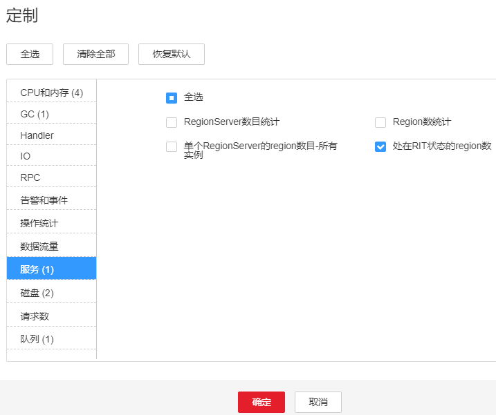
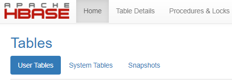

# ALM-19013 region处在RIT状态的时长超过阈值

## 告警解释

系统按300秒周期性检测HBase上的region处在RIT状态的数量。当检测到处在RIT状态的region时长超过阈值时长（连续两次超过阈值），上报该告警。当处在超时状态的region都恢复后，告警恢复。

> **说明：** 
>若集群启用了多实例功能且安装了多个HBase服务，请根据“定位信息”的“服务名”值来确定具体产生告警的HBase服务。例如HBase1服务不可用，则“定位信息”中显示服务名=HBase1，处理步骤中的操作对象也应由HBase调整为HBase1。

## 告警属性

<table><thead align="left"><tr id="row9358345"><th class="cellrowborder" valign="top" width="33.33333333333333%" id="mcps1.1.4.1.1">
告警ID

</th>
<th class="cellrowborder" valign="top" width="33.33333333333333%" id="mcps1.1.4.1.2">
告警级别

</th>
<th class="cellrowborder" valign="top" width="33.33333333333333%" id="mcps1.1.4.1.3">
是否自动清除

</th>
</tr>
</thead>
<tbody><tr id="row29606020"><td class="cellrowborder" valign="top" width="33.33333333333333%" headers="mcps1.1.4.1.1 ">
19013

</td>
<td class="cellrowborder" valign="top" width="33.33333333333333%" headers="mcps1.1.4.1.2 ">
重要

</td>
<td class="cellrowborder" valign="top" width="33.33333333333333%" headers="mcps1.1.4.1.3 ">
是

</td>
</tr>
</tbody>
</table>

## 告警参数

<table><thead align="left"><tr id="row42029922"><th class="cellrowborder" valign="top" width="50%" id="mcps1.1.3.1.1">
参数名称

</th>
<th class="cellrowborder" valign="top" width="50%" id="mcps1.1.3.1.2">
参数含义

</th>
</tr>
</thead>
<tbody><tr id="row1882112262176"><td class="cellrowborder" valign="top" width="50%" headers="mcps1.1.3.1.1 ">
来源

</td>
<td class="cellrowborder" valign="top" width="50%" headers="mcps1.1.3.1.2 ">
产生告警的集群名称。

</td>
</tr>
<tr id="row44167618"><td class="cellrowborder" valign="top" width="50%" headers="mcps1.1.3.1.1 ">
服务名

</td>
<td class="cellrowborder" valign="top" width="50%" headers="mcps1.1.3.1.2 ">
产生告警的服务名称。

</td>
</tr>
<tr id="row1943587"><td class="cellrowborder" valign="top" width="50%" headers="mcps1.1.3.1.1 ">
角色名

</td>
<td class="cellrowborder" valign="top" width="50%" headers="mcps1.1.3.1.2 ">
产生告警的角色名称。

</td>
</tr>
<tr id="row10765874"><td class="cellrowborder" valign="top" width="50%" headers="mcps1.1.3.1.1 ">
主机名

</td>
<td class="cellrowborder" valign="top" width="50%" headers="mcps1.1.3.1.2 ">
产生告警的主机名。

</td>
</tr>
</tbody>
</table>

## 对系统的影响

表的部分数据丢失或不可用。

## 可能原因

-   Compaction永久阻塞。
-   HDFS文件异常。

## 处理步骤

**检查告警原因**

1.  在FusionInsight Manager首页，选择“运维  \>   告警  \>   告警“，选中“告警ID”为“19013”的告警，查看“定位信息”中的主机名及角色名。

1.  选择“集群 \>  _待操作集群的名称_  \> 服务 \> HBase ”，单击图表区域右上角的下拉菜单，选择“定制 \> 服务 \> 处在RIT状态的region数”，单击“确定”，查看该图表中“处在RIT状态达到阈值时长的region数”监控项是否在连续3个检测周期内检测到值。（默认阈值为60秒）。

    -   是，执行[3](#li61221412391)。
    -   否，执行[7](#li61221212393)。

    **图 1**  处在RIT状态的region数  
    

2.  选择“集群 \>  _待操作集群的名称_  \> 服务 \> HBase \> HMaster（主） \> Tables” ，查看是否只是某一个表的region RIT状态超时。

    -   是，执行[4](#li3812920131116)。
    -   否，执行[7](#li61221212393)。

    **图 2**  Tables  
    

3.  在客户端执行**hbase hbck**是否报错“No table descriptor file under hdfs://hacluster/hbase/data/default/table”。
    -   是，执行[5](#li107594711312)。
    -   否，执行[7](#li61221212393)。

4.  以**root**用户登录客户端，用户密码为安装前用户自定义，请咨询系统管理员。执行如下命令：

    **cd** _客户端安装目录_

    **source bigdata\_env**

    如为安全模式集群，请执行**kinit hbase**

    登录HMaster WebUI，在导航栏选择“Procedure & Locks”，在Procedures查看是否有处于Waiting状态的process id。如果有，需要执行以下命令将procedure lock释放：

    **hbase hbck -j /opt/Bigdata/client/HBase/hbase/tools/hbase-hbck2-2.2.3-hw-ei-\*.jar bypass -o **_pid_

    查看State是否处于Bypass状态，如果界面上的procedures一直处于RUNNABLE\(Bypass\)状态，需要进行主备切换。执行**assigns**命令使region重新上线。

    **hbase hbck -j /opt/Bigdata/client/HBase/hbase/tools/hbase-hbck2-2.2.3-hw-ei-\*.jar assigns -o **_regionName_

5.  在客户端执行**hbase hbck**，查看否报错“No table descriptor file under hdfs://hacluster/hbase/data/default/table”。
    -   是，执行[7](#li61221212393)。
    -   否，处理完毕。

**收集故障信息**

1.  在主备集群的FusionInsight Manager界面，选择“运维 \> 日志 \> 下载”。
2.  在“服务”中勾选待操作集群的有问题的HBase服务。
3.  单击右上角的设置日志收集的“开始时间”和“结束时间”分别为告警产生时间的前后10分钟，单击“下载”。
4.  请联系运维人员，并发送已收集的故障日志信息。

## 告警清除

此告警修复后，系统会自动清除此告警，无需手工清除。

## 参考信息

无。

