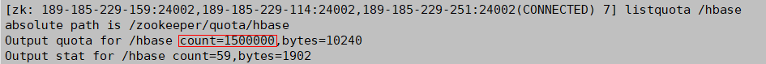

# ALM-19015 在ZooKeeper上的数量配额使用率超过阈值

## 告警解释

系统每120秒周期性检测HBase服务的ZNode使用情况，当检测到HBase服务的ZNode数量使用率超出告警的阈值（默认75%）时产生该告警。

当ZNode的数量使用率小于告警的阈值时，告警恢复。

> **说明：** 
>若集群启用了多实例功能且安装了多个HBase服务，请根据“定位信息”的“服务名”值来确定具体产生告警的HBase服务。例如“定位信息”中显示服务名=HBase-1，处理步骤中的操作对象也应由HBase调整为HBase-1。

## 告警属性

<table><thead align="left"><tr id="row569210161113"><th class="cellrowborder" valign="top" width="33.33333333333333%" id="mcps1.1.4.1.1">
告警ID

</th>
<th class="cellrowborder" valign="top" width="33.33333333333333%" id="mcps1.1.4.1.2">
告警级别

</th>
<th class="cellrowborder" valign="top" width="33.33333333333333%" id="mcps1.1.4.1.3">
是否自动清除

</th>
</tr>
</thead>
<tbody><tr id="row96925131117"><td class="cellrowborder" valign="top" width="33.33333333333333%" headers="mcps1.1.4.1.1 ">
19015

</td>
<td class="cellrowborder" valign="top" width="33.33333333333333%" headers="mcps1.1.4.1.2 ">
重要

</td>
<td class="cellrowborder" valign="top" width="33.33333333333333%" headers="mcps1.1.4.1.3 ">
是

</td>
</tr>
</tbody>
</table>

## 告警参数

<table><thead align="left"><tr id="row269281171115"><th class="cellrowborder" valign="top" width="50%" id="mcps1.1.3.1.1">
参数名称

</th>
<th class="cellrowborder" valign="top" width="50%" id="mcps1.1.3.1.2">
参数含义

</th>
</tr>
</thead>
<tbody><tr id="row1669210181117"><td class="cellrowborder" valign="top" width="50%" headers="mcps1.1.3.1.1 ">
来源

</td>
<td class="cellrowborder" valign="top" width="50%" headers="mcps1.1.3.1.2 ">
产生告警的集群名称。

</td>
</tr>
<tr id="row166921915117"><td class="cellrowborder" valign="top" width="50%" headers="mcps1.1.3.1.1 ">
服务名

</td>
<td class="cellrowborder" valign="top" width="50%" headers="mcps1.1.3.1.2 ">
产生告警的服务名称。

</td>
</tr>
<tr id="row669215117116"><td class="cellrowborder" valign="top" width="50%" headers="mcps1.1.3.1.1 ">
角色名

</td>
<td class="cellrowborder" valign="top" width="50%" headers="mcps1.1.3.1.2 ">
产生告警的角色名称。

</td>
</tr>
<tr id="row16924111120"><td class="cellrowborder" valign="top" width="50%" headers="mcps1.1.3.1.1 ">
主机名

</td>
<td class="cellrowborder" valign="top" width="50%" headers="mcps1.1.3.1.2 ">
产生告警的主机名。

</td>
</tr>
<tr id="row1825612712356"><td class="cellrowborder" valign="top" width="50%" headers="mcps1.1.3.1.1 ">
Threshold

</td>
<td class="cellrowborder" valign="top" width="50%" headers="mcps1.1.3.1.2 ">
产生告警的阈值。

</td>
</tr>
</tbody>
</table>

## 对系统的影响

产生该告警表示HBase服务的ZNode的数量使用率已经超过规定的阈值，如果不及时处理，可能会导致问题级别升级为紧急，影响数据写入。

## 可能原因

-   HBase配置了容灾并且容灾存在数据同步失败或者同步速度慢；
-   HBase集群存在大量的WAL文件在进行split。

## 处理步骤

**检查ZNode数量配额和使用量**

1.  在FusionInsight Manager首页，选择“运维 \> 告警 \> 告警”，选中“告警ID”为“19015”的告警，查看“附加信息”中的阈值。
2.  以**root**用户登录HBase客户端，用户密码为安装前用户自定义，请咨询系统管理员。执行以下命令进入客户端安装目录：

    **cd** _客户端安装目录_

    然后执行以下命令设置环境变量：

    **source bigdata\_env**

    如果集群采用安全版本，要执行以下命令进行安全认证：

    **kinit hbase**

    按提示输入密码（向管理员获取密码）。

3.  执行**hbase zkcli**命令进入ZooKeeper客户端，然后执行命令**listquota /hbase**查看对应HBase服务的ZNode数量配额，其中命令中的ZNode根目录为对应HBase服务的参数“zookeeper.znode.parent”所指定。下图标注所示即为当前HBase服务根ZNode的数量配额。

    

4.  执行命令**getusage /hbase/splitWAL**查看该ZNode的数量使用情况，查看返回结果的“**Node count**”跟ZNode数量配额的比值是否接近告警的阈值。
    -   是，执行[5](#li1269371131112)。
    -   否，执行[6](#li62018222616)。

5.  在FusionInsight Manager首页，选择“运维 \> 告警 \> 告警”，查看是否存在“告警ID”为“12007”、“19000”或者“19013”且“定位信息”中的“服务名”为当前HBase服务的告警。
    -   是，单击对应告警右侧的“查看帮助”并按照帮助文档进行处理，执行[8](#li9693191171112)。
    -   否，执行[9](#li146938101112)。

6.  执行命令**getusage /hbase/replication**查看该ZNode的数量使用情况，查看返回结果的“**Node count**”跟ZNode数量配额的比值是否接近告警的阈值。
    -   是，执行[7](#li17555915687)。
    -   否，执行[9](#li146938101112)。

7.  在FusionInsight Manager首页，选择“运维 \> 告警 \> 告警”，查看是否存在“告警ID”为“19006”并且“定位信息”中的“服务名”为当前HBase服务的告警。
    -   是，单击对应告警右侧的“查看帮助”并按照帮助文档进行处理，执行[8](#li9693191171112)。
    -   否，执行[9](#li146938101112)。

8.  观察界面告警是否清除。
    -   是，处理完毕。
    -   否，执行[9](#li146938101112)。

**收集故障信息**

1.  在FusionInsight Manager界面，选择“运维 \> 日志 \> 下载”。
2.  在“服务”中勾选待操作集群的“HBase”。
3.  单击右上角的设置日志收集的“开始时间”和“结束时间”分别为告警产生时间的前后10分钟，单击“下载”。
4.  请联系运维人员，并发送已收集的故障日志信息。

## 告警清除

此告警修复后，系统会自动清除此告警，无需手工清除。

## 参考信息

无。

