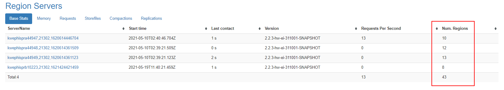

# ALM-19019 HBase容灾等待同步的HFile文件数量超过阈值

## 告警解释

系统每30秒周期性检测每个HBase服务实例RegionServer等待同步的HFile文件数量。该指标可以在RegionServer角色监控界面查看，当检测到某个RegionServer上的等待同步HFile文件数量超出阈值（默认连续20次超过默认阈值128）时产生该告警。用户可通过“运维 \> 告警 \> 阈值设置 \>  _待操作集群_  \> HBase”来修改阈值。当等待同步的HFile文件数量小于或等于阈值时，告警消除。

## 告警属性

<table><thead align="left"><tr id="row1431461419318"><th class="cellrowborder" valign="top" width="33.33333333333333%" id="mcps1.1.4.1.1">
告警ID

</th>
<th class="cellrowborder" valign="top" width="33.33333333333333%" id="mcps1.1.4.1.2">
告警级别

</th>
<th class="cellrowborder" valign="top" width="33.33333333333333%" id="mcps1.1.4.1.3">
是否自动清除

</th>
</tr>
</thead>
<tbody><tr id="row531419147312"><td class="cellrowborder" valign="top" width="33.33333333333333%" headers="mcps1.1.4.1.1 ">
19019

</td>
<td class="cellrowborder" valign="top" width="33.33333333333333%" headers="mcps1.1.4.1.2 ">
重要

</td>
<td class="cellrowborder" valign="top" width="33.33333333333333%" headers="mcps1.1.4.1.3 ">
是

</td>
</tr>
</tbody>
</table>

## 告警参数

<table><thead align="left"><tr id="row53145146319"><th class="cellrowborder" valign="top" width="50%" id="mcps1.1.3.1.1">
参数名称

</th>
<th class="cellrowborder" valign="top" width="50%" id="mcps1.1.3.1.2">
参数含义

</th>
</tr>
</thead>
<tbody><tr id="row11533153471712"><td class="cellrowborder" valign="top" width="50%" headers="mcps1.1.3.1.1 ">
来源

</td>
<td class="cellrowborder" valign="top" width="50%" headers="mcps1.1.3.1.2 ">
产生告警的集群名称。

</td>
</tr>
<tr id="row15316814937"><td class="cellrowborder" valign="top" width="50%" headers="mcps1.1.3.1.1 ">
服务名

</td>
<td class="cellrowborder" valign="top" width="50%" headers="mcps1.1.3.1.2 ">
产生告警的服务名称。

</td>
</tr>
<tr id="row193161314938"><td class="cellrowborder" valign="top" width="50%" headers="mcps1.1.3.1.1 ">
角色名

</td>
<td class="cellrowborder" valign="top" width="50%" headers="mcps1.1.3.1.2 ">
产生告警的角色名称。

</td>
</tr>
<tr id="row9316141415313"><td class="cellrowborder" valign="top" width="50%" headers="mcps1.1.3.1.1 ">
主机名

</td>
<td class="cellrowborder" valign="top" width="50%" headers="mcps1.1.3.1.2 ">
产生告警的主机名。

</td>
</tr>
<tr id="row61264569583"><td class="cellrowborder" valign="top" width="50%" headers="mcps1.1.3.1.1 ">
Trigger Condition

</td>
<td class="cellrowborder" valign="top" width="50%" headers="mcps1.1.3.1.2 ">
系统当前指标取值满足自定义的告警设置条件。

</td>
</tr>
</tbody>
</table>

## 对系统的影响

RegionServer等待同步的HFile文件数量超出阈值，会影响HBase使用的ZNode超出阈值，影响HBase服务状态。

## 可能原因

-   网络异常。
-   RegionServer的Region分布不均匀。
-   备集群HBase服务规模过小。

## 处理步骤

**查看告警定位信息**

1.  在FusionInsight Manager首页，选择“运维 \> 告警 \> 告警”，选择“告警ID”为“19019”的告警，查看“定位信息”中产生该告警的服务实例和主机名。

**检查主备集群RegionServer之间的网络连接。**

1.  执行**ping**命令，查看故障RegionServer节点和备集群RegionServer所在主机的网络连接是否正常。
    -   是，执行[5](#li1686411529911)
    -   否，执行[3](#li1946854011118)

2.  联系网络管理员恢复网络。
3.  网络恢复后，在告警列表中，查看本告警是否清除。
    -   是，处理完毕。
    -   否，执行[5](#li1686411529911)。

**检查主集群RegionServer的Region分布情况**

1.  在FusionInsight Manager首页，选择“集群 \>  _待操作集群的名称_  \> 服务 \> HBase”，单击“HMaster\(主\)”，打开该HBase实例的WebUI，查看Region Servers上Region分布是否均衡。

    

2.  以**omm**用户登录故障RegionServer节点。
3.  进入客户端安装目录，设置环境变量。

    **cd** _客户端安装目录_

    **source bigdata\_env**

    如果集群采用安全版本，要进行安全认证。执行**kinit hbase**命令，按提示输入密码（向管理员获取密码）。

4.  执行以下命令查看目前负载均衡功能是否打开。

    **hbase shell**

    **balancer\_enabled**

    -   是，执行[10](#li127781952161113)。
    -   否，执行[9](#li8778145241118)。

5.  在hbase shell中执行命令打开负载均衡功能，并执行命令查看确认成功打开。

    **balance\_switch true**

    **balancer\_enabled**

6.  执行**balancer**命令手动触发负载均衡。

    > **说明：** 
    >建议打开和手动触发负载均衡操作在业务低峰期进行。

7.  观察该告警是否清除。
    -   是，处理完毕。
    -   否，执行[12](#li14354010126)。

**检查备集群HBase服务规模**

1.  对HBase集群扩容，增加节点，并在节点上增加RegionServer实例。然后执行步骤[6](#li277716529115)  -步骤[10](#li127781952161113)，打开负载均衡功能并手动触发。
2.  在FusionInsight Manager首页，选择“集群 \>  _待操作集群的名称_  \> 服务 \> HBase”，单击“HMaster\(主\)”，打开该HBase实例的WebUI，刷新页面查看Region分布是否均衡。
    -   是，执行[14](#li435514181217)。
    -   否，执行[15](#li193977212510)。

3.  观察该告警是否清除。
    -   是，处理完毕。
    -   否，执行[15](#li193977212510)。

**收集故障信息**

1.  在主备群的FusionInsight Manager界面，选择“运维 \> 日志 \> 下载”。
2.  在“服务”中勾选待操作集群的“HBase”。
3.  单击右上角的设置日志收集的“开始时间”和“结束时间”分别为告警产生时间的前后10分钟，单击“下载”。
4.  请联系运维人员，并发送已收集的故障日志信息。

## 告警清除

此告警修复后，系统会自动清除此告警，无需手工清除。

## 参考信息

无。

