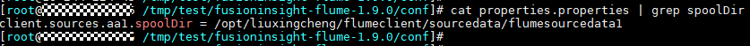
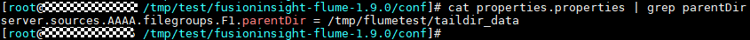
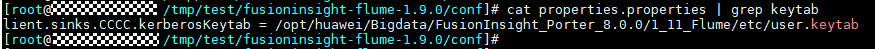

# ALM-24001 Flume Agent异常

## 告警解释

Flume Agent监控模块对Flume Agent状态进行监控，当Flume Agent进程故障（每5秒检测一次）或Flume Agent启动失败时（即时上报告警），系统产生此告警。

当检测到Flume Agent进程故障恢复，Flume Agent启动成功，且告警处理完成时，告警恢复。

## 告警属性

<table><thead align="left"><tr id="row23613923"><th class="cellrowborder" valign="top" width="33.33333333333333%" id="mcps1.1.4.1.1">
告警ID

</th>
<th class="cellrowborder" valign="top" width="33.33333333333333%" id="mcps1.1.4.1.2">
告警级别

</th>
<th class="cellrowborder" valign="top" width="33.33333333333333%" id="mcps1.1.4.1.3">
是否自动清除

</th>
</tr>
</thead>
<tbody><tr id="row66379833"><td class="cellrowborder" valign="top" width="33.33333333333333%" headers="mcps1.1.4.1.1 ">
24001

</td>
<td class="cellrowborder" valign="top" width="33.33333333333333%" headers="mcps1.1.4.1.2 ">
重要

</td>
<td class="cellrowborder" valign="top" width="33.33333333333333%" headers="mcps1.1.4.1.3 ">
是

</td>
</tr>
</tbody>
</table>

## 告警参数

<table><thead align="left"><tr id="row36757527"><th class="cellrowborder" valign="top" width="50%" id="mcps1.1.3.1.1">
参数名称

</th>
<th class="cellrowborder" valign="top" width="50%" id="mcps1.1.3.1.2">
参数含义

</th>
</tr>
</thead>
<tbody><tr id="row520681912167"><td class="cellrowborder" valign="top" width="50%" headers="mcps1.1.3.1.1 ">
来源

</td>
<td class="cellrowborder" valign="top" width="50%" headers="mcps1.1.3.1.2 ">
产生告警的集群名称。

</td>
</tr>
<tr id="row6444987"><td class="cellrowborder" valign="top" width="50%" headers="mcps1.1.3.1.1 ">
服务名

</td>
<td class="cellrowborder" valign="top" width="50%" headers="mcps1.1.3.1.2 ">
产生告警的服务名称。

</td>
</tr>
<tr id="row13409957152411"><td class="cellrowborder" valign="top" width="50%" headers="mcps1.1.3.1.1 ">
AgentId

</td>
<td class="cellrowborder" valign="top" width="50%" headers="mcps1.1.3.1.2 ">
产生告警的Agent id。

</td>
</tr>
<tr id="row62827498"><td class="cellrowborder" valign="top" width="50%" headers="mcps1.1.3.1.1 ">
角色名

</td>
<td class="cellrowborder" valign="top" width="50%" headers="mcps1.1.3.1.2 ">
产生告警的角色名称。

</td>
</tr>
<tr id="row55835340"><td class="cellrowborder" valign="top" width="50%" headers="mcps1.1.3.1.1 ">
主机名

</td>
<td class="cellrowborder" valign="top" width="50%" headers="mcps1.1.3.1.2 ">
产生告警的主机名。

</td>
</tr>
</tbody>
</table>

## 对系统的影响

产生告警的Flume Agent实例无法正常启动，定义在该实例下的数据传输任务暂时中断，对于实时数据传输，会丢失实时数据。

## 可能原因

-   JAVA\_HOME目录不存在或JAVA权限异常。
-   Flume Agent目录权限异常。
-   Flume Agent启动失败。

## 处理步骤

****检查JAVA\_HOME目录是否存在或JAVA权限是否正确****

1.  以**root**用户登录故障节点IP所在主机，用户密码为安装前用户自定义，请咨询系统管理员。
2.  执行以下命令获取发生告警的Flume客户端安装目录。（AgentId可以在告警的“定位信息”中获取）

    **ps -ef|grep **_AgentId_** | grep -v grep | awk -F 'conf-file ' '\{print $2\}' | awk -F 'fusioninsight' '\{print $1\}'**

3.  使用“**su - **_Flume安装_用户”命令切换到Flume安装用户，执行**cd **_Flume__客户端安装目录_**/fusioninsight-flume-1.9.0/conf/**命令，进入Flume的配置目录。
4.  执行**cat ENV\_VARS | grep JAVA\_HOME**命令。
5.  检查JAVA\_HOME目录是否存在，若步骤[4](#li62419311105615)执行结果返回不为空，且**ll $JAVA\_HOME/**不为空，则JAVA\_HOME目录存在。
    -   是，执行[7](#li1404949105615)。
    -   否，执行[6](#li28531951910)。

6.  指定正确的JAVA\_HOME目录，如**export JAVA\_HOME=$\{BIGDATA\_HOME\}/common/runtime0/jdk1.8.0\_242**。
7.  执行**$JAVA\_HOME/bin/java -version**命令检查Flume Agent运行用户是否有JAVA可执行权限，若可以查到java版本，这说明JAVA权限满足，否则不满足。
    -   是，执行[9](#li12942052171720)。
    -   否，执行[8](#li17575375105615)。

        > **说明：** 
        >**JAVA\_HOME**为安装Flume客户端时export导出的环境变量，也可以进入到_Flume__客户端安装目录_**/fusioninsight-flume-1.9.0/conf**目录下，执行**cat ENV\_VARS | grep JAVA\_HOME**命令来查看变量的值。

8.  执行**chmod 750 $JAVA\_HOME/bin/java**命令赋予Flume Agent运行用户JAVA可执行权限。

**检查Flume Agent的目录权限。**

1.  以**root**用户登录故障节点IP所在主机。
2.  执行以下命令，进入Flume Agent的安装目录。

    **cd **_Flume__客户端安装目录_**/fusioninsight-flume-1.9.0/conf/**

3.  执行**ls -al \* -R**命令，检查所有文件的所有者是否均是Flume Agent运行用户。
    -   是，执行[12](#li62476305536)。
    -   否，使用**chown**命令修改文件所有者为Flume Agent运行用户。

**检查Flume Agent配置。**

1.  执行**cat properties.properties | grep spooldir**以及**cat properties.properties | grep TAILDIR**命令，确认Flume Source是否是spooldir类型或TAILDIR类型，若任意一个命令有返回值，则为spooldir类型或TAILDIR类型。
    -   是，执行[13](#li124343613141)。
    -   否，执行[17](#li7261720101519)。

2.  查看数据监控目录是否存在。
    -   是，执行[15](#li155813021512)。
    -   否，执行[14](#li17447826131411)。

        > **说明：** 
        >查看spooldir监控目录，执行命令：**cat properties.properties | grep spoolDir**
        >
        >查看TAILDIR监控目录，执行命令：**cat properties.properties | grep parentDir**
        >

3.  指定服务器上用户自定义已经存在的数据监控目录。
4.  查看Flume Agent运行用户对步骤[13](#li124343613141)所指定的监控目录是否有可读可写可执行权限。
    -   是，执行[17](#li7261720101519)。
    -   否，执行[16](#li64671529111412)。

        > **说明：** 
        >使用Flume运行用户进入监控目录，若可以创建文件，这说明Flume运行用户是否对该监控目录具有可读可写可执行权限。

5.  执行“**chmod 777** _Flume监控目录_”命令赋予Flume Agent运行用户对步骤[13](#li124343613141)监控目录的可读可写可执行权限。
6.  确认Flume Sink对接组件是否处于安全模式。
    -   是，执行[18](#li922422181513)。
    -   否，执行[23](#li28033577105615)。

        > **说明：** 
        >若用户业务配置文件properties.properties的sink为hdfs sink、solr sink、hbase sink，当配置文件中包含有keytab时，则Flume Sink对接组件处于安全模式。
        >若用户业务配置文件properties.properties的sink为kafka sink，当配置参数\*.security.protocol的值为SASL\_PLAINTEXT或为SASL\_SSL时，则Flume Sink对接的Kafka处于安全模式。
        >若用户业务配置文件properties.properties的sink为ESSink，当配置参数\*.securityEnable的值为true时，则Flume Sink对接的Elasticsearch处于安全模式。

7.  使用“**ll** _ketab路径命令_”查看配置文件“\*.kerberosKeytab”参数所指的keytab认证路径是否存在。
    -   是，执行[20](#li485841172212)。
    -   否，执行[19](#li13851168209)。

        > **说明：** 
        >ketab路径查看方式：**cat properties.properties | grep keytab**
        >

8.  将步骤[18](#li922422181513)中kerberosKeytab参数的值指定为用户自定的keytab路径，执行[21](#li12245192314156)。
9.  执行步骤[18](#li922422181513)查看Flume Agent运行用户是否有访问keytab认证文件的权限，若返回为keytab路径，则表示有权限，否则无权限。
    -   是，执行[22](#li8869032152012)。
    -   否，执行[21](#li12245192314156)。

10. 执行“**chmod 755** _ketab文件_”赋予步骤[19](#li13851168209)中所指定的keytab文件的可读权限, 并重启Flume进程。
11. 查看告警列表中该告警是否已清除。
    -   是，处理完毕。
    -   否，执行[23](#li28033577105615)。

**收集故障信息。**

1.  在FusionInsight Manager界面，选择“运维 \> 日志 \> 下载”。
2.  在“服务”框中勾选待操作集群的“Flume”。
3.  单击右上角的设置日志收集的“开始时间”和“结束时间”分别为告警产生时间的前后1小时，单击“下载”。
4.  请联系运维人员，并发送已收集的故障日志信息。

## 告警清除

此告警修复后，系统会自动清除此告警，无需手工清除。

## 参考信息

无。

