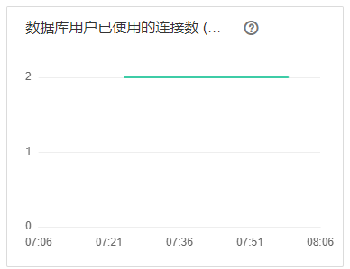
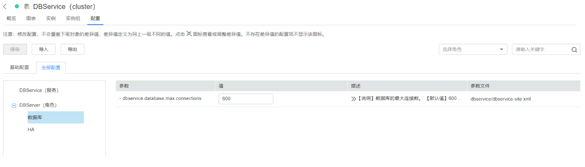
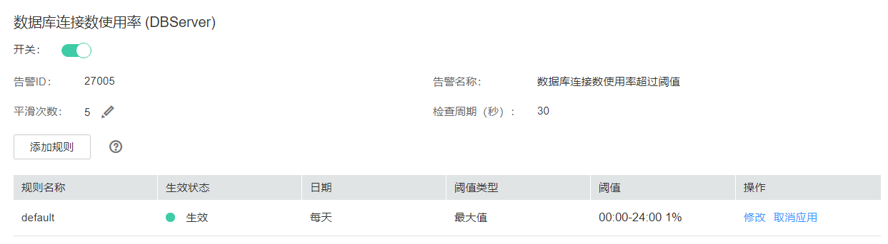
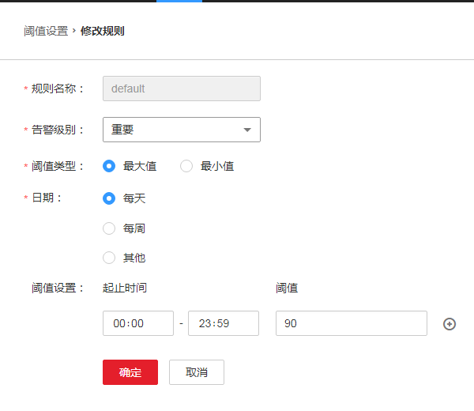

# ALM-27005 数据库连接数使用率超过阈值

## 告警解释

系统每30秒周期性检查DBServer节点的数据库连接数使用率，并把实际数据库连接数使用率和阈值相比较，当数据库连接数的使用率连续5次（可配置，默认值为5）超过设定阈值时，系统将产生此告警，数据库连接数使用率的阈值设为90%（可配置，默认值为90%）。

平滑次数可配置，当平滑次数为1，数据库连接数使用率小于或等于阈值时，该告警恢复；当平滑次数大于1，数据库连接数使用率小于或等于阈值的90%时，该告警恢复。

## 告警属性

<table><thead align="left"><tr id="row49989141"><th class="cellrowborder" valign="top" width="33.33333333333333%" id="mcps1.1.4.1.1">
告警ID

</th>
<th class="cellrowborder" valign="top" width="33.33333333333333%" id="mcps1.1.4.1.2">
告警级别

</th>
<th class="cellrowborder" valign="top" width="33.33333333333333%" id="mcps1.1.4.1.3">
是否自动清除

</th>
</tr>
</thead>
<tbody><tr id="row30415758"><td class="cellrowborder" valign="top" width="33.33333333333333%" headers="mcps1.1.4.1.1 ">
27005

</td>
<td class="cellrowborder" valign="top" width="33.33333333333333%" headers="mcps1.1.4.1.2 ">
重要

</td>
<td class="cellrowborder" valign="top" width="33.33333333333333%" headers="mcps1.1.4.1.3 ">
是

</td>
</tr>
</tbody>
</table>

## 告警参数

<table><thead align="left"><tr id="row59179380"><th class="cellrowborder" valign="top" width="50%" id="mcps1.1.3.1.1">
参数名称

</th>
<th class="cellrowborder" valign="top" width="50%" id="mcps1.1.3.1.2">
参数含义

</th>
</tr>
</thead>
<tbody><tr id="row817112239128"><td class="cellrowborder" valign="top" width="50%" headers="mcps1.1.3.1.1 ">
来源

</td>
<td class="cellrowborder" valign="top" width="50%" headers="mcps1.1.3.1.2 ">
产生告警的集群名称。

</td>
</tr>
<tr id="row48724307"><td class="cellrowborder" valign="top" width="50%" headers="mcps1.1.3.1.1 ">
服务名

</td>
<td class="cellrowborder" valign="top" width="50%" headers="mcps1.1.3.1.2 ">
产生告警的服务名称。

</td>
</tr>
<tr id="row30412584"><td class="cellrowborder" valign="top" width="50%" headers="mcps1.1.3.1.1 ">
角色名

</td>
<td class="cellrowborder" valign="top" width="50%" headers="mcps1.1.3.1.2 ">
产生告警的角色名称。

</td>
</tr>
<tr id="row66596640"><td class="cellrowborder" valign="top" width="50%" headers="mcps1.1.3.1.1 ">
主机名

</td>
<td class="cellrowborder" valign="top" width="50%" headers="mcps1.1.3.1.2 ">
产生告警的主机名。

</td>
</tr>
<tr id="row19795720"><td class="cellrowborder" valign="top" width="50%" headers="mcps1.1.3.1.1 ">
Trigger Condition

</td>
<td class="cellrowborder" valign="top" width="50%" headers="mcps1.1.3.1.2 ">
系统当前指标取值满足自定义的告警设置条件。

</td>
</tr>
</tbody>
</table>

## 对系统的影响

可能导致上层服务无法连接DBService的数据库，影响正常业务。

## 可能原因

-   数据库连接数使用过多。
-   数据库连接数最大值设置不合理。
-   告警阈值配置或者平滑次数配置不合理。

## 处理步骤

**检查数据连接数是否使用过多**

1.  在FusionInsight Manager主页，单击左侧服务列表的DBService服务，进入DBService监控页面。
2.  观察数据库用户已使用的连接数图表，如[图1](#fig206520365224)所示，用户根据业务场景评估，适当降低数据库用户连接数的使用。

    **图 1**  数据库用户已使用的连接数图表  
    

3.  等待2分钟查看告警是否自动恢复。
    -   是，处理完毕。
    -   否，执行[4](#li16521364227)。

**检查数据库连接数最大值设置是否合理**

1.  登录FusionInsight Manager，选择“集群 \>  _待操作集群的名称_  \> 服务 \> DBService \> 配置 \> 全部配置”，根据实际业务需求，将数据库连接数的最大值适当增加，如[图2](#fig6652183682220)所示。修改后单击“保存“，在弹出的“保存配置“页面中单击“确定”。

    **图 2**  设置数据库连接数最大值  
    

2.  完成数据库连接数最大值修改后，需要重启DBService服务（不要重启其上层服务）。

    操作步骤：登录FusionInsight Manager，选择“集群 \>  _待操作集群的名称_  \> 服务 \> DBService \> 更多 \> 重启服务”，输入当前登录的用户密码确认身份，单击“确定”。注意，不要勾选“同时重启上层服务”，单击“确定”完成重启。

3.  重启服务完成后，等待2分钟查看告警是否自动恢复。
    -   是，处理完毕。
    -   否，执行[7](#li79886464297)。

**检查告警阈值配置或者平滑次数配置是否合理**

1.  登录FusionInsight Manager，基于实际数据库连接数使用率的情况，修改告警阈值和平滑次数配置项。选择“运维 \> 告警 \> 阈值设置 \>  _待操作集群的名称_  \> DBService \> 数据库 \> 数据库连接数使用率 \(DBServer\)”，单击平滑次数旁的铅笔标志，更改告警的平滑次数，如[图3](#fig39889469292)所示。

    > **说明：** 
    >平滑次数：连续检查多少次超过阈值，则发送告警。

    **图 3**  设置告警平滑次数  
    

    根据数据库连接数使用率的实际情况，选择“运维 \> 告警 \> 阈值设置 \>  _待操作集群的名称_  \> DBService \> 数据库 \> 数据库连接数使用率 \(DBServer\)”，单击“操作”栏的“修改”按钮，进入修改规则界面，修改后单击“确定”，修改即生效，如[图4](#fig109881046112910)所示。

    **图 4**  设置告警阈值  
    

2.  等待2分钟，查看告警是否自动恢复。
    -   是，处理完毕。
    -   否，执行[9](#li39839699173731)。

**收集故障信息**

1.  在FusionInsight Manager界面，选择“运维 \> 日志 \> 下载”。
2.  在“服务”中勾选待操作集群的“DBService”。
3.  设置日志收集的主机，可选项，默认所有主机。
4.  单击右上角的设置日志收集的“开始时间”和“结束时间”分别为告警产生时间的前后10分钟，单击“下载”。
5.  请联系运维人员，并发送已收集的故障日志信息。

## 告警清除

此告警修复后，系统会自动清除此告警，无需手工清除。

## 参考信息

无。

