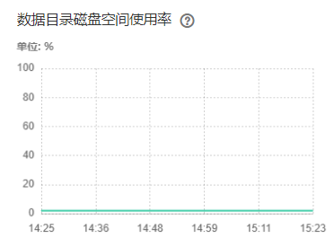

# ALM-27006  数据目录磁盘空间使用率超过阈值

## 告警解释

系统每30秒周期性检查DBServer主节点的数据目录磁盘空间使用率，并把实际数据目录磁盘空间使用率和阈值相比较，当数据目录磁盘空间使用率连续5次（可配置，默认值为5）超过设定阈值时，系统将产生此告警。数据目录磁盘空间使用率的阈值设为80%（可配置，默认值为80%）。

平滑次数可配置，当平滑次数为1，数据磁盘目录空间使用率小于或等于阈值时，该告警恢复；当平滑次数大于1，数据磁盘目录空间使用率小于阈值的90%时，该告警恢复。

## 告警属性

<table><thead align="left"><tr id="row1899773575116"><th class="cellrowborder" valign="top" width="33.33333333333333%" id="mcps1.1.4.1.1">
告警ID

</th>
<th class="cellrowborder" valign="top" width="33.33333333333333%" id="mcps1.1.4.1.2">
告警级别

</th>
<th class="cellrowborder" valign="top" width="33.33333333333333%" id="mcps1.1.4.1.3">
是否自动清除

</th>
</tr>
</thead>
<tbody><tr id="row2997203575112"><td class="cellrowborder" valign="top" width="33.33333333333333%" headers="mcps1.1.4.1.1 ">
27006

</td>
<td class="cellrowborder" valign="top" width="33.33333333333333%" headers="mcps1.1.4.1.2 ">
重要

</td>
<td class="cellrowborder" valign="top" width="33.33333333333333%" headers="mcps1.1.4.1.3 ">
是

</td>
</tr>
</tbody>
</table>

## 告警参数

<table><thead align="left"><tr id="row14412171593313"><th class="cellrowborder" valign="top" width="50%" id="mcps1.1.3.1.1">
参数名称

</th>
<th class="cellrowborder" valign="top" width="50%" id="mcps1.1.3.1.2">
参数含义

</th>
</tr>
</thead>
<tbody><tr id="row3413181517336"><td class="cellrowborder" valign="top" width="50%" headers="mcps1.1.3.1.1 ">
来源

</td>
<td class="cellrowborder" valign="top" width="50%" headers="mcps1.1.3.1.2 ">
产生告警的集群名称。

</td>
</tr>
<tr id="row54131815103314"><td class="cellrowborder" valign="top" width="50%" headers="mcps1.1.3.1.1 ">
服务名

</td>
<td class="cellrowborder" valign="top" width="50%" headers="mcps1.1.3.1.2 ">
产生告警的服务名称。

</td>
</tr>
<tr id="row144131315133312"><td class="cellrowborder" valign="top" width="50%" headers="mcps1.1.3.1.1 ">
角色名

</td>
<td class="cellrowborder" valign="top" width="50%" headers="mcps1.1.3.1.2 ">
产生告警的角色名称。

</td>
</tr>
<tr id="row1041311516331"><td class="cellrowborder" valign="top" width="50%" headers="mcps1.1.3.1.1 ">
主机名

</td>
<td class="cellrowborder" valign="top" width="50%" headers="mcps1.1.3.1.2 ">
产生告警的主机名。

</td>
</tr>
<tr id="row2413101515330"><td class="cellrowborder" valign="top" width="50%" headers="mcps1.1.3.1.1 ">
设备分区名

</td>
<td class="cellrowborder" valign="top" width="50%" headers="mcps1.1.3.1.2 ">
产生告警的磁盘分区。

</td>
</tr>
<tr id="row114131215163315"><td class="cellrowborder" valign="top" width="50%" headers="mcps1.1.3.1.1 ">
Trigger Condition

</td>
<td class="cellrowborder" valign="top" width="50%" headers="mcps1.1.3.1.2 ">
系统当前指标取值满足自定义的告警设置条件。

</td>
</tr>
</tbody>
</table>

## 对系统的影响

-   业务进程不可用。
-   当数据目录磁盘空间使用率超过90%时，数据库进入只读模式并发送告警“数据库进入只读模式”，业务数据丢失。

## 可能原因

-   告警阈值配置不合理。
-   数据库数据量过大或磁盘配置无法满足业务需求，导致磁盘使用率达到上限。

## 处理步骤

**检查阈值设置是否合理**

1.  在FusionInsight Manager，选择“运维 \> 告警 \> 阈值设置 \>  _待操作集群的名称_  \> DBService \> 数据库 \> 数据目录磁盘空间使用率”，查看该告警阈值是否合理（默认值80%为合理值）。
    -   是，执行[3](#li696213241773)。
    -   否，执行[2](#li76152032183613)。

2.  根据实际服务的使用情况修改告警阈值。
3.  选择“集群 \>  _待操作集群的名称_  \> 服务 \> DBService”，在“概览”页面查看“数据目录磁盘空间使用率”图表，检查数据目录磁盘空间使用率是否低于设置的阈值。

    -   是，执行[4](#li461543273618)。
    -   否，执行[5](#li149831549185912)。

    **图 1**  数据目录磁盘空间使用率  
    

4.  等待2分钟查看告警是否自动恢复。
    -   是，处理完毕。
    -   否，执行[5](#li149831549185912)。

**检查磁盘是否有误写入的大文件**

1.  以**omm**用户登录DBService主管理节点。
2.  执行以下命令，查看数据目录磁盘空间下超过500MB的文件，检查该目录下是否有误写入的大文件存在。

    **source $DBSERVER\_HOME/.dbservice\_profile**

    **find "$DBSERVICE\_DATA\_DIR"/../  -type f -size +500M**

    -   是，执行[7](#li11270141513437)。
    -   否，执行[8](#li366932304312)。

3.  根据实际情况处理误写入的文件，并等待2分钟，查看告警是否清除。
    -   是，执行完毕。
    -   否，执行[8](#li366932304312)。

**收集故障信息**

1.  在FusionInsight Manager界面，选择“运维 \> 日志 \> 下载”。
2.  在“服务”中勾选待操作集群的“DBService”。
3.  设置日志收集的主机，可选项，默认所有主机。
4.  单击右上角的设置日志收集的“开始时间”和“结束时间”分别为告警产生时间的前后10分钟，单击“下载”。
5.  请联系运维人员，并发送已收集的故障日志信息。

## 告警清除

此告警修复后，系统会自动清除此告警，无需手工清除。

## 参考信息

无。

