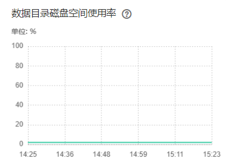

# ALM-27007  数据库进入只读模式<a name="ALM-27007"></a>

## 告警解释<a name="section60313499"></a>

系统每30秒周期性检查DBServer主节点的数据目录磁盘空间使用率，当数据目录磁盘空间使用率超过90%时，系统将产生此告警。

当数据目录磁盘空间使用率低于80%时，此告警恢复。

## 告警属性<a name="section5950580"></a>

<a name="table15548096"></a>
<table><thead align="left"><tr id="row49989141"><th class="cellrowborder" valign="top" width="33.33333333333333%" id="mcps1.1.4.1.1"><p id="p22588643"><a name="p22588643"></a><a name="p22588643"></a>告警ID</p>
</th>
<th class="cellrowborder" valign="top" width="33.33333333333333%" id="mcps1.1.4.1.2"><p id="p17740769"><a name="p17740769"></a><a name="p17740769"></a>告警级别</p>
</th>
<th class="cellrowborder" valign="top" width="33.33333333333333%" id="mcps1.1.4.1.3"><p id="p27716151"><a name="p27716151"></a><a name="p27716151"></a>是否自动清除</p>
</th>
</tr>
</thead>
<tbody><tr id="row30415758"><td class="cellrowborder" valign="top" width="33.33333333333333%" headers="mcps1.1.4.1.1 "><p id="p47757325"><a name="p47757325"></a><a name="p47757325"></a>27007</p>
</td>
<td class="cellrowborder" valign="top" width="33.33333333333333%" headers="mcps1.1.4.1.2 "><p id="p43138141"><a name="p43138141"></a><a name="p43138141"></a>紧急</p>
</td>
<td class="cellrowborder" valign="top" width="33.33333333333333%" headers="mcps1.1.4.1.3 "><p id="p4528550"><a name="p4528550"></a><a name="p4528550"></a>是</p>
</td>
</tr>
</tbody>
</table>

## 告警参数<a name="section53555227"></a>

<a name="table9390101503313"></a>
<table><thead align="left"><tr id="row14412171593313"><th class="cellrowborder" valign="top" width="50%" id="mcps1.1.3.1.1"><p id="p2412151583313"><a name="p2412151583313"></a><a name="p2412151583313"></a>参数名称</p>
</th>
<th class="cellrowborder" valign="top" width="50%" id="mcps1.1.3.1.2"><p id="p1141231511335"><a name="p1141231511335"></a><a name="p1141231511335"></a>参数含义</p>
</th>
</tr>
</thead>
<tbody><tr id="row3413181517336"><td class="cellrowborder" valign="top" width="50%" headers="mcps1.1.3.1.1 "><p id="p1441316156335"><a name="p1441316156335"></a><a name="p1441316156335"></a>来源</p>
</td>
<td class="cellrowborder" valign="top" width="50%" headers="mcps1.1.3.1.2 "><p id="p16413141593313"><a name="p16413141593313"></a><a name="p16413141593313"></a>产生告警的集群名称。</p>
</td>
</tr>
<tr id="row54131815103314"><td class="cellrowborder" valign="top" width="50%" headers="mcps1.1.3.1.1 "><p id="p194131715133310"><a name="p194131715133310"></a><a name="p194131715133310"></a>服务名</p>
</td>
<td class="cellrowborder" valign="top" width="50%" headers="mcps1.1.3.1.2 "><p id="p14413171593311"><a name="p14413171593311"></a><a name="p14413171593311"></a>产生告警的服务名称。</p>
</td>
</tr>
<tr id="row144131315133312"><td class="cellrowborder" valign="top" width="50%" headers="mcps1.1.3.1.1 "><p id="p34130155333"><a name="p34130155333"></a><a name="p34130155333"></a>角色名</p>
</td>
<td class="cellrowborder" valign="top" width="50%" headers="mcps1.1.3.1.2 "><p id="p0413115183317"><a name="p0413115183317"></a><a name="p0413115183317"></a>产生告警的角色名称。</p>
</td>
</tr>
<tr id="row114131215163315"><td class="cellrowborder" valign="top" width="50%" headers="mcps1.1.3.1.1 "><p id="p7413111513336"><a name="p7413111513336"></a><a name="p7413111513336"></a>Trigger Condition</p>
</td>
<td class="cellrowborder" valign="top" width="50%" headers="mcps1.1.3.1.2 "><p id="p1141321510333"><a name="p1141321510333"></a><a name="p1141321510333"></a>系统当前指标取值满足自定义的告警设置条件。</p>
</td>
</tr>
</tbody>
</table>

## 对系统的影响<a name="section12235000"></a>

数据库进入只读模式，业务数据丢失。

## 可能原因<a name="section43006140"></a>

磁盘配置无法满足业务需求，磁盘使用率达到上限。

## 处理步骤<a name="section335410719615"></a>

**检查磁盘使用率是否达到上限**

1.  在FusionInsight Manager，选择“集群 \>  _待操作集群的名称_  \> 服务 \> DBService”。
2.  在“概览”页面查看“数据目录磁盘空间使用率”图表，检查数据目录磁盘空间使用率是否超过90%。
    -   是，执行[3](#li081419456453)。
    -   否，执行[13](#li1728351518576)。

3.  <a name="li081419456453"></a>以**omm**用户登录DBServer主管理节点，执行以下命令，查看数据库是否进入只读模式。

    **source $DBSERVER\_HOME/.dbservice\_profile**

    **gsql -U omm -W **_password_** -d postgres -p 20051**

    **show default\_transaction\_read\_only;**

    > **说明：** 
    >其中_password_为DBService数据库的**omm**用户密码，用户可以执行**\\q**退出数据库界面。

    结果如下所示，查看“default\_transaction\_read\_only”的值是否为“on”。

    ```
    POSTGRES=# show default_transaction_read_only;
     default_transaction_read_only
    -------------------------------
     on
    (1 row)
    ```

    -   是，执行[4](#li153831332405)。
    -   否，执行[13](#li1728351518576)。

4.  <a name="li153831332405"></a>执行以下命令，打开“dbservice.properties”文件：

    **source $DBSERVER\_HOME/.dbservice\_profile**

    **vi $\{DBSERVICE\_SOFTWARE\_DIR\}/tools/dbservice.properties**

5.  修改“gaussdb\_readonly\_auto”的值为“OFF”，默认为“ON”。

1.  执行以下命令，打开dbservice.properties文件：

    **vi $\{DBSERVICE\_DATA\_DIR**\}**/postgresql.conf**

2.  删除“default\_transaction\_read\_only = on”。
3.  执行以下命令，使配置生效：

    **gs\_ctl reload  -D $\{DBSERVICE\_DATA\_DIR**\}

4.  登录FusionInsight Manager，选择“运维 \> 告警 \> 告警”。单击告警“数据库进入只读模式”所在行右侧“操作”列中的“清除”，在弹出窗口中单击“确定”。手动清除该告警。

1.  以**omm**用户登录DBServer主管理节点，执行以下命令查看数据目录磁盘空间下超过500MB的文件，检查该目录下是否有误写入的大文件存在。

    **source $DBSERVER\_HOME/.dbservice\_profile**

    **find "$DBSERVICE\_DATA\_DIR"/../  -type f -size +500M**

    -   是，执行[11](#li1754313435197)。
    -   否，执行[13](#li1728351518576)。

2.  <a name="li1754313435197"></a>根据实际情况处理误写入的文件。
3.  登录FusionInsight Manager，选择“集群 \>  _待操作集群的名称_  \> 服务 \> DBService”，在“概览”页面查看“数据目录磁盘空间使用率”图表，检查数据目录磁盘空间使用率是否低于80%。

    -   是，处理完毕。
    -   否，执行[13](#li1728351518576)。

    **图 1**  数据目录磁盘空间使用率<a name="fig87736218297"></a>  
    


**收集故障信息**

1.  <a name="li1728351518576"></a>在FusionInsight Manager界面，选择“运维 \> 日志 \> 下载”。
2.  在“服务”中勾选待操作集群的“DBService”。
3.  设置日志收集的主机，可选项，默认所有主机。
4.  单击右上角的设置日志收集的“开始时间”和“结束时间”分别为告警产生时间的前后10分钟，单击“下载”。

1.  请联系运维人员，并发送已收集的故障日志信息。

## 告警清除<a name="section169311343318"></a>

此告警修复后，系统会自动清除此告警，无需手工清除。

## 参考信息<a name="section60945317"></a>

无。

