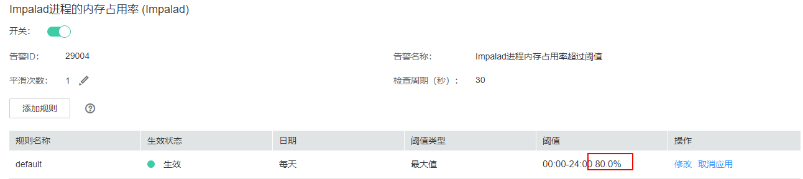

# ALM-29004 Impalad进程内存占用率超过阈值

## 告警解释

以30s为周期检测Impalad进程系统内存占用率，当检测到的超过默认阈值（80%）时，系统产生此告警。

当系统检测到进程内存占用率下降到阈值以下时，告警将自动解除。

## 告警属性

<table><thead align="left"><tr id="row5683496"><th class="cellrowborder" valign="top" width="33.33333333333333%" id="mcps1.1.4.1.1">
告警ID

</th>
<th class="cellrowborder" valign="top" width="33.33333333333333%" id="mcps1.1.4.1.2">
告警级别

</th>
<th class="cellrowborder" valign="top" width="33.33333333333333%" id="mcps1.1.4.1.3">
是否自动清除

</th>
</tr>
</thead>
<tbody><tr id="row60910108"><td class="cellrowborder" valign="top" width="33.33333333333333%" headers="mcps1.1.4.1.1 ">
29004

</td>
<td class="cellrowborder" valign="top" width="33.33333333333333%" headers="mcps1.1.4.1.2 ">
次要

</td>
<td class="cellrowborder" valign="top" width="33.33333333333333%" headers="mcps1.1.4.1.3 ">
是

</td>
</tr>
</tbody>
</table>

## 告警参数

<table><thead align="left"><tr id="row40868022"><th class="cellrowborder" valign="top" width="50%" id="mcps1.1.3.1.1">
参数名称

</th>
<th class="cellrowborder" valign="top" width="50%" id="mcps1.1.3.1.2">
参数含义

</th>
</tr>
</thead>
<tbody><tr id="row594512751512"><td class="cellrowborder" valign="top" width="50%" headers="mcps1.1.3.1.1 ">
来源

</td>
<td class="cellrowborder" valign="top" width="50%" headers="mcps1.1.3.1.2 ">
产生告警的集群名称。

</td>
</tr>
<tr id="row31170320"><td class="cellrowborder" valign="top" width="50%" headers="mcps1.1.3.1.1 ">
服务名

</td>
<td class="cellrowborder" valign="top" width="50%" headers="mcps1.1.3.1.2 ">
产生告警的服务名称。

</td>
</tr>
<tr id="row8175713133714"><td class="cellrowborder" valign="top" width="50%" headers="mcps1.1.3.1.1 ">
角色名

</td>
<td class="cellrowborder" valign="top" width="50%" headers="mcps1.1.3.1.2 ">
产生告警的角色名称。

</td>
</tr>
<tr id="row144886177375"><td class="cellrowborder" valign="top" width="50%" headers="mcps1.1.3.1.1 ">
主机名

</td>
<td class="cellrowborder" valign="top" width="50%" headers="mcps1.1.3.1.2 ">
产生告警的主机名。

</td>
</tr>
<tr id="row1688158103712"><td class="cellrowborder" valign="top" width="50%" headers="mcps1.1.3.1.1 ">
Trigger Condition

</td>
<td class="cellrowborder" valign="top" width="50%" headers="mcps1.1.3.1.2 ">
系统当前指标取值满足自定义的告警设置条件。

</td>
</tr>
</tbody>
</table>

## 对系统的影响

内存使用过高，部分查询任务可能因为内存不足而失败。

## 可能原因

Impalad进程正在执行较大量查询任务。

## 处理步骤

1.  在FusionInsight Manager首页，选择“运维 \> 告警 \> 阈值设置 \> Impala \> CPU和内存 \> Impalad进程的内存占用率（Impalad）" ，检查阈值大小。

    

2.  如阈值较小（小于80%），可根据实际需要适当增大告警阈值，检查告警是否消除。
    -   是，处理完毕。
    -   否，执行[3](#li54643151153)。

3.  如阈值已超过80%，请检查告警出现时刻是否有突发的大量并发查询任务，突发大量任务将会导致内存占用飙升，待任务执行完成后告警将自动消失，期间可能有因内存不足而执行失败或取消的任务，请重试。

    > **说明：** 
    >如内存占用超过阈值为常态化状态，需要考虑集群扩容。

## 告警清除

突发并发任务执行结束后告警自动清除。

## 参考信息

无

