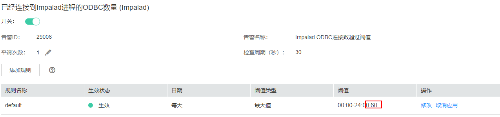
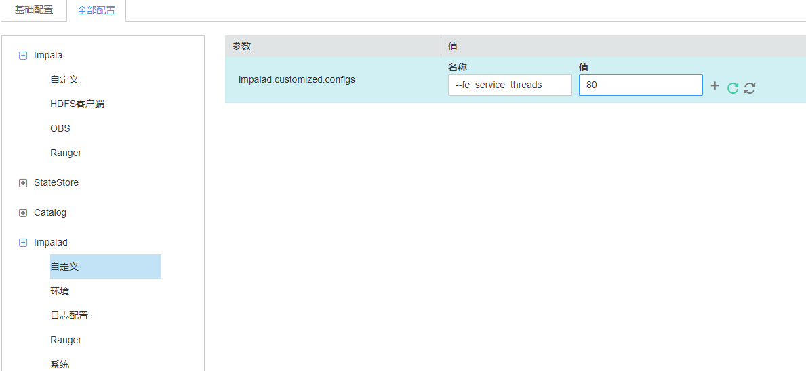
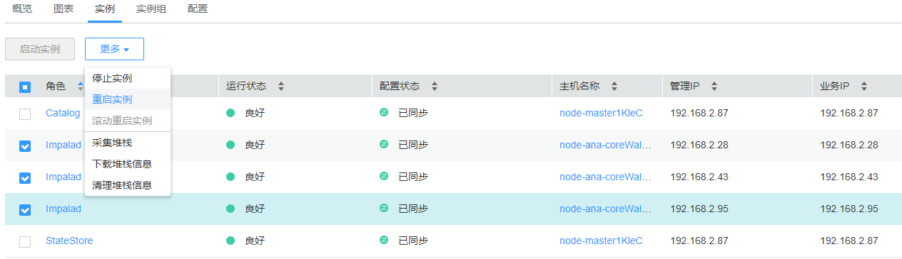

# ALM-29006 Impalad ODBC连接数超过阈值

## 告警解释

以30s为周期检测连接到该Impalad节点的客户端连接数，当检测到的连接数超过自定义阈值（默认60）时，系统产生此告警。

当系统检测到客户端连接数减少到阈值以下时，告警将自动解除。

## 告警属性

<table><thead align="left"><tr id="row5683496"><th class="cellrowborder" valign="top" width="33.3033303330333%" id="mcps1.1.4.1.1">
告警ID

</th>
<th class="cellrowborder" valign="top" width="33.36333633363336%" id="mcps1.1.4.1.2">
告警级别

</th>
<th class="cellrowborder" valign="top" width="33.33333333333333%" id="mcps1.1.4.1.3">
是否自动清除

</th>
</tr>
</thead>
<tbody><tr id="row60910108"><td class="cellrowborder" valign="top" width="33.3033303330333%" headers="mcps1.1.4.1.1 ">
29006

</td>
<td class="cellrowborder" valign="top" width="33.36333633363336%" headers="mcps1.1.4.1.2 ">
重要

</td>
<td class="cellrowborder" valign="top" width="33.33333333333333%" headers="mcps1.1.4.1.3 ">
是

</td>
</tr>
</tbody>
</table>

## 告警参数

<table><thead align="left"><tr id="row40868022"><th class="cellrowborder" valign="top" width="50%" id="mcps1.1.3.1.1">
参数名称

</th>
<th class="cellrowborder" valign="top" width="50%" id="mcps1.1.3.1.2">
参数含义

</th>
</tr>
</thead>
<tbody><tr id="row594512751512"><td class="cellrowborder" valign="top" width="50%" headers="mcps1.1.3.1.1 ">
来源

</td>
<td class="cellrowborder" valign="top" width="50%" headers="mcps1.1.3.1.2 ">
产生告警的集群名称

</td>
</tr>
<tr id="row31170320"><td class="cellrowborder" valign="top" width="50%" headers="mcps1.1.3.1.1 ">
服务名

</td>
<td class="cellrowborder" valign="top" width="50%" headers="mcps1.1.3.1.2 ">
产生告警的服务名称

</td>
</tr>
<tr id="row883552454311"><td class="cellrowborder" valign="top" width="50%" headers="mcps1.1.3.1.1 ">
角色名

</td>
<td class="cellrowborder" valign="top" width="50%" headers="mcps1.1.3.1.2 ">
产生告警的角色名称

</td>
</tr>
<tr id="row164912316433"><td class="cellrowborder" valign="top" width="50%" headers="mcps1.1.3.1.1 ">
主机名

</td>
<td class="cellrowborder" valign="top" width="50%" headers="mcps1.1.3.1.2 ">
产生告警的主机名

</td>
</tr>
<tr id="row1305193818439"><td class="cellrowborder" valign="top" width="50%" headers="mcps1.1.3.1.1 ">
Trigger Condition

</td>
<td class="cellrowborder" valign="top" width="50%" headers="mcps1.1.3.1.2 ">
系统当前指标取值满足自定义的告警设置条件

</td>
</tr>
</tbody>
</table>

## 对系统的影响

后续新建立客户端连接可能会阻塞甚至失败。

## 可能原因

该Impalad服务维护的客户端连接过多，或者阈值设定的太小。

## 处理步骤

1.  在FusionInsight Manager首页，选择“运维 \> 告警 \> 阈值设置 \> Impala \> 连接数 \> 已经连接到Impalad进程的ODBC数量" ，检查阈值大小。

    

2.  检查连接到当前Impalad进程的ODBC应用数，并关闭闲置的应用，观察告警是否自动清除。
    -   是，处理完毕。
    -   否，执行[3](#li1507754134111)，修改并发Impalad支持的并发连接数。

3.  在FusionInsight Manager首页，选择“集群 \> Impala \> 配置 \> 全部配置 \> Impalad \> 自定义”，增加自定义参数 --fe\_service\_threads，该参数默认值64，请按照需要修改该值，单击“保存”按钮保存配置。

    

4.  在所有客户端的查询任务都执行完成后，选择“实例”页签，勾选所有“Impalad”实例并重启。

    

5.  重启完成后告警将消失，请重新运行使用ODBC方式连接Impalad的应用。

## 告警清除

此告警修复后，系统会自动清除此告警，无需手工清除。

## 参考信息

无

