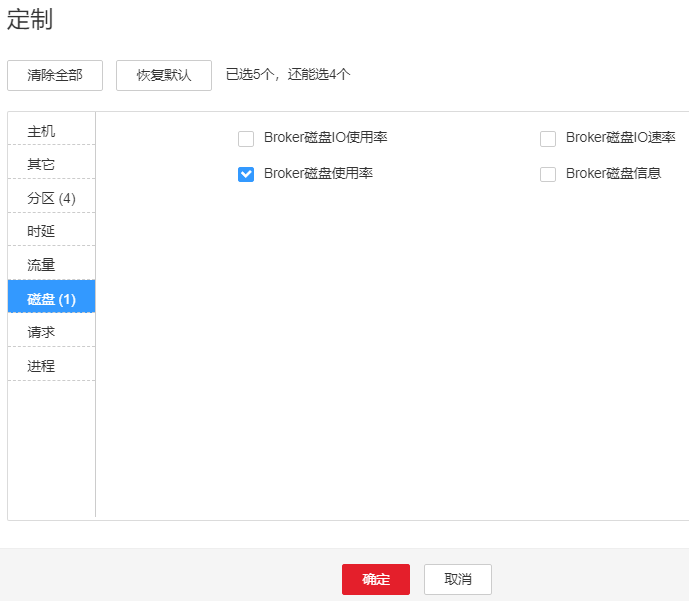

# ALM-38001 Kafka磁盘容量不足

## 告警解释

系统按60秒周期检测Kafka磁盘空间使用率，并把实际磁盘使用率和阈值相比较。磁盘使用率默认提供一个阈值范围。当检测到磁盘使用率高于阈值时产生该告警。

用户可通过“运维 \> 告警 \> 阈值设置”，在服务列表下面，选择“Kafka \> 磁盘 \> Broker磁盘使用率 \(Broker\)”修改阈值。

平滑次数为1，Kafka磁盘使用率小于或等于阈值时，告警恢复；平滑次数大于1，Kafka磁盘使用率小于或等于阈值的90%时，告警恢复。

## 告警属性

<table><thead align="left"><tr id="row5975028"><th class="cellrowborder" valign="top" width="33.33333333333333%" id="mcps1.1.4.1.1">
告警ID

</th>
<th class="cellrowborder" valign="top" width="33.33333333333333%" id="mcps1.1.4.1.2">
告警级别

</th>
<th class="cellrowborder" valign="top" width="33.33333333333333%" id="mcps1.1.4.1.3">
是否自动清除

</th>
</tr>
</thead>
<tbody><tr id="row3390323"><td class="cellrowborder" valign="top" width="33.33333333333333%" headers="mcps1.1.4.1.1 ">
38001

</td>
<td class="cellrowborder" valign="top" width="33.33333333333333%" headers="mcps1.1.4.1.2 ">
重要

</td>
<td class="cellrowborder" valign="top" width="33.33333333333333%" headers="mcps1.1.4.1.3 ">
是

</td>
</tr>
</tbody>
</table>

## 告警参数

<table><thead align="left"><tr id="row12062690"><th class="cellrowborder" valign="top" width="50%" id="mcps1.1.3.1.1">
参数名称

</th>
<th class="cellrowborder" valign="top" width="50%" id="mcps1.1.3.1.2">
参数含义

</th>
</tr>
</thead>
<tbody><tr id="row04245146811"><td class="cellrowborder" valign="top" width="50%" headers="mcps1.1.3.1.1 ">
来源

</td>
<td class="cellrowborder" valign="top" width="50%" headers="mcps1.1.3.1.2 ">
产生告警的集群名称。

</td>
</tr>
<tr id="row34169093"><td class="cellrowborder" valign="top" width="50%" headers="mcps1.1.3.1.1 ">
服务名

</td>
<td class="cellrowborder" valign="top" width="50%" headers="mcps1.1.3.1.2 ">
产生告警的服务名称。

</td>
</tr>
<tr id="row22815263"><td class="cellrowborder" valign="top" width="50%" headers="mcps1.1.3.1.1 ">
角色名

</td>
<td class="cellrowborder" valign="top" width="50%" headers="mcps1.1.3.1.2 ">
产生告警的角色名称。

</td>
</tr>
<tr id="row8034041"><td class="cellrowborder" valign="top" width="50%" headers="mcps1.1.3.1.1 ">
主机名

</td>
<td class="cellrowborder" valign="top" width="50%" headers="mcps1.1.3.1.2 ">
产生告警的主机名。

</td>
</tr>
<tr id="row9582866"><td class="cellrowborder" valign="top" width="50%" headers="mcps1.1.3.1.1 ">
设备分区名

</td>
<td class="cellrowborder" valign="top" width="50%" headers="mcps1.1.3.1.2 ">
产生告警的磁盘分区。

</td>
</tr>
<tr id="row63867374"><td class="cellrowborder" valign="top" width="50%" headers="mcps1.1.3.1.1 ">
Trigger Condition

</td>
<td class="cellrowborder" valign="top" width="50%" headers="mcps1.1.3.1.2 ">
系统当前指标取值满足自定义的告警设置条件。

</td>
</tr>
</tbody>
</table>

## 对系统的影响

磁盘容量不足会导致Kafka写入数据失败。

## 可能原因

-   用于存储Kafka数据的磁盘配置（如磁盘数目、磁盘大小等），无法满足当前业务数据流量，导致磁盘使用率达到上限。
-   数据保存时间配置过长，数据累积达到磁盘使用率上限。
-   业务规划不合理，导致数据分配不均，使部分磁盘达到使用率上限。

## 处理步骤

**检查Kafka数据的磁盘配置。**

1.  在FusionInsight Manager管理界面，选择“运维 \> 告警 \> 告警”。
2.  在告警列表中单击该告警，从“定位信息”中获得主机名。
3.  选择“集群 \>  _待操作集群的名称_  \> 主机”。
4.  在“主机”页面单击[2](#li18737111110109)中获取的主机名称。
5.  检查“磁盘”区域中是否包含该告警中的磁盘分区名称。
    -   是，执行[6](#li12738181118106)。
    -   否，手动清除该告警，操作结束。

6.  检查“磁盘”区域中包含该告警中的磁盘分区使用率是否达到百分之百。
    -   是，参考[参考信息](#section39564683)进行处理。
    -   否，执行[7](#li05611840153313)

**检查Kafka数据保存时间配置。**

1.  选择“集群 \>  _待操作集群的名称_  \> 服务 \> Kafka \> 配置 \> 全部配置”。
2.  查看“disk.adapter.enable”参数是否配置为“true”。
    -   是，执行[10](#li156384063310)。
    -   否，执行[9](#li05621440103316)。

3.  将“disk.adapter.enable”配置为“true”，开启该功能。然后查看“adapter.topic.min.retention.hours”所配置的数据最短保存周期是否合理。

    -   是，执行[10](#li156384063310)。
    -   否，根据业务需求合理调整数据保存周期。

    > **须知：** 
    >启用磁盘自适应功能可能导致Topic的历史数据被清除，如果有个别Topic不能做保存周期调整，单击“全部配置”，将Topic配置在“disk.adapter.topic.blacklist”参数中。

4.  等待10分钟，查看故障磁盘的使用率是否有减少。
    -   是，继续等待直到告警消除。
    -   否，执行[11](#li496671744211)。

**检查Kafka数据规划。**

1.  选择上报告警实例主机名对应的角色“Broker”。单击图表区域右上角的下拉菜单，选择“定制”，来自定义监控项。
2.  在弹出的“定制”对话框中，选择“磁盘 \> Broker磁盘使用率”，并单击“确定“。

    关于Kafka磁盘使用情况信息会被显示。

    **图 1**  Broker磁盘使用率  
    

3.  根据[12](#li1396731715421)的显示信息，查看是否只有[2](#li18737111110109)中上报告警的磁盘分区。
    -   是，执行[14](#li16967191774213)。
    -   否，执行[15](#li2967171774215)。

4.  重新进行磁盘规划，挂载新的磁盘，进入当前问题节点“实例配置”页面，重新配置“log.dirs”，增加其他磁盘相应路径，重启当前Kafka实例。
5.  查看Kafka配置的数据保存时间配置，根据业务需求和业务量权衡，考虑是否需要调小数据保存时间。
    -   是，执行[16](#li196814175426)。
    -   否，执行[17](#li9968317144220)。

6.  在FusionInsight Manager界面，选择“集群 \>  _待操作集群的名称_  \> 服务 \> Kafka \> 配置 \> 全部配置”，在右侧搜索框中填写配置项名称“log.retention.hours”，然后会显示该配置的当前值，此处的值为Topic默认的数据保存时间，可以适当调小该值。

    > **说明：** 
    >-   对于单独配置数据保存时间的Topic，修改Kafka服务配置页面上配置的数据保存时间不生效。
    >-   如果需要对某个Topic单独配置的话，可以使用Kafka客户端命令行，来单独配置该Topic。
    >    例如：**kafka-topics.sh --zookeeper “**_ZooKeeper__地址**:**_**2181/kafka”_ _--alter --topic “**_T__opic__名称_**” --config retention.ms=“**_保存时间_**”**

7.  查看是否由于某些Topic的Partition配置不合理导致部分磁盘使用率达到上限（例如：数据量非常大的Topic的Partition数目小于配置的磁盘个数，导致各磁盘上数据分配无法均匀，进而部分磁盘达到使用率上限）。

    > **说明：** 
    >如果不清楚哪些Topic业务数据量较大，可以根据[2](#li18737111110109)中获取到的主机节点信息，登录到实例节点上，进入对应的数据目录（即[14](#li16967191774213)中“log.dirs”修改之前的配置路径），查看该目录下哪些Topic的Partition目录占用的磁盘空间比较大。

    -   是，执行[18](#li119694177424)。
    -   否，执行[19](#li69701117144213)。

8.  通过Kafka客户端对Topic的Partition进行扩展，命令行操作命令如下：

    **kafka-topics.sh --zookeeper “**_ZooKeeper__地址_**:2181/kafka” --alter --topic “**_Topic__名称_**” --partitions=“**_新Partition__数目_**”**

    > **说明：** 
    >-   新Partition数目建议配置为Kafka数据磁盘数量的倍数。
    >-   当前步骤修改可能不会很快解决当前告警，需要结合[11](#li496671744211)中的数据保存时间逐渐均衡数据。

9.  考虑是否需要扩容。

    > **说明：** 
    >建议当前Kafka磁盘使用率超过80%时，则需要扩容。

    -   是，执行[20](#li8970171744212)。
    -   否，执行[21](#li1797061714424)。

10. 扩展磁盘容量，扩展后检查告警是否消失。
    -   是，操作结束。
    -   否，执行[22](#li1573581113104)。

11. 检查告警是否清除。
    -   是，操作结束。
    -   否，执行[22](#li1573581113104)。

**收集故障信息。**

1.  在FusionInsight Manager界面，选择“运维 \> 日志 \> 下载”。
2.  在“服务”中勾选待操作集群的“Kafka”。
3.  单击右上角的设置日志收集的“开始时间”和“结束时间”分别为告警产生时间的前后10分钟，单击“下载”。
4.  请联系运维人员，并发送已收集的故障日志信息。

## 告警清除

此告警修复后，系统会自动清除此告警，无需手工清除。

## 参考信息

1.  登录FusionInsight Manager，选择“集群 \>  _待操作集群的名称_  \> 服务 \> Kafka \> 实例”，将运行状态为“正在恢复“的Broker实例停止并记录实例所在节点的管理IP地址以及对应的“broker.id“，该值可通过单击角色名称，在“实例配置“页面中选择“全部配置”，搜索“broker.id“参数获取。
2.  以**root**用户登录记录的管理IP地址，并执行**df -lh**命令，查看磁盘占用率为100%的挂载目录，例如“$\{BIGDATA\_DATA\_HOME\}/kafka/data1“。
3.  进入该目录，执行**du -sh \***命令，查看该目录下各文件夹的大小。查看是否存在除“kafka-logs“目录外的其他文件，并判断是否可以删除或者迁移。
    -   是，删除或者迁移相关数据，然后执行[8](#le5f408260b7c4eaea839d9f216e3039b)。
    -   否，执行[4](#l6b4a3aa101714691aebfd7f69ccfc8d4)。

4.  进入“kafka-logs“目录，执行**du -sh \***命令，选择一个待移动的Partition文件夹，其名称命名规则为“Topic名称-Partition标识“，记录Topic及Partition。
5.  修改“kafka-logs“目录下的“recovery-point-offset-checkpoint“和“replication-offset-checkpoint“文件（两个文件做同样的修改）。
    1.  减少文件中第二行的数字（若移出多个目录，则减少的数字为移出的目录个数）。
    2.  删除待移出的Partition所在的行（行结构为“Topic名称 Partition标识 Offset”，删除前先将该行数据保存，后续此内容还要添加到目的目录下的同名文件中）。

6.  修改目的数据目录下（例如：“$\{BIGDATA\_DATA\_HOME\}/kafka/data2/kafka-logs“）的“recovery-point-offset-checkpoint“和“replication-offset-checkpoint“文件（两个文件做同样的修改）。
    -   增加文件中第二行的数字（若移入多个Partition目录，则增加的数字为移入的Partition目录个数）。
    -   添加待移入的Partition行到文件末尾（行结构为“Topic名称 Partition标识 Offset”，直接复制[5](#l847204e787034666b0ffc45eaaaf2cd4)中保存的行数据即可）。

7.  移动数据，将待移动的Partition文件夹移动到目的目录下，移动完成后执行**chown omm:wheel -R** _Partition目录_命令修改Partition目录属组。
8.  登录FusionInsight Manager，选择“集群 \>  _待操作集群的名称_  \> 服务 \> Kafka \> 实例”，启动停止的Broker实例。
9.  等待5至10分钟后查看Broker实例的运行状态是否为“良好“。
    -   是，修复完成后按照“ALM-38001 Kafka磁盘容量不足”告警指导彻底解决磁盘容量不足问题。
    -   否，联系运维人员。

