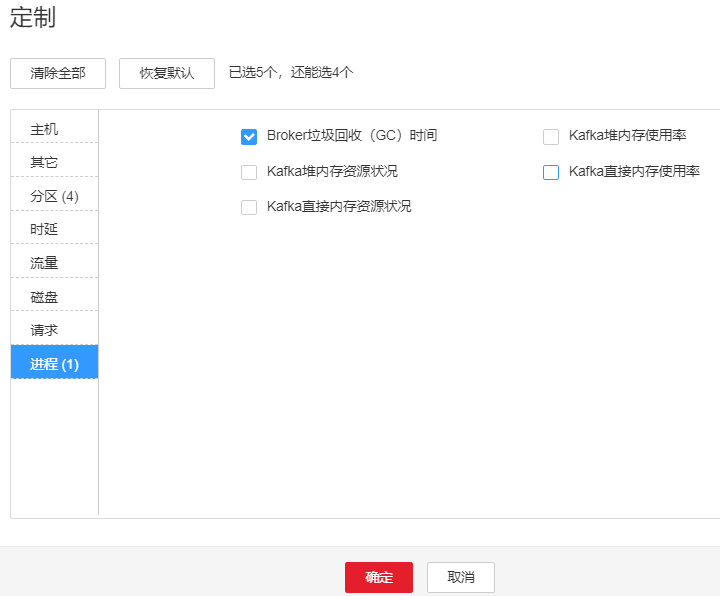

# ALM-38005 Broker进程垃圾回收（GC）时间超过阈值

## 告警解释

系统每60秒周期性检测Broker进程的垃圾回收（GC）占用时间，当连续3次检测到Broker进程的垃圾回收（GC）时间超出阈值（默认12秒）时，产生该告警。

平滑次数为1，垃圾回收（GC）时间小于或等于阈值时，告警恢复；平滑次数大于1，垃圾回收（GC）时间小于或等于阈值的90%时，告警恢复。

## 告警属性

<table><thead align="left"><tr id="row4979446"><th class="cellrowborder" valign="top" width="33.33333333333333%" id="mcps1.1.4.1.1">
告警ID

</th>
<th class="cellrowborder" valign="top" width="33.33333333333333%" id="mcps1.1.4.1.2">
告警级别

</th>
<th class="cellrowborder" valign="top" width="33.33333333333333%" id="mcps1.1.4.1.3">
是否自动清除

</th>
</tr>
</thead>
<tbody><tr id="row28865132"><td class="cellrowborder" valign="top" width="33.33333333333333%" headers="mcps1.1.4.1.1 ">
38005

</td>
<td class="cellrowborder" valign="top" width="33.33333333333333%" headers="mcps1.1.4.1.2 ">
重要

</td>
<td class="cellrowborder" valign="top" width="33.33333333333333%" headers="mcps1.1.4.1.3 ">
是

</td>
</tr>
</tbody>
</table>

## 告警参数

<table><thead align="left"><tr id="row22744955"><th class="cellrowborder" valign="top" width="50%" id="mcps1.1.3.1.1">
参数名称

</th>
<th class="cellrowborder" valign="top" width="50%" id="mcps1.1.3.1.2">
参数含义

</th>
</tr>
</thead>
<tbody><tr id="row167685516714"><td class="cellrowborder" valign="top" width="50%" headers="mcps1.1.3.1.1 ">
来源

</td>
<td class="cellrowborder" valign="top" width="50%" headers="mcps1.1.3.1.2 ">
产生告警的集群名称。

</td>
</tr>
<tr id="row20189592"><td class="cellrowborder" valign="top" width="50%" headers="mcps1.1.3.1.1 ">
服务名

</td>
<td class="cellrowborder" valign="top" width="50%" headers="mcps1.1.3.1.2 ">
产生告警的服务名称。

</td>
</tr>
<tr id="row53359872"><td class="cellrowborder" valign="top" width="50%" headers="mcps1.1.3.1.1 ">
角色名

</td>
<td class="cellrowborder" valign="top" width="50%" headers="mcps1.1.3.1.2 ">
产生告警的角色名称。

</td>
</tr>
<tr id="row18844162"><td class="cellrowborder" valign="top" width="50%" headers="mcps1.1.3.1.1 ">
主机名

</td>
<td class="cellrowborder" valign="top" width="50%" headers="mcps1.1.3.1.2 ">
产生告警的主机名称。

</td>
</tr>
<tr id="row63975386"><td class="cellrowborder" valign="top" width="50%" headers="mcps1.1.3.1.1 ">
Trigger Condition

</td>
<td class="cellrowborder" valign="top" width="50%" headers="mcps1.1.3.1.2 ">
系统当前指标取值满足自定义的告警设置条件。

</td>
</tr>
</tbody>
</table>

## 对系统的影响

Broker进程的垃圾回收时间过长，可能影响该Broker进程正常提供服务。

## 可能原因

该节点Kafka实例进程的垃圾回收时间过长，或配置的直接内存大小不合理，导致进程GC频繁。

## 处理步骤

**检查Broker进程的垃圾回收（GC）时间**。

1.  在FusionInsight Manager首页，选择“运维 \> 告警 \> 告警 \> Broker进程垃圾回收（GC）时间超过阈值 \> 定位信息”。查看告警上报的实例的主机名。
2.  在FusionInsight Manager首页，选择“集群 \>  _待操作集群的名称_  \> 服务 \> Kafka \> 实例”，选择上报告警实例主机名对应的角色 。单击图表区域右上角的下拉菜单，选择“定制 \> 进程 \> Broker垃圾回收（GC）时间”，单击“确定”。

    **图 1**  Broker垃圾回收（GC）时间  
    

3.  查看Broker每分钟的垃圾回收时间统计值是否大于告警阈值（默认12秒）。
    -   是，执行[4](#li643265354316)。
    -   否，执行[7](#li37309391154856)。

**检查Kafka配置的直接内存大小。**

1.  在FusionInsight Manager首页，选择“集群 \>  _待操作集群的名称_  \> 服务 \> Kafka \> 配置 \> 全部配置 \> Broker（角色） \> 环境变量”。将“KAFKA\_HEAP\_OPTS”参数中配置的“-Xmx”值参考如下说明调大。

    > **说明：** 
    >-   建议“KAFKA\_HEAP\_OPTS”参数中“-Xmx”和“-Xms”值保持一致。
    >-   建议根据“Kafka直接内存资源状况”调整“KAFKA\_HEAP\_OPTS”的值为“Kafka使用的直接内存大小”的两倍（可根据实际业务场景进行修改）。“Kafka直接内存资源状况”可在FusionInsight Manager首页，选择“集群 \>  _待操作集群的名称_  \> 服务 \> Kafka \> 实例”，选择上报告警实例主机名对应的角色。单击图表区域右上角的下拉菜单，选择“定制 \> 进程 \> Kafka直接内存资源状况”进行查看。

2.  保存配置，并重启Kafka服务。
3.  观察界面告警是否清除。
    -   是，处理完毕。
    -   否，执行[7](#li37309391154856)。

**收集故障信息**

1.  在FusionInsight Manager界面，选择“运维 \> 日志 \> 下载”。
2.  在“服务”中勾选待操作集群的“Kafka”。
3.  单击右上角的设置日志收集的“开始时间”和“结束时间”分别为告警产生时间的前后10分钟，单击“下载”。
4.  请联系运维人员，并发送已收集的故障日志信息。

## 告警清除

此告警修复后，系统会自动清除此告警，无需手工清除。

## 参考信息

无。

