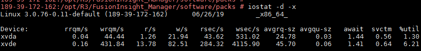

# ALM-38009 Broker磁盘IO繁忙

## 告警解释

系统每60秒周期性检测Kafka各个磁盘的IO情况，当检测到某个Broker上的Kafka数据目录磁盘IO超出阈值（默认80%）时，产生该告警。

平滑次数为3，当该磁盘IO低于阈值（默认80%）时，告警恢复。

## 告警属性

<table><thead align="left"><tr id="row4979446"><th class="cellrowborder" valign="top" width="33.33333333333333%" id="mcps1.1.4.1.1">
告警ID

</th>
<th class="cellrowborder" valign="top" width="33.33333333333333%" id="mcps1.1.4.1.2">
告警级别

</th>
<th class="cellrowborder" valign="top" width="33.33333333333333%" id="mcps1.1.4.1.3">
是否自动清除

</th>
</tr>
</thead>
<tbody><tr id="row28865132"><td class="cellrowborder" valign="top" width="33.33333333333333%" headers="mcps1.1.4.1.1 ">
38009

</td>
<td class="cellrowborder" valign="top" width="33.33333333333333%" headers="mcps1.1.4.1.2 ">
重要

</td>
<td class="cellrowborder" valign="top" width="33.33333333333333%" headers="mcps1.1.4.1.3 ">
是

</td>
</tr>
</tbody>
</table>

## 告警参数

<table><thead align="left"><tr id="row22744955"><th class="cellrowborder" valign="top" width="50%" id="mcps1.1.3.1.1">
参数名称

</th>
<th class="cellrowborder" valign="top" width="50%" id="mcps1.1.3.1.2">
参数含义

</th>
</tr>
</thead>
<tbody><tr id="row1919991618711"><td class="cellrowborder" valign="top" width="50%" headers="mcps1.1.3.1.1 ">
来源

</td>
<td class="cellrowborder" valign="top" width="50%" headers="mcps1.1.3.1.2 ">
产生告警的集群名称。

</td>
</tr>
<tr id="row20189592"><td class="cellrowborder" valign="top" width="50%" headers="mcps1.1.3.1.1 ">
服务名

</td>
<td class="cellrowborder" valign="top" width="50%" headers="mcps1.1.3.1.2 ">
产生告警的服务名称。

</td>
</tr>
<tr id="row53359872"><td class="cellrowborder" valign="top" width="50%" headers="mcps1.1.3.1.1 ">
角色名

</td>
<td class="cellrowborder" valign="top" width="50%" headers="mcps1.1.3.1.2 ">
产生告警的角色名称。

</td>
</tr>
<tr id="row18844162"><td class="cellrowborder" valign="top" width="50%" headers="mcps1.1.3.1.1 ">
主机名

</td>
<td class="cellrowborder" valign="top" width="50%" headers="mcps1.1.3.1.2 ">
产生告警的主机名。

</td>
</tr>
<tr id="row63975386"><td class="cellrowborder" valign="top" width="50%" headers="mcps1.1.3.1.1 ">
数据目录名称

</td>
<td class="cellrowborder" valign="top" width="50%" headers="mcps1.1.3.1.2 ">
Kafka磁盘IO频繁的数据目录名称

</td>
</tr>
</tbody>
</table>

## 对系统的影响

Partition所在的磁盘分区IO过于繁忙，产生告警的Kafka Topic上可能无法写入数据。

## 可能原因

-   Topic副本数配置过多。
-   生产者消息批量写入磁盘的参数设置不合理。该Topic承担的业务流量过大，当前Partition的设置不合理。

## 处理步骤

**检查Topic副本数配置。**

1.  在FusionInsight Manager首页，选择“运维 \> 告警 \> 告警”，单击此告警所在行的，查看定位信息中上报告警的“主题名”。
2.  在FusionInsight Manager首页，选择“集群 \>  _待操作集群的名称_  \> 服务 \> Kafka \> KafkaTopic监控”，搜索发生告警的Topic，查看副本数量。
3.  如果副本数量值大于3，则考虑减少该Topic的复制因子（减少为3）。

    在FusionInsight客户端执行以下命令对Kafka Topic的副本进行重新规划：

    **kafka-reassign-partitions.sh --zookeeper **_\{zk\_host\}:\{port\}_**/kafka** **--reassignment-json-file_ _**_\{manual assignment json file path\}_ **--execute**

    例如：

    **/opt/Bigdata/client/Kafka/kafka/bin/kafka-reassign-partitions.sh --zookeeper 10.149.0.90:2181,10.149.0.91:2181,10.149.0.92:2181/kafka --reassignment-json-file expand-cluster-reassignment.json --execute**

    > **说明：** 
    >在**expand-cluster-reassignment.json**文件中描述该Topic的Partition迁移到哪些Broker。其中json文件中的内容格式为：\{"partitions":\[\{"topic": "_topicName_","partition": 1,"replicas": \[1,2,3\] \}\],"version":1\}。

4.  观察一段时间，看告警是否消失。如果告警没有消失，执行[5](#li15319131241119)。

**检查Topic的Partition规划设置。**

1.  在“KafkaTopic监控”页面单击每一个Topic的“Topic的字节流量 \> Topic输入的字节流量”，统计出“Topic输入的字节流量”值最大的Topic。查看该Topic有哪些Partition以及这些Partition所在的主机信息。
2.  登录到[5](#li15319131241119)查询到的主机，执行**iostat -d -x**命令查看每个磁盘的最后一个指标“%util”：

    

    -   各个磁盘的“%util”指标都比较高，则考虑对Kafka磁盘进行扩容，扩容后，参考[3](#li8398191175118)，对Topic的Partition重新规划。
    -   各个磁盘的“%util”指标差别较大，查看Kafka的磁盘分区配置信息。例如： $\{BIGDATA\_HOME\}/FusionInsight\_HD\_8.1.0.1/1\_14\_Broker/etc/server.properties文件中的log.dirs配置值。

        执行如下命令查看命令输出的Filesystem信息：

        **df -h** _log.dirs配置值_

        执行结果如下：

        

    -   Filesystem所在的分区与“%util”指标比较高的分区相匹配，则考虑在空闲的磁盘上规划Kafka分区，并将log.dirs设置为空闲磁盘目录，然后参考[3](#li8398191175118)，对Topic的Partition重新规划，保证该Topic的Partition均匀分布到各个磁盘。

3.  观察一段时间，检查告警是否清除。
    -   告警清除，操作结束。
    -   告警没有清除，重复执行[5](#li15319131241119)\~[6](#li7320112121118)三次。重复执行次数达到上限，执行[8](#li1032011218115)。

4.  观察一段时间，检查告警是否清除。
    -   是，操作结束。
    -   否，执行[9](#li1473912318017)。

**收集故障信息。**

1.  在FusionInsight Manager界面，选择“运维 \> 日志 \> 下载”。
2.  在“服务”中勾选待操作集群的“Kafka”。
3.  单击右上角的设置日志收集的“开始时间”和“结束时间”分别为告警产生时间的前后10分钟，单击“下载”。
4.  请联系运维人员，并发送已收集的故障日志信息。

## 告警清除

此告警修复后，系统会自动清除此告警，无需手工清除。

## 参考信息

无。

