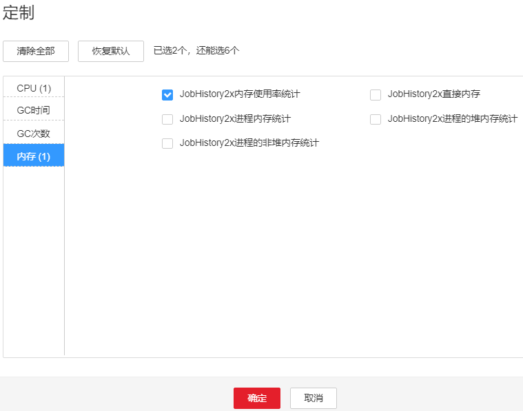

# ALM-43006 JobHistory2x进程堆内存使用超出阈值

## 告警解释

系统每30秒周期性检测JobHistory2x进程堆内存使用状态，当检测到JobHistory2x进程堆内存使用率超出阈值（最大内存的95%）时产生该告警。

## 告警属性

<table><thead align="left"><tr id="r75eeb1a0acad4ffdba4324b500dfeb8a"><th class="cellrowborder" valign="top" width="33.373337333733375%" id="mcps1.1.4.1.1">
告警ID

</th>
<th class="cellrowborder" valign="top" width="33.29332933293329%" id="mcps1.1.4.1.2">
告警级别

</th>
<th class="cellrowborder" valign="top" width="33.33333333333333%" id="mcps1.1.4.1.3">
是否自动清除

</th>
</tr>
</thead>
<tbody><tr id="r57b1f92cb8954e1fbca5da34962440f4"><td class="cellrowborder" valign="top" width="33.373337333733375%" headers="mcps1.1.4.1.1 ">
43006

</td>
<td class="cellrowborder" valign="top" width="33.29332933293329%" headers="mcps1.1.4.1.2 ">
重要

</td>
<td class="cellrowborder" valign="top" width="33.33333333333333%" headers="mcps1.1.4.1.3 ">
是

</td>
</tr>
</tbody>
</table>

## 告警参数

<table><thead align="left"><tr id="r2751e9e8a7a74c339db02b39c7ef45ba"><th class="cellrowborder" valign="top" width="50%" id="mcps1.1.3.1.1">
参数名称

</th>
<th class="cellrowborder" valign="top" width="50%" id="mcps1.1.3.1.2">
参数含义

</th>
</tr>
</thead>
<tbody><tr id="row1912841841316"><td class="cellrowborder" valign="top" width="50%" headers="mcps1.1.3.1.1 ">
来源

</td>
<td class="cellrowborder" valign="top" width="50%" headers="mcps1.1.3.1.2 ">
产生告警的集群名称。

</td>
</tr>
<tr id="ra00d7dce80f0407783a02d5c8a8ae2fa"><td class="cellrowborder" valign="top" width="50%" headers="mcps1.1.3.1.1 ">
服务名

</td>
<td class="cellrowborder" valign="top" width="50%" headers="mcps1.1.3.1.2 ">
产生告警的服务名称。

</td>
</tr>
<tr id="r02059bfd8aa2498d9e8cef82c0a19ea6"><td class="cellrowborder" valign="top" width="50%" headers="mcps1.1.3.1.1 ">
角色名

</td>
<td class="cellrowborder" valign="top" width="50%" headers="mcps1.1.3.1.2 ">
产生告警的角色名称。

</td>
</tr>
<tr id="r4bf1f48884e84a2f80cdf7f111411d38"><td class="cellrowborder" valign="top" width="50%" headers="mcps1.1.3.1.1 ">
主机名

</td>
<td class="cellrowborder" valign="top" width="50%" headers="mcps1.1.3.1.2 ">
产生告警的主机名。

</td>
</tr>
<tr id="rc73339d2a67d45bc83b82ed004b10148"><td class="cellrowborder" valign="top" width="50%" headers="mcps1.1.3.1.1 ">
Trigger Condition

</td>
<td class="cellrowborder" valign="top" width="50%" headers="mcps1.1.3.1.2 ">
系统当前指标取值满足自定义的告警设置条件。

</td>
</tr>
</tbody>
</table>

## 对系统的影响

JobHistory2x进程堆内存使用率过高，会影响JobHistory2x进程运行的性能，甚至造成内存溢出导致JobHistory2x进程不可用。

## 可能原因

该节点JobHistory2x进程堆内存使用率过大，或配置的堆内存不合理，导致使用率超过阈值。

## 处理步骤

检查堆内存使用率

1.  在FusionInsight Manager首页，选择“运维 \> 告警 \> 告警”，选中“ID”为“43006”的告警，查看“定位信息”中的角色名以及确认主机名所在的IP地址。
2.  在FusionInsight Manager首页，选择“集群 \>  _待操作集群的名称_  \> 服务 \> Spark2x \> 实例”，单击告警上报的JobHistory2x，进入实例“概览”页面，单击图表区域右上角的下拉菜单，选择“定制 \> JobHistory2x内存使用率统计”，单击“确定”，查看JobHistory2x进程使用的堆内存是否已达到JobHistory2x进程设定的最大堆内存的阈值（默认95%）。

    -   是，执行[3](#li4800192612341)。
    -   否，执行[7](#li131017814534)。

    **图 1**  JobHistory2x内存使用率统计  
    

3.  在FusionInsight Manager首页，选择“集群 \>  _待操作集群的名称_  \> 服务 \> Spark2x \> 实例”，单击告警上报的JobHistory2x，进入实例“概览”页面，单击图表区域右上角的下拉菜单，选择“定制 \> 内存 \> JobHistory2x进程的堆内存统计”，单击“确定”，根据告警产生时间，查看对应时间段的“JobHistory2x进程使用的堆内存”的值，获取最大值。

    **图 2**  jobHistory2x进程的堆内存统计  
    

4.  在FusionInsight Manager首页，选择“集群 \>  _待操作集群的名称_  \> 服务 \> Spark2x \> 配置”，单击“全部配置”，选择“JobHistory2x \> 默认”，“SPARK\_DAEMON\_MEMORY”参数默认值为4G，可根据如下方案调整该参数值：告警时间段内JobHistory2x使用堆内存的最大值和“JobHistory2x堆内存使用率统计 \(JobHistory2x\)”阈值的比值。若参数值调整后，仍偶现告警，可以按0.5倍速率调大。若频繁出现告警，可以按1倍速率调大。

    > **说明：** 
    >在FusionInsight Manager首页，选择“运维 \> 告警 \> 阈值设置 \>_ 待操作集群名称_  \> Spark2x \> 内存 \> JobHistory2x堆内存使用率统计 \(JobHistory2x\)”，可查看“阈值”。

5.  重启所有的JobHistory2x实例。
6.  等待10分钟，观察界面告警是否清除。
    -   是，处理完毕。
    -   否，执行[7](#li131017814534)。

收集故障信息

1.  在FusionInsight Manager界面，选择“运维 \> 日志 \> 下载”。
2.  在“服务”中勾选待操作集群的“Spark2x”。
3.  单击右上角的设置日志收集的“开始时间”和“结束时间”分别为告警产生时间的前后10分钟，单击“下载”。
4.  请联系运维人员，并发送已收集的故障日志信息。

## 告警清除

此告警修复后，系统会自动清除此告警，无需手工清除。

## 参考信息

无。

