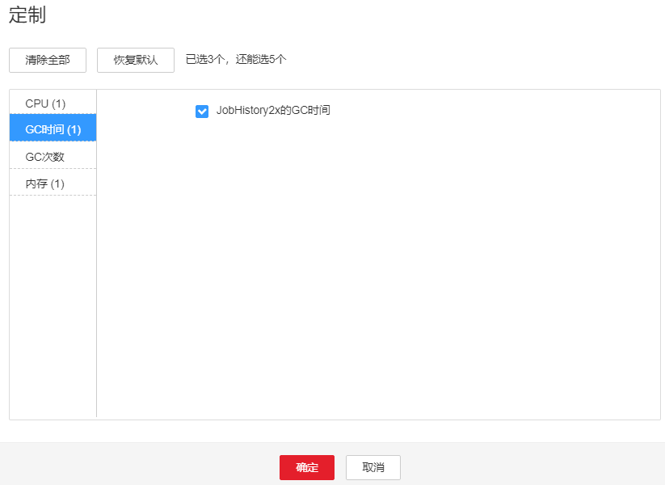

# ALM-43009 JobHistory2x进程GC时间超出阈值

## 告警解释

系统每60秒周期性检测JobHistory2x进程的GC时间，当检测到JobHistory2x进程的GC时间超出阈值（连续3次检测超过12秒）时产生该告警。用户可通过“运维 \>告警 \> 阈值设置 \>  _待操作集群的名称_  \> Spark2x \> GC时间 \> JobHistory2x的总GC时间”修改阈值。当JobHistory2x进程 GC时间小于或等于阈值时，告警恢复。

## 告警属性

<table><thead align="left"><tr id="rf5d4b0ff1a1644708cc37464deb323b1"><th class="cellrowborder" valign="top" width="33.33333333333333%" id="mcps1.1.4.1.1">
告警ID

</th>
<th class="cellrowborder" valign="top" width="33.33333333333333%" id="mcps1.1.4.1.2">
告警级别

</th>
<th class="cellrowborder" valign="top" width="33.33333333333333%" id="mcps1.1.4.1.3">
是否自动清除

</th>
</tr>
</thead>
<tbody><tr id="raaad36490869425b8d1cca71ffd8794c"><td class="cellrowborder" valign="top" width="33.33333333333333%" headers="mcps1.1.4.1.1 ">
43009

</td>
<td class="cellrowborder" valign="top" width="33.33333333333333%" headers="mcps1.1.4.1.2 ">
重要

</td>
<td class="cellrowborder" valign="top" width="33.33333333333333%" headers="mcps1.1.4.1.3 ">
是

</td>
</tr>
</tbody>
</table>

## 告警参数

<table><thead align="left"><tr id="r3c9be5983b7a43c78b6d7bc171427942"><th class="cellrowborder" valign="top" width="50%" id="mcps1.1.3.1.1">
参数名称

</th>
<th class="cellrowborder" valign="top" width="50%" id="mcps1.1.3.1.2">
参数含义

</th>
</tr>
</thead>
<tbody><tr id="row8265958191219"><td class="cellrowborder" valign="top" width="50%" headers="mcps1.1.3.1.1 ">
来源

</td>
<td class="cellrowborder" valign="top" width="50%" headers="mcps1.1.3.1.2 ">
产生告警的集群名称。

</td>
</tr>
<tr id="r37b5d5a252854719b47b485621615e42"><td class="cellrowborder" valign="top" width="50%" headers="mcps1.1.3.1.1 ">
服务名

</td>
<td class="cellrowborder" valign="top" width="50%" headers="mcps1.1.3.1.2 ">
产生告警的服务名称。

</td>
</tr>
<tr id="ra8d625fccbc4419d8964118488600058"><td class="cellrowborder" valign="top" width="50%" headers="mcps1.1.3.1.1 ">
角色名

</td>
<td class="cellrowborder" valign="top" width="50%" headers="mcps1.1.3.1.2 ">
产生告警的角色名称。

</td>
</tr>
<tr id="re2ba32fd2b684781baa20342df0d233e"><td class="cellrowborder" valign="top" width="50%" headers="mcps1.1.3.1.1 ">
主机名

</td>
<td class="cellrowborder" valign="top" width="50%" headers="mcps1.1.3.1.2 ">
产生告警的主机名。

</td>
</tr>
<tr id="rcbc682d3e1f7459d959bb546736d1ec2"><td class="cellrowborder" valign="top" width="50%" headers="mcps1.1.3.1.1 ">
Trigger Condition

</td>
<td class="cellrowborder" valign="top" width="50%" headers="mcps1.1.3.1.2 ">
系统当前指标取值满足自定义的告警设置条件。

</td>
</tr>
</tbody>
</table>

## 对系统的影响

GC时间超出阈值，会影响JobHistory2x进程运行的性能，甚至造成JobHistory2x进程不可用。

## 可能原因

该节点JobHistory2x进程堆内存使用率过大，或配置的堆内存不合理，导致进程GC频繁。

## 处理步骤

检查GC时间

1.  在FusionInsight Manager首页，选择“运维 \> 告警 \> 告警”，选中“ID”为“43009”的告警，查看“定位信息”中的角色名以及确认主机名所在的IP地址。
2.  在FusionInsight Manager首页，选择“集群 \>  _待操作集群的名称_  \> 服务 \> Spark2x \> 实例”，单击告警上报的JobHistory2x，进入实例“概览”页面，单击图表区域右上角的下拉菜单，选择“定制 \> JobHistory2x的GC时间”，单击“确定”，查看JobHistory2x进程的GC时间是否大于阈值（默认12秒）。

    -   是，执行[3](#li17251131385614)。
    -   否，执行[6](#li532493465617)。

    **图 1**  JobHistory2x的GC时间  
    

3.  在FusionInsight Manager首页，选择“集群 \>  _待操作集群的名称_  \> 服务 \> Spark2x \> 配置”，单击“全部配置”，选择“JobHistory2x \> 默认”，将“SPARK\_DAEMON\_MEMORY”参数的值根据如下原则调整：“SPARK\_DAEMON\_MEMORY”参数默认值为4G，若偶现告警，可以按0.5倍速率调大。若告警次数比较频繁，可以按1倍速率调大。
4.  重启所有的JobHistory2x实例。
5.  等待10分钟，观察界面告警是否清除。
    -   是，处理完毕。
    -   否，执行[6](#li532493465617)。

收集故障信息

1.  在FusionInsight Manager界面，选择“运维 \> 日志 \> 下载”。
2.  在“服务”中勾选待操作集群的“Spark2x”。
3.  单击右上角的设置日志收集的“开始时间”和“结束时间”分别为告警产生时间的前后10分钟，单击“下载”。
4.  请联系运维人员，并发送已收集的故障日志信息。

## 告警清除

此告警修复后，系统会自动清除此告警，无需手工清除。

## 参考信息

无。

