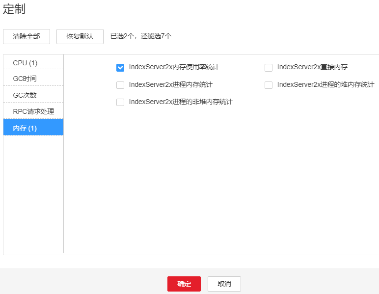

# ALM-43021 IndexServer2x进程直接内存使用超出阈值

## 告警解释

系统每30秒周期性检测IndexServer2x进程直接内存使用状态，当检测到IndexServer2x进程直接内存使用率超出阈值（最大内存的95%）时产生该告警。

## 告警属性

<table><thead align="left"><tr id="r7c7f9b98ceca4ec0a0800ecf76ccef9e"><th class="cellrowborder" valign="top" width="33.33333333333333%" id="mcps1.1.4.1.1">
告警ID

</th>
<th class="cellrowborder" valign="top" width="33.33333333333333%" id="mcps1.1.4.1.2">
告警级别

</th>
<th class="cellrowborder" valign="top" width="33.33333333333333%" id="mcps1.1.4.1.3">
是否自动清除

</th>
</tr>
</thead>
<tbody><tr id="rfea230e6015b4acf959f0f8c1aee9d3e"><td class="cellrowborder" valign="top" width="33.33333333333333%" headers="mcps1.1.4.1.1 ">
43021

</td>
<td class="cellrowborder" valign="top" width="33.33333333333333%" headers="mcps1.1.4.1.2 ">
重要

</td>
<td class="cellrowborder" valign="top" width="33.33333333333333%" headers="mcps1.1.4.1.3 ">
是

</td>
</tr>
</tbody>
</table>

## 告警参数

<table><thead align="left"><tr id="r3e98675c76d14517b23a76d0cb501e87"><th class="cellrowborder" valign="top" width="50%" id="mcps1.1.3.1.1">
参数名称

</th>
<th class="cellrowborder" valign="top" width="50%" id="mcps1.1.3.1.2">
参数含义

</th>
</tr>
</thead>
<tbody><tr id="row19850194112121"><td class="cellrowborder" valign="top" width="50%" headers="mcps1.1.3.1.1 ">
来源

</td>
<td class="cellrowborder" valign="top" width="50%" headers="mcps1.1.3.1.2 ">
产生告警的集群名称。

</td>
</tr>
<tr id="r9ded483eb9844736ac68a17c358d7da2"><td class="cellrowborder" valign="top" width="50%" headers="mcps1.1.3.1.1 ">
服务名

</td>
<td class="cellrowborder" valign="top" width="50%" headers="mcps1.1.3.1.2 ">
产生告警的服务名称。

</td>
</tr>
<tr id="r510741ebfe864dd981b589f5f8595102"><td class="cellrowborder" valign="top" width="50%" headers="mcps1.1.3.1.1 ">
角色名

</td>
<td class="cellrowborder" valign="top" width="50%" headers="mcps1.1.3.1.2 ">
产生告警的角色名称。

</td>
</tr>
<tr id="r03c3304824734d9fa9a737747e27b53a"><td class="cellrowborder" valign="top" width="50%" headers="mcps1.1.3.1.1 ">
主机名

</td>
<td class="cellrowborder" valign="top" width="50%" headers="mcps1.1.3.1.2 ">
产生告警的主机名。

</td>
</tr>
<tr id="red34012f122e4af9a640d3c1332a6922"><td class="cellrowborder" valign="top" width="50%" headers="mcps1.1.3.1.1 ">
Trigger Condition

</td>
<td class="cellrowborder" valign="top" width="50%" headers="mcps1.1.3.1.2 ">
系统当前指标取值满足自定义的告警设置条件。

</td>
</tr>
</tbody>
</table>

## 对系统的影响

IndexServer2x进程直接内存使用率过高，会影响IndexServer2x进程运行的性能，甚至造成内存溢出导致IndexServer2x进程不可用。

## 可能原因

该节点IndexServer2x进程直接内存使用率过大，或配置的直接内存不合理，导致使用率超过阈值。

## 处理步骤

**检查直接内存使用率**

1.  在FusionInsight Manager首页，选择“运维 \> 告警 \> 告警”，选中“ID”为“43021”的告警，查看“定位信息”中的角色名以及确认主机名所在的IP地址。
2.  在FusionInsight Manager首页，选择“集群 \>  _待操作集群的名称_  \> 服务 \> Spark2x \> 实例”，单击告警上报的IndexServer2x，进入实例“概览”页面，单击图表区域右上角的下拉菜单，选择“定制 \> IndexServer2x内存使用率统计”，单击“确定”，查看IndexServer2x进程使用的直接内存是否已达到IndexServer2x进程设定的最大直接内存的阈值。

    -   是，执行[3](#li141321031113812)。
    -   否，执行[7](#li181301231123812)。

    **图 1**  IndexServer2x内存使用率统计  
    

3.  在FusionInsight Manager首页，选择“集群 \>  _待操作集群的名称_  \> 服务 \> Spark2x \> 实例”，单击告警上报的IndexServer2x，进入实例“概览”页面，单击图表区域右上角的下拉菜单，选择“定制 \> IndexServer2x直接内存” ，单击“确定”，根据告警产生时间，查看对应时间段的“IndexServer2x进程使用的直接内存”的值，获取最大值。

    **图 2**  IndexServer2x直接内存  
    

4.  在FusionInsight Manager首页，选择“集群 \>  _待操作集群的名称_  \> 服务 \> Spark2x \> 配置”，单击“全部配置”，选择“IndexServer2x \> 性能”，“spark.driver.extraJavaOptions”参数中-XX:MaxDirectMemorySize的默认值为512M，可根据如下方案调整：告警时间段内IndexServer2x使用的直接内存的最大值和“IndexServer2x直接内存使用率统计 \(IndexServer2x\)”阈值的比值。若参数值调整后，仍偶现告警，可以按0.5倍速率调大。若频繁出现告警，可以按1倍速率调大。

    > **说明：** 
    >在FusionInsight Manager首页，选择“运维 \> 告警 \> 阈值设置 \>_ 待操作集群名称_  \> Spark2x \> 内存 \> IndexServer2x直接内存使用率统计 \(IndexServer2x\)”，可查看“阈值”。

5.  重启所有的IndexServer2x实例。
6.  等待10分钟，观察界面告警是否清除。
    -   是，处理完毕。
    -   否，执行[7](#li181301231123812)。

**收集故障信息**

1.  在FusionInsight Manager界面，选择“运维 \> 日志 \> 下载”。
2.  在“服务”中勾选待操作集群的“Spark2x”。
3.  单击右上角的设置日志收集的“开始时间”和“结束时间”分别为告警产生时间的前后10分钟，单击“下载”。
4.  请联系运维人员，并发送已收集的故障日志信息。

## 告警清除

此告警修复后，系统会自动清除此告警，无需手工清除。

## 参考信息

无。

