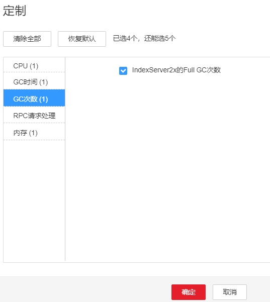

# ALM-43023 IndexServer2x进程Full GC次数超出阈值

## 告警解释

系统每60秒周期性检测IndexServer2x进程的Full GC次数，当检测到IndexServer2x进程的Full GC次数超出阈值（连续3次检测超过12次）时产生该告警。用户可通过“运维 \> 告警 \> 阈值设置 \>  _待操作集群的名称_  \> Spark2x \> GC次数 \> IndexServer2x的Full GC次数”修改阈值。当IndexServer2x进程Full GC次数小于或等于阈值时，告警恢复。

## 告警属性

<table><thead align="left"><tr id="row37737737"><th class="cellrowborder" valign="top" width="33.33333333333333%" id="mcps1.1.4.1.1">
告警ID

</th>
<th class="cellrowborder" valign="top" width="33.33333333333333%" id="mcps1.1.4.1.2">
告警级别

</th>
<th class="cellrowborder" valign="top" width="33.33333333333333%" id="mcps1.1.4.1.3">
是否自动清除

</th>
</tr>
</thead>
<tbody><tr id="row49578673"><td class="cellrowborder" valign="top" width="33.33333333333333%" headers="mcps1.1.4.1.1 ">
43023

</td>
<td class="cellrowborder" valign="top" width="33.33333333333333%" headers="mcps1.1.4.1.2 ">
重要

</td>
<td class="cellrowborder" valign="top" width="33.33333333333333%" headers="mcps1.1.4.1.3 ">
是

</td>
</tr>
</tbody>
</table>

## 告警参数

<table><thead align="left"><tr id="row60623697"><th class="cellrowborder" valign="top" width="50%" id="mcps1.1.3.1.1">
参数名称

</th>
<th class="cellrowborder" valign="top" width="50%" id="mcps1.1.3.1.2">
参数含义

</th>
</tr>
</thead>
<tbody><tr id="row16874142741220"><td class="cellrowborder" valign="top" width="50%" headers="mcps1.1.3.1.1 ">
来源

</td>
<td class="cellrowborder" valign="top" width="50%" headers="mcps1.1.3.1.2 ">
产生告警的集群名称。

</td>
</tr>
<tr id="row26700723"><td class="cellrowborder" valign="top" width="50%" headers="mcps1.1.3.1.1 ">
服务名

</td>
<td class="cellrowborder" valign="top" width="50%" headers="mcps1.1.3.1.2 ">
产生告警的服务名称。

</td>
</tr>
<tr id="row62479192"><td class="cellrowborder" valign="top" width="50%" headers="mcps1.1.3.1.1 ">
角色名

</td>
<td class="cellrowborder" valign="top" width="50%" headers="mcps1.1.3.1.2 ">
产生告警的角色名称。

</td>
</tr>
<tr id="row24021195"><td class="cellrowborder" valign="top" width="50%" headers="mcps1.1.3.1.1 ">
主机名

</td>
<td class="cellrowborder" valign="top" width="50%" headers="mcps1.1.3.1.2 ">
产生告警的主机名。

</td>
</tr>
<tr id="row14595088"><td class="cellrowborder" valign="top" width="50%" headers="mcps1.1.3.1.1 ">
Trigger Condition

</td>
<td class="cellrowborder" valign="top" width="50%" headers="mcps1.1.3.1.2 ">
系统当前指标取值满足自定义的告警设置条件。

</td>
</tr>
</tbody>
</table>

## 对系统的影响

GC次数超出阈值，会影响IndexServer2x进程运行的性能，甚至造成IndexServer2x进程不可用。

## 可能原因

该节点IndexServer2x进程堆内存使用率过大，或配置的堆内存不合理，导致进程Full GC频繁。

## 处理步骤

**检查Full GC次数**

1.  在FusionInsight Manager首页，选择“运维 \> 告警 \> 告警”，选中“告警ID”为“43023”的告警，查看“定位信息”中的角色名以及确认主机名所在的IP地址。
2.  在FusionInsight Manager首页，选择“集群 \>  _待操作集群的名称_  \> 服务 \> Spark2x \> 实例”，单击上报告警的IndexServer2x，进入实例“概览”页面，单击图表区域右上角的下拉菜单，选择“定制 \> IndexServer2x的Full GC次数”，单击“确定”，查看IndexServer2x进程的Full GC次数是否大于阈值（默认12）。

    -   是，执行[3](#li150175319432)。
    -   否，执行[6](#li79972052174314)。

    **图 1**  IndexServer2x的Full GC次数  
    

3.  在FusionInsight Manager首页，选择“集群 \>  _待操作集群的名称_  \> 服务 \> Spark2x \> 配置”，单击“全部配置”，选择“IndexServer2x \> 性能”，“SPARK\_DRIVER\_MEMORY”参数的默认值为4G，可根据如下原则进行调整：若偶现告警，可以按0.5倍速率调大。若告警次数比较频繁，可以按1倍速率调大。多业务量、高并发的情况可以考虑增加实例。
4.  重启所有的IndexServer2x实例。
5.  等待10分钟，观察界面告警是否清除。
    -   是，处理完毕。
    -   否，执行[6](#li79972052174314)。

**收集故障信息**

1.  在FusionInsight Manager界面，选择“运维 \> 日志 \> 下载”。
2.  在“服务”中勾选待操作集群的“Spark2x”。
3.  单击右上角的设置日志收集的“开始时间”和“结束时间”分别为告警产生时间的前后10分钟，单击“下载”。
4.  请联系运维人员，并发送已收集的故障日志信息。

## 告警清除

此告警修复后，系统会自动清除此告警，无需手工清除。

## 参考信息

无。

