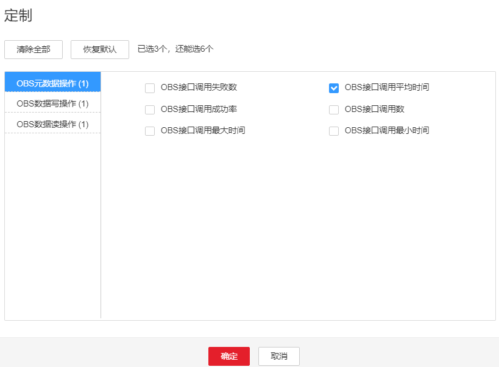

# ALM-45175 OBS元数据接口调用平均时间超过阈值

## 告警解释

系统每30秒周期性检测OBS元数据接口调用平均时间是否超过阈值，当检测到连续超过所设置阈值次数大于平滑次数时就会产生该告警 。

当OBS元数据接口调用平均时间小于阈值时，该告警会自动清除。

## 告警属性

<table><thead align="left"><tr id="row8931076"><th class="cellrowborder" valign="top" width="33.33333333333333%" id="mcps1.1.4.1.1">
告警ID

</th>
<th class="cellrowborder" valign="top" width="33.33333333333333%" id="mcps1.1.4.1.2">
告警级别

</th>
<th class="cellrowborder" valign="top" width="33.33333333333333%" id="mcps1.1.4.1.3">
是否自动清除

</th>
</tr>
</thead>
<tbody><tr id="row40652256"><td class="cellrowborder" valign="top" width="33.33333333333333%" headers="mcps1.1.4.1.1 ">
45175

</td>
<td class="cellrowborder" valign="top" width="33.33333333333333%" headers="mcps1.1.4.1.2 ">
次要

</td>
<td class="cellrowborder" valign="top" width="33.33333333333333%" headers="mcps1.1.4.1.3 ">
是

</td>
</tr>
</tbody>
</table>

## 告警参数

<table><thead align="left"><tr id="row33518103"><th class="cellrowborder" valign="top" width="50%" id="mcps1.1.3.1.1">
参数名称

</th>
<th class="cellrowborder" valign="top" width="50%" id="mcps1.1.3.1.2">
参数含义

</th>
</tr>
</thead>
<tbody><tr id="row163311621185116"><td class="cellrowborder" valign="top" width="50%" headers="mcps1.1.3.1.1 ">
来源

</td>
<td class="cellrowborder" valign="top" width="50%" headers="mcps1.1.3.1.2 ">
产生告警的集群名称。

</td>
</tr>
<tr id="row54362592"><td class="cellrowborder" valign="top" width="50%" headers="mcps1.1.3.1.1 ">
服务名

</td>
<td class="cellrowborder" valign="top" width="50%" headers="mcps1.1.3.1.2 ">
产生告警的服务名称。

</td>
</tr>
<tr id="row38406179"><td class="cellrowborder" valign="top" width="50%" headers="mcps1.1.3.1.1 ">
角色名

</td>
<td class="cellrowborder" valign="top" width="50%" headers="mcps1.1.3.1.2 ">
产生告警的角色名称。

</td>
</tr>
<tr id="row36637496"><td class="cellrowborder" valign="top" width="50%" headers="mcps1.1.3.1.1 ">
主机名

</td>
<td class="cellrowborder" valign="top" width="50%" headers="mcps1.1.3.1.2 ">
产生告警的主机名。

</td>
</tr>
<tr id="row7466123884718"><td class="cellrowborder" valign="top" width="50%" headers="mcps1.1.3.1.1 ">
Trigger condition

</td>
<td class="cellrowborder" valign="top" width="50%" headers="mcps1.1.3.1.2 ">
系统当前指标取值满足自定义的告警设置条件。

</td>
</tr>
</tbody>
</table>

## 对系统的影响

OBS元数据接口调用平均时间超过阈值，会影响上层大数据计算业务的性能，导致某些计算任务的执行时间超过阈值。

## 可能原因

OBS服务端出现卡顿，或OBS客户端到OBS服务端之间的网络不稳定。

## 处理步骤

**检查堆内存使用率。**

1.  在FusionInsight Manager首页，选择“运维 \> 告警 \> 告警 \> OBS元数据接口调用平均时间超过阈值”，查看“定位信息”中的角色名并确定实例的IP地址。
2.  选择“集群 \>  _待操作集群的名称_  \> 服务 \> meta \> 实例 \> meta（对应上报告警实例IP地址）”。单击图表区域右上角的下拉菜单，选择“定制”，在“OBS元数据操作”中勾选“OBS接口调用平均时间”，单击“确定”，查看OBS元数据接口调用平均时间，确定是否有接口调用时间超过阈值。

    -   是，执行[3](#li5868113155910)。
    -   否，执行[5](#li4749473185459)。

    **图 1**  OBS接口调用平均时间  
    

3.  选择“集群 \>  _待操作集群的名称_  \> 运维 \> 告警 \> 阈值设置  \> meta \> OBS元数据接口调用平均时间”，将阈值或平滑次数参数的值根据实际情况调大。
4.  观察界面告警是否清除。
    -   是，处理完毕。
    -   否，执行[5](#li4749473185459)。

**收集故障信息。**

1.  在FusionInsight Manager界面，选择“运维 \> 日志 \> 下载”。
2.  在“服务”中勾选操作OMS下面的“NodeAgent”、“NodeMetricAgent”、“OmmServer”、“OmmAgent”。
3.  单击右上角的设置日志收集的“开始时间”和“结束时间”分别为告警产生时间的前后30分钟，单击“下载”。
4.  请联系运维人员，并发送已收集的故障日志信息。

## 告警清除

此告警修复后，系统会自动清除此告警，无需手工清除。

## 参考信息

无。

