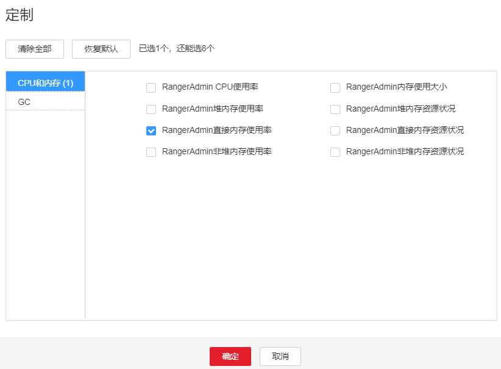

# ALM-45278 RangerAdmin直接内存使用率超过阈值

## 告警解释

系统每60秒周期性检测RangerAdmin服务直接内存使用状态，当连续5次检测到RangerAdmin实例直接内存使用率超出阈值（最大内存的80%）时，产生该告警。当RangerAdmin直接内存使用率小于或等于阈值时，告警恢复。

## 告警属性

<table><thead align="left"><tr id="row62299817"><th class="cellrowborder" valign="top" width="33.33333333333333%" id="mcps1.1.4.1.1">
告警ID

</th>
<th class="cellrowborder" valign="top" width="33.33333333333333%" id="mcps1.1.4.1.2">
告警级别

</th>
<th class="cellrowborder" valign="top" width="33.33333333333333%" id="mcps1.1.4.1.3">
是否自动清除

</th>
</tr>
</thead>
<tbody><tr id="row28278868"><td class="cellrowborder" valign="top" width="33.33333333333333%" headers="mcps1.1.4.1.1 ">
45278

</td>
<td class="cellrowborder" valign="top" width="33.33333333333333%" headers="mcps1.1.4.1.2 ">
重要

</td>
<td class="cellrowborder" valign="top" width="33.33333333333333%" headers="mcps1.1.4.1.3 ">
是

</td>
</tr>
</tbody>
</table>

## 告警参数

<table><thead align="left"><tr id="row30968229"><th class="cellrowborder" valign="top" width="50%" id="mcps1.1.3.1.1">
参数名称

</th>
<th class="cellrowborder" valign="top" width="50%" id="mcps1.1.3.1.2">
参数含义

</th>
</tr>
</thead>
<tbody><tr id="row1083384091512"><td class="cellrowborder" valign="top" width="50%" headers="mcps1.1.3.1.1 ">
来源

</td>
<td class="cellrowborder" valign="top" width="50%" headers="mcps1.1.3.1.2 ">
产生告警的集群名称。

</td>
</tr>
<tr id="row9088906"><td class="cellrowborder" valign="top" width="50%" headers="mcps1.1.3.1.1 ">
服务名

</td>
<td class="cellrowborder" valign="top" width="50%" headers="mcps1.1.3.1.2 ">
产生告警的服务名称。

</td>
</tr>
<tr id="row21242631"><td class="cellrowborder" valign="top" width="50%" headers="mcps1.1.3.1.1 ">
角色名

</td>
<td class="cellrowborder" valign="top" width="50%" headers="mcps1.1.3.1.2 ">
产生告警的角色名称。

</td>
</tr>
<tr id="row24370534"><td class="cellrowborder" valign="top" width="50%" headers="mcps1.1.3.1.1 ">
主机名

</td>
<td class="cellrowborder" valign="top" width="50%" headers="mcps1.1.3.1.2 ">
产生告警的主机名。

</td>
</tr>
<tr id="row19533456154912"><td class="cellrowborder" valign="top" width="50%" headers="mcps1.1.3.1.1 ">
Trigger Condition

</td>
<td class="cellrowborder" valign="top" width="50%" headers="mcps1.1.3.1.2 ">
系统当前指标取值满足自定义的告警设置条件。

</td>
</tr>
</tbody>
</table>

## 对系统的影响

直接内存溢出可能导致服务崩溃。

## 可能原因

节点RangerAdmin实例直接内存使用率过大，或配置的直接内存不合理，导致使用率超过阈值。

## 处理步骤

**检查直接内存使用率。**

1.  在FusionInsight Manager首页，选择“运维 \> 告警 \> 告警 \> ALM-45278 RangerAdmin直接内存使用率超过阈值”，检查该告警的“定位信息”，查看告警上报的实例主机名。
2.  在FusionInsight Manager首页，选择“集群 \> 服务 \> Ranger \> 实例”，选择上报告警实例主机名对应的角色，单击图表区域右上角的下拉菜单，选择“定制 \> CPU和内存 \> RangerAdmin直接内存使用率”，单击“确定”。

    **图 1**  RangerAdmin直接内存使用率  
    

3.  查看RangerAdmin使用的直接内存是否已达到RangerAdmin设定的阈值（默认值为最大直接内存的80%）。
    -   是，执行[4](#li10450762161055)。
    -   否，执行[6](#d0e43963)。

4.  在FusionInsight Manager首页，选择“集群 \> 服务 \> Ranger \> 实例 \> RangerAdmin \> 实例配置”，单击“全部配置”，选择“RangerAdmin \> 系统”。将“GC\_OPTS”参数中“-XX:MaxDirectMemorySize”的值根据实际情况调大，并保存配置。

    > **说明：** 
    >出现此告警时，说明当前RangerAdmin设置的直接内存无法满足当前RangerAdmin进程所需的直接内存，建议根据[2](#li7677390)查看“RangerAdmin直接内存使用率”，调整“GC\_OPTS”参数中“-XX:MaxDirectMemorySize”的值为“RangerAdmin使用的直接内存大小”的两倍（可根据实际业务场景进行修改）。

5.  重新启动受影响的服务或实例，观察界面告警是否清除。
    -   是，处理完毕。
    -   否，执行[6](#d0e43963)。

**收集故障信息。**

1.  在FusionInsight Manager界面，选择“运维 \> 日志 \> 下载”。
2.  在“服务”框中勾选待操作集群的“Ranger”。
3.  单击右上角的设置日志收集的“开始时间”和“结束时间”分别为告警产生时间的前后10分钟，单击“下载”。
4.  请联系运维人员，并发送已收集的故障日志信息。

## 告警清除

此告警修复后，系统会自动清除此告警，无需手工清除。

## 参考信息

无。

